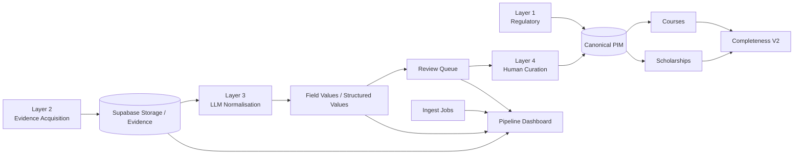

# Coursefinder Architecture v2.2

**Date:** 9 August 2026  
**Status:** Admin operational visibility update  
**Supabase project:** `coursefinder-demo`

## Scope
V2.2 expands the UnoPIM-inspired admin UI from the initial PIM/review screens into an operational console covering the full catalogue and Layer 1–4 data lifecycle.

## Admin navigation

```text
Overview
  Dashboard

Catalogue
  Providers
  Courses
  Completeness
  Scholarships

Enrichment
  Pipeline
  Jobs
  Review Queue
  Evidence

PIM
  Attributes
  Scholarship Matcher
```

## Operational model



## UI data surfaces

| Screen | Primary live source |
|---|---|
| Dashboard | `catalogue_stats`, `ingest_jobs`, `review_queue`, `evidence_artifacts`, PIM definitions |
| Providers | `providers` |
| Courses | `course_completeness_v2` |
| Completeness | `course_completeness_v2` |
| Pipeline | `ingest_jobs`, `review_queue`, `evidence_artifacts`, `field_values` |
| Jobs | `ingest_jobs` |
| Scholarships | `scholarship_catalogue_v2` |
| Review Queue | `pim-admin-v2-1` Edge Function |
| Evidence | `evidence_artifacts` + signed Storage URLs via `pim-admin-v2-1` |
| Attributes | families, groups, definitions, aliases and `field_values` |
| Scholarship Matcher | `scholarship-match-v2-1` |

## Layer status interpretation

- **Layer 1**: tracked from `ingest_jobs.layer = 1`.
- **Layer 2**: tracked from `ingest_jobs.layer = 2` plus evidence artifacts.
- **Layer 3**: tracked from `ingest_jobs.layer = 3` where jobs are logged; structured output is also visible through `field_values`.
- **Layer 4**: operational activity is primarily `review_queue` and `review_actions`; Layer 4 is not dependent on an ingest job existing.

A layer with no job record is displayed as idle/no tracked job rather than failed.

## Admin role model

Application administration is controlled through `public.pim_user_roles`, not PostgreSQL superuser privileges.

Roles:
- `viewer`
- `counsellor`
- `curator`
- `pipeline_operator`
- `pim_admin`
- `platform_admin`

`platform_admin` is the Coursefinder application super-admin and is appropriate for the primary owner/admin user.

Do **not** grant PostgreSQL `postgres`, service-role credentials, or database-owner credentials to the browser application.

## Current primary admin
The Supabase Auth user created on 9 August 2026 has been assigned `platform_admin` in `pim_user_roles`.

## Security direction
The current pilot retains several read policies from the demo phase. Future hardening should migrate admin-only operational reads from direct Data API access to authenticated admin Edge Function/RPC endpoints, and remove legacy `demo_public_read` policies before production go-live.

## Next recommended release
V2.3 should focus on:
1. Pipeline run controls with role checks.
2. Securing Layer 1–3 execution functions.
3. Job detail/log drill-down.
4. Course/provider detail editing using attribute-family-generated forms.
5. Attribute creation and alias mapping directly from Layer 4 review.
6. Removal of remaining demo public-read policies.
