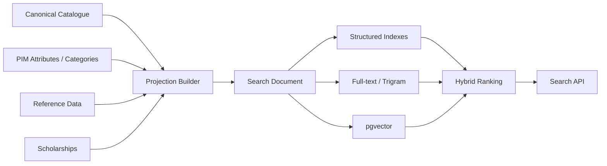
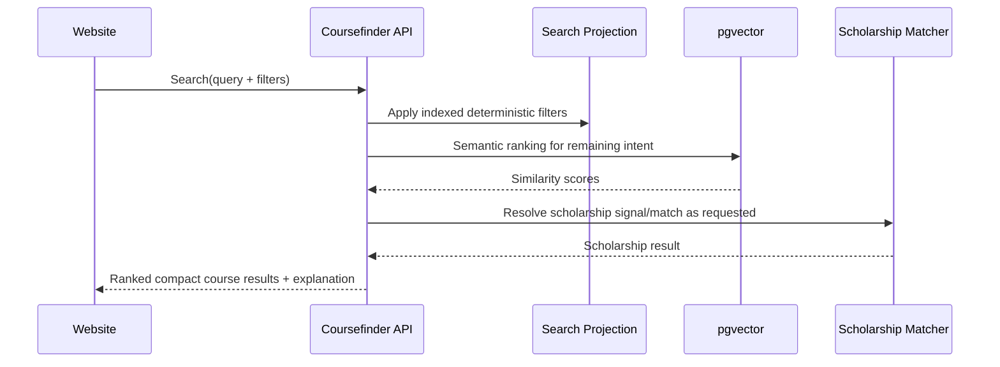

# Coursefinder Architecture v2.8.1 — Global Reference, Seed Data & Search Foundation

**Status:** Target production architecture for review. Architecture only; no database or application changes are included in this document.

**Target platform:** `Coursefinder_Prod`

**Architecture baseline:** v2.8.1

**Companion documents:**
- `docs/coursefinder-database-architecture-v2.8.1.md`
- `docs/coursefinder-architecture-v2.8.1-menu-integration-model.md`
- `docs/coursefinder-current-db-assessment-v2.8.1.md`
- `docs/coursefinder-database-architecture-v2.8.1-review-checklist.md`

---

## 1. Purpose

This document defines the global reference-data, seed-data, provider-identity and search foundation for Coursefinder.

It supports staged destination rollout from Oceania to the Americas and Europe without redesigning geography, provider identity, institution-group membership, rankings, taxonomy or search architecture at each expansion stage.

The design is intentionally independent of any single country, regulator, scraper, ranking provider or LLM provider.

---

## 2. Core modelling principles

### 2.1 Keep global concepts separate

The following are distinct data products:

- country/region/subdivision;
- canonical Provider;
- provider external identifiers;
- regulatory registration;
- Institution Collection membership;
- provider ranking;
- provider-defined Course Collection;
- Course Family;
- global Coursefinder Category / Field of Study;
- PIM attributes;
- scholarship scopes/criteria;
- derived Search Projection.

They must not be collapsed into provider/course booleans or generic free-text fields.

### 2.2 Seed globally; activate operationally

Stable global reference data should be seeded once even when ingestion is initially active only for selected destinations.

Example:

```text
Australia        active
New Zealand      active
Fiji             seed_only
United States    future
Canada           future
United Kingdom   future
Germany          future
```

Country existence and country activation are different concepts.

### 2.3 Official jurisdictional sources establish canonical education identity

Do not use one global university list as the sole source of truth.

Recommended trust hierarchy:

```text
Official regulator / national dataset
        ↓
Coursefinder canonical Provider
        ↓
External identifier crosswalk
        ↓
Institution groups / rankings / enrichment
        ↓
Official provider website evidence
```

### 2.4 Search is hybrid

Use pgvector for semantic meaning and indexed relational fields for deterministic facts.

Student search must combine:

- structured filters;
- hierarchical taxonomy;
- exact identifiers;
- full-text/trigram search;
- institution collections;
- rankings/boosts;
- scholarship state;
- pgvector similarity;
- completeness/freshness;
- external customer-specific commercial ranking when applicable.

---

## 3. Global geography reference design

### `ref.regions`

Represents global geographic hierarchy such as world, region, subregion and intermediate region.

Suggested fields:

- `id`
- `code`
- `name`
- `region_type`
- `parent_id`
- `display_order`
- `status`

### `ref.countries`

Country identity only.

Suggested business/reference fields:

- canonical name;
- official name;
- ISO alpha-2;
- ISO alpha-3;
- ISO numeric/M49 code;
- default currency;
- default locale.

Suggested operational fields:

- region ID;
- subregion ID;
- catalogue status;
- student-search enabled;
- provider-ingestion enabled;
- course-ingestion enabled;
- scholarship-ingestion enabled;
- validity timestamps.

Regulator URLs and scraper adapter configuration do not belong in the country row.

### `ref.subdivisions`

Supports states/provinces/territories and structured destination filtering.

Examples:

- `AU-VIC`
- `AU-NSW`
- `US-CA`
- `CA-ON`
- `GB-ENG`

Suggested fields:

- ID;
- country ID;
- subdivision code;
- name;
- type;
- parent subdivision ID;
- status.

### Cities

Cities should be canonicalised where useful for search, campuses and location aggregation, but Coursefinder does not need to seed every global city at project creation. Cities can be loaded incrementally for active destinations and referenced from campuses.

---

## 4. Global controlled seed data

Seed once and manage centrally:

### Geography

- regions/subregions;
- countries;
- active-destination subdivisions.

### Academic reference

- study levels;
- delivery modes;
- study loads/attendance modes;
- award/qualification types;
- global Field of Study taxonomy;
- standard intake/term concepts where useful.

### Language/admissions reference

- languages;
- English tests;
- test component codes;
- standard operators/units.

### Commercial-neutral catalogue reference

- currencies;
- provider types;
- institution collection types;
- ranking-source definitions;
- evidence/source types;
- publication/lifecycle states.

### Scholarship reference

- scholarship types;
- award types;
- audience/eligibility dimensions;
- common criteria metric codes.

Do not seed university names as application-code constants.

---

## 5. Provider identity architecture

### 5.1 Canonical Provider

A Provider is a Coursefinder canonical institution/entity with its own stable internal key.

Names are display values, not identity keys.

### 5.2 External identifiers

Use `catalogue.provider_identifiers` to store multiple external IDs.

Suggested fields:

- provider ID;
- scheme;
- identifier;
- issuing authority;
- country;
- primary flag;
- validity;
- source/evidence;
- verification date.

Examples by destination may include:

Australia:
- CRICOS provider code;
- TEQSA provider identifier;
- ROR ID where available.

New Zealand:
- NZQA/provider identifiers;
- ROR where available.

United States:
- official federal education identifier such as UNITID where applicable;
- ROR where available.

Canada/Europe:
- jurisdiction-specific official identifiers;
- ROR where applicable.

ROR or any similar global registry should be treated as a crosswalk/enrichment source rather than the sole canonical authority for all education-provider types.

### 5.3 Provider aliases

Store alternate, former and local names separately so that imports/search can resolve historical and source-specific naming without changing canonical identity.

---

## 6. Institution Collections

Institution Collections represent provider memberships/associations such as:

- Group of Eight;
- Russell Group;
- U15 Canada;
- Association of American Universities;
- LERU;
- other authoritative institutional associations added where useful.

Do not create permanent provider booleans such as:

- `is_go8`
- `is_russell_group`
- `is_top_university`

### `ref.institution_collections`

Suggested fields:

- ID;
- stable code;
- name;
- collection type;
- geographic scope;
- official URL;
- description;
- status.

### `catalogue.provider_collection_memberships`

Suggested fields:

- provider ID;
- institution collection ID;
- membership type/status;
- valid from/to;
- source ID;
- evidence ID;
- verified at.

Membership is temporal and deterministic.

### Difference from Course Collections

**Institution Collection** groups providers.

Example:

```text
Go8
  ├── University A
  └── University B
```

**Course Collection** groups courses within one provider.

Example:

```text
University A
  └── Information Technology
      ├── Bachelor of Data Science
      └── Master of AI
```

These must never share the same table or meaning.

---

## 7. Rankings

Rankings are time-series measurements, not provider attributes and not Institution Collection memberships.

### `ref.ranking_sources`

Suggested fields:

- code;
- name;
- ranking type;
- publisher;
- source URL;
- licence/redistribution notes;
- active status.

### `catalogue.provider_rankings`

Suggested fields:

- provider ID;
- ranking source ID;
- ranking year;
- subject/category ID nullable;
- exact rank nullable;
- rank band min/max;
- percentile nullable;
- score nullable;
- source/evidence;
- retrieved/verified time.

### Search treatment

Rankings support:

- exact filters;
- rank-band filters;
- sorting;
- controlled boosts;
- explanatory result metadata.

Raw ranking numbers should not be treated as primary semantic vector content.

---

## 8. Field of Study taxonomy

`ref.fields_of_study` is a global hierarchical taxonomy.

Example:

```text
Computing
├── Computer Science
├── Information Technology
├── Data Science
├── Artificial Intelligence
└── Cyber Security
```

Suggested fields:

- ID;
- code;
- name;
- parent ID;
- hierarchy path;
- depth;
- status;
- optional external-taxonomy crosswalk.

### Provider wording vs global taxonomy

Source/provider wording is preserved through:

- Course Collections;
- source labels/evidence;
- attribute aliases;
- category mappings.

A provider may call a vertical `Computing & Digital Technologies`; Coursefinder can preserve that label while mapping individual courses to controlled global subjects.

---

## 9. Seed strategy by rollout phase

### Phase A — Oceania

Global geography/reference tables are already present; activate relevant destination records.

#### Australia

Canonical identity and registration ingestion should prioritise official regulatory/provider datasets suitable for international-study catalogue use, followed by crosswalk and official provider-web enrichment.

Seed/enrich:

- canonical providers;
- official provider identifiers;
- registrations;
- campuses;
- provider type/classification;
- Group of Eight membership;
- official aliases/domains;
- provider-defined Course Collections;
- course registrations;
- global Field of Study mappings;
- scholarships.

#### New Zealand

Seed similarly from authoritative provider/programme sources, then crosswalk and enrich.

### Phase B — Americas

#### United States

Seed canonical institutions from authoritative national education datasets chosen during adapter implementation, then crosswalk/enrich and add authoritative group memberships such as AAU where useful.

#### Canada

Use authoritative jurisdictional/institution sources selected during adapter design, then crosswalk/enrich and add groups such as U15 where useful.

### Phase C — Europe

Use country-specific official/regulatory sources with global identity reconciliation and selected institution collections such as Russell Group or LERU.

Do not invent one generic Europe-wide provider identifier when authoritative country-level identity is required.

---

## 10. Search architecture

### 10.1 Read-optimised Search Projection

Website and counsellor search should query a derived projection, not perform deep joins across canonical PIM tables per request.



### 10.2 Recommended Search Projection fields

Identity:

- course ID;
- provider ID;
- course stable key;
- canonical title;
- provider name.

Geography:

- country ID/code;
- subdivision ID/code;
- city/campus IDs.

Academic:

- Course Family ID;
- study-level code;
- Field of Study/category IDs;
- provider Course Collection IDs;
- delivery mode;
- duration.

Admissions:

- structured English-test thresholds;
- selected admission tags/requirements.

Fees/intakes:

- current fee min/max/currency;
- next/available intake dates;
- application deadline signals.

Provider reference:

- Institution Collection codes;
- selected ranking bands/features.

Scholarship:

- scholarship status;
- scholarship count;
- verified-none/unknown distinction;
- optionally selected headline award signal.

Quality/publication:

- completeness score/status;
- evidence freshness;
- publication state;
- channel eligibility.

Semantic:

- governed search text;
- embedding state;
- Search Profile/version;
- embedding model/version;
- source content hash.

---

## 11. pgvector principles

### Use pgvector for meaning

Examples suited to semantic similarity:

- artificial intelligence;
- robotics;
- sustainability;
- public health;
- creative industries;
- career/subject intent.

### Use structured fields for facts

Examples:

- Australia;
- Go8;
- fee under AUD 50,000;
- IELTS 6.5;
- Master level;
- February intake;
- scholarship available;
- University X;
- QS top 100 where licensed data is available.

### Controlled Search Profile

A Search Profile decides which canonical content is used to build search text and embeddings.

High semantic contribution may include:

- course title;
- course summary/description;
- Field of Study labels;
- majors/specialisations;
- careers/outcomes;
- selected provider Course Collection labels;
- selected admissions context.

Filter-only or low semantic contribution may include:

- fee numbers;
- CRICOS code;
- provider ID;
- country code;
- IELTS number;
- ranking number.

### Embedding lifecycle

Changing any of the following can mark a search document stale:

- vector-included canonical content;
- Course Family/search recipe;
- relevant Course Collection membership/label;
- global category mapping;
- Search Profile version;
- embedding model profile.

Embeddings are regenerated asynchronously and versioned.

---

## 12. Hybrid search case scenario

Student query:

> I want AI in Australia at a top research university under 50k with scholarship and IELTS 6.5.

Logical resolution:

```text
country = AU
semantic subject = Artificial Intelligence
max tuition = 50000
scholarship_required = true
IELTS threshold <= 6.5
institution intent = research/prestige
```

Execution:

1. resolve explicit structured constraints;
2. map academic intent to taxonomy plus semantic text;
3. filter indexed Search Projection rows;
4. run pgvector similarity within/alongside the constrained candidate set;
5. apply controlled quality/ranking/Institution Collection boosts;
6. resolve scholarship applicability/match;
7. return explainable result factors.

A softer phrase such as `top research university` should generally influence ranking rather than silently become a hard Go8/AAU filter unless the student explicitly requests that group.

---

## 13. Scholarship interaction

Scholarship availability is not inferred from university prestige or group membership.

Scholarship matching uses:

- explicit course links;
- provider-wide scope;
- Course Collection scope;
- global category scope;
- study-level scope;
- campus/specific-course scope;
- structured student eligibility criteria;
- active academic year and validity;
- scholarship coverage verification.

Search can deterministically combine:

```text
Go8
+ Engineering
+ Masters
+ scholarship available
+ max fee
```

without stuffing scholarship prose or institution-group booleans into the vector as the sole retrieval method.

---

## 14. Website/API performance model

### Search endpoint

Search returns compact records from the Search Projection.

Typical response contains:

- course/provider identity;
- title/provider;
- location;
- study level/subject;
- current fee;
- next intake;
- English threshold;
- scholarship signal;
- provider group/ranking signal;
- relevance score;
- completeness/freshness;
- explanation facets.

### Detail endpoint

Only when a course is opened should the API hydrate deeper canonical content such as:

- all fees;
- all intakes;
- campuses;
- requirements;
- attributes;
- evidence/public source links;
- scholarship details;
- provider collections.

This keeps search fast as catalogue volume grows.

---

## 15. Search API scenario



---

## 16. Zoho commercial reranking boundary

Canonical Search Projection may expose neutral relevance signals such as:

- semantic relevance;
- ranking/group metadata;
- scholarship availability;
- completeness;
- freshness.

Customer-specific commercial preference remains in Zoho CRM/Creator.

Flow:

```text
Coursefinder neutral candidate ranking
       ↓
Zoho customer/account context
       ↓
commission / direct agreement / preferred status / restrictions
       ↓
final counsellor or customer-specific ranking
```

The canonical Search Projection does not store commission or customer-specific provider preference.

---

## 17. Import/export seed requirements

Seed/reference data should be exportable in stable CSV/XLSX sheets such as:

- Countries
- Regions
- Subdivisions
- StudyLevels
- FieldsOfStudy
- ProviderTypes
- InstitutionCollections
- RankingSources
- Currencies
- Languages
- EnglishTests

Provider/catalogue imports reference stable codes rather than database UUIDs wherever practical.

Example:

```text
country_code = AU
study_level_code = masters
field_code = DATA_SCIENCE
institution_collection_code = GO8_AU
```

---

## 18. Data-governance principles

1. Preserve canonical identity separately from names.
2. Preserve source wording/evidence even after canonical mapping.
3. Do not make uncontrolled new free-text values automatically filterable.
4. Do not make arbitrary PIM attributes automatically vectorised.
5. Institution Collection membership requires source/provenance.
6. Ranking data requires source/year and licensing review.
7. Search projections are derived and rebuildable.
8. Search model/profile versions are explicit.
9. Global seed data is versioned and auditable.
10. Country rollout state is configuration, not a schema migration.

---

## 19. v2.8.1 decisions

1. Seed global geography/reference data at production foundation stage.
2. Activate destinations independently of seed existence.
3. Use jurisdictional official sources as primary provider identity inputs.
4. Maintain external provider identifiers as crosswalks.
5. Model Institution Collections as temporal provider memberships.
6. Model Rankings separately as time-series data.
7. Model provider Course Collections separately from Institution Collections and global categories.
8. Use a global hierarchical Field of Study taxonomy.
9. Build a denormalised Search Projection for website/counsellor search.
10. Use hybrid structured + text + pgvector retrieval.
11. Version Search Profiles and embeddings.
12. Keep commercial customer preference outside canonical search/PIM.

---

## 20. Implementation sequence after architecture approval

1. approve complete v2.8.1 architecture set;
2. define physical v2.9 reference/catalogue/search tables;
3. seed global reference data in `Coursefinder_Prod`;
4. activate Oceania ingestion;
5. migrate/normalise validated existing providers/courses;
6. create Search Projection builder;
7. generate fresh embeddings using approved Search Profile;
8. expose search API;
9. expand destination adapters without redesigning the core reference/search model.

---

## Appendix A — Relationship to earlier designs

Earlier global-reference and search design iterations remain available in the repository as historical artefacts. This v2.8.1 document consolidates those concepts into the production baseline and is authoritative for the next physical-schema design wherever earlier versions differ.
