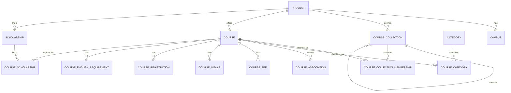
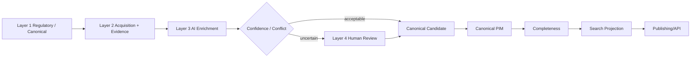
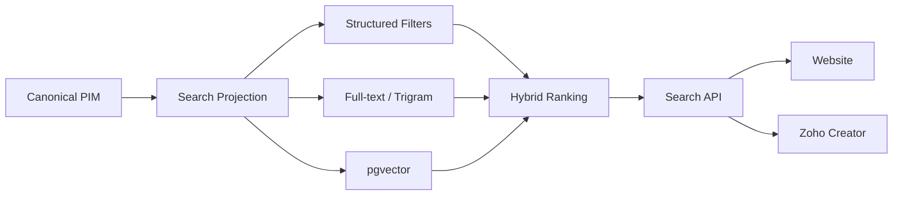

# Coursefinder Architecture v2.8.1 — Menu, Integration & Information Model

**Status:** Target production architecture for review. Architecture only; no database or application changes are included in this document.

**Target platform:** `Coursefinder_Prod`

**Architecture baseline:** v2.8.1

**Companion documents:**
- `docs/coursefinder-database-architecture-v2.8.1.md`
- `docs/coursefinder-architecture-v2.8.1-global-reference-seed-search.md`
- `docs/coursefinder-current-db-assessment-v2.8.1.md`
- `docs/coursefinder-database-architecture-v2.8.1-review-checklist.md`

---

## 1. Purpose

This document defines the production information architecture, platform-admin menu, role-driven navigation, PIM operating model, catalogue relationships, integration model and Layer 1–4 operational boundaries for Coursefinder.

It is a complete v2.8.1 design and can be read independently of earlier versions.

The design applies established PIM and relational-data principles: canonical entities, structural families, reusable attributes, hierarchical classifications, explicit relationships, provenance, controlled reference data, derived search projections and role-based administration.

Coursefinder does not use any third-party product schema as its backend design. External PIM products are useful only as examples of general design principles such as separating structural families, attribute definitions, categories and catalogue entities.

---

## 2. Core information-model principles

### 2.1 Separate structural type, provider grouping and global classification

Coursefinder deliberately separates:

- **Course Family** — the structural/schema type of a course;
- **Course Collection** — how a provider groups its own courses;
- **Global Category / Field of Study** — Coursefinder-controlled cross-provider taxonomy;
- **Course Association** — explicit relationships between courses;
- **Institution Collection** — provider memberships such as Go8 or Russell Group;
- **Ranking** — time-series ranking information;
- **Attribute** — reusable business data definition.

Example:

```text
Provider: University X
Course Collection: Information Technology
Course: Master of Data Science
Course Family: Higher Education Course
Study Level: Masters
Global Category: Computing > Data Science
Institution Collection: Go8 (provider-level membership)
```

These concepts solve different problems and must not be collapsed into a single generic category field.

### 2.2 Families define data shape

A Family determines:

- which attribute groups apply;
- which attributes are expected or required;
- validation rules;
- completeness profile selection;
- edit-screen organisation;
- search projection recipe;
- publication requirements.

Recommended initial Course Families:

- Higher Education Course
- VET / Vocational Course
- English Language / ELICOS
- Foundation / Pathway
- Research Program
- Short Course / Microcredential

Recommended Scholarship Families:

- Merit Scholarship
- International Scholarship
- Equity / Access Scholarship
- Research Scholarship
- Faculty / Course-specific Scholarship
- Government / External Scholarship

A provider's Information Technology or Business vertical is **not** a Course Family unless it genuinely changes the structural data model.

### 2.3 Course Collections preserve provider presentation

Universities commonly publish multiple related programmes inside their own vertical or collection.

Example:

```text
University X
└── Information Technology
    ├── Undergraduate
    │   ├── Bachelor of Data Science
    │   ├── Bachelor of Artificial Intelligence
    │   └── Bachelor of Cyber Security
    └── Postgraduate
        ├── Master of Data Science
        ├── Master of Artificial Intelligence
        └── Graduate Certificate in IT
```

Course Collections therefore need to be first-class catalogue entities with hierarchy, ordering, source URL, validity and many-to-many course membership.

A single course may belong to several provider-defined collections without duplication.

### 2.4 Global categories standardise meaning

Provider wording is preserved, but Coursefinder maps courses to global classifications for cross-provider discovery.

Example provider labels:

- Information Technology
- Computing & Digital Technologies
- Computer Science and Data

may map to Coursefinder categories such as:

```text
Computing
├── Computer Science
├── Data Science
├── Artificial Intelligence
└── Cyber Security
```

### 2.5 Attributes are governed data definitions

Each Attribute Definition should explicitly record:

- entity type;
- data type;
- unit;
- validation rules;
- required state;
- filterable state;
- full-text searchable state;
- vector inclusion state;
- localisation/channel behaviour;
- multivalue behaviour;
- controlled option list where applicable;
- display order;
- sensitivity/publication behaviour.

`is_searchable`, `is_filterable` and `include_in_vector` are separate decisions.

### 2.6 Completeness is policy-driven

Completeness must not be hard-coded to one fixed list of course fields.

A Completeness Profile is selected by:

```text
Entity Type + Family + Country/Regime + Publication Channel
```

Example:

`Higher Education Course + AU + Counsellor Channel`

may require:

- course identity;
- provider;
- study level;
- field of study;
- duration;
- current fee;
- active intake;
- English requirement;
- official URL;
- registration/CRICOS where applicable;
- scholarship coverage status (`available` or `verified_none`).

---

## 3. Platform Admin super-menu

`platform_admin` receives the full production menu. Other roles receive a filtered subset and reduced actions.

```text
Dashboard

Catalogue
  Providers
  Campuses
  Course Collections
  Courses
  Scholarships
  Student Profiles
  Categories
  Associations

PIM Model
  Attribute Families
  Attribute Groups
  Attributes
  Attribute Options
  Attribute Aliases
  Completeness Profiles
  Category Configuration

Reference Data
  Countries & Regions
  Subdivisions
  Study Levels
  Fields of Study
  Provider Types
  Institution Collections
  Ranking Sources
  Currencies
  Languages
  English Tests

Data Quality
  Completeness
  Missing Attributes
  Scholarship Coverage
  Evidence Freshness
  Conflicts
  Duplicates
  Stale / Expiring Records

Enrichment
  Pipeline Overview
  Layer 1 - Regulatory
  Layer 2 - Acquisition
  Layer 3 - AI Enrichment
  Layer 4 - Human Review
  Jobs
  Schedules
  Evidence

Integrations
  Overview
  Scrapers
  LLM Providers
  LLM Routers / Aggregators
  Model Profiles
  Regulatory Sources
  Consumer APIs
  Zoho
  Webhooks

Search & Matching
  Search Profiles
  Search Projection Health
  Vector Indexes
  Embedding Jobs
  Ranking / Boost Rules
  Scholarship Matcher
  Search Diagnostics

Publishing
  Channels
  Locales
  Publication Queue
  Consumer Views

Import / Export
  Import Jobs
  Export Jobs
  Templates
  Mapping Profiles
  Validation Errors

Administration
  Users
  Roles & Permissions
  Audit Log
  System Settings
  Feature Flags
  Maintenance
```

---

## 4. Menu purpose and ownership

### Dashboard

Operational summary only:

- provider/course/scholarship counts;
- completeness by country/family/channel;
- pipeline throughput;
- failures;
- review backlog;
- stale evidence;
- search projection freshness;
- embedding backlog;
- expiring scholarships/registrations.

Dashboard is not a configuration screen.

### Catalogue

The canonical PIM/catalogue workspace.

#### Providers
Canonical institution identity, aliases, external IDs, regulatory registrations, campuses, institution-collection membership and rankings.

#### Campuses
Physical/delivery locations attached to providers and referenced by course offerings/registrations.

#### Course Collections
Provider-defined course verticals and hierarchies.

#### Courses
Canonical course records plus family assignment, provider collections, global categories, attributes, fees, intakes, requirements, evidence, completeness and publication state.

#### Scholarships
First-class scholarship records with award tiers, scopes, criteria, evidence and course/provider relationships.

#### Student Profiles
Testing/UAT and matching profiles only. Coursefinder is not the primary CRM for production student records.

#### Categories
Global hierarchical classification managed by Coursefinder.

#### Associations
Typed relationships such as related course, pathway, articulation, successor, parent/nested award and related scholarship.

### PIM Model

Defines how catalogue data is shaped and governed; it does not contain customer-specific commercial preferences.

### Reference Data

System-wide controlled vocabularies and global identity/reference sets.

### Data Quality

Operational assessment of completeness, missing data, conflict and freshness without mixing those concerns into normal editing screens.

### Enrichment

Execution workspace for Layers 1–4.

### Integrations

Configuration registry describing which external capabilities exist. This is intentionally separate from Enrichment, which describes execution.

### Search & Matching

Derived search architecture, pgvector health and deterministic matching. Search is an output system, not the canonical source of truth.

### Publishing

Controls what can be surfaced to each channel.

### Import / Export

Bulk data interchange with stable templates, staging, validation and audit.

### Administration

Restricted platform configuration and security controls.

---

## 5. Role-driven menu model

Navigation visibility is convenience only. Real authorisation must be enforced server-side.

| Area | platform_admin | pim_admin | pipeline_operator | curator | counsellor | viewer |
|---|---|---|---|---|---|---|
| Dashboard | Full | Full | Ops-focused | Quality-focused | Limited | Read |
| Providers/Campuses | Full CRUD | Full CRUD | Read | Read / proposed edit | Read | Read |
| Course Collections | Full CRUD | Full CRUD | Read | Suggest / review | Read | Read |
| Courses | Full CRUD | Full CRUD | Read | Review/correct | Read | Read |
| Scholarships | Full CRUD | Full CRUD | Read | Review/correct | Read | Read |
| PIM Model | Full | Full | Read | Suggest | No | Limited metadata |
| Reference Data | Full | Selected CRUD | Read | Read | Read relevant | Read relevant |
| Data Quality | Full | Full | Full | Full queues | Relevant read | Read |
| Layer 1–3 execute | Full | Permission-based | Full | No | No | No |
| Layer 1–3 config | Full | Limited/read | Operational config | No | No | No |
| Layer 4 review | Full | Full | Read | Full | No | Read limited |
| Integrations | Full | Limited/read | Operational | No | No | No |
| Search config | Full | Selected | Embedding jobs | No | No | No |
| Publishing | Full | Full | No | Suggest | No | Read |
| Import/Export | Full | Full | Relevant operational | Limited | Export permitted datasets | Export permitted datasets |
| Administration | Full | No | No | No | No | No |

---

## 6. Catalogue relationship model



### Course Collection relationship types

Recommended membership relationship values:

- `primary`
- `secondary`
- `featured`
- `pathway_group`
- `specialisation_group`
- `provider_defined`

One course may have one primary collection and zero-to-many additional memberships.

---

## 7. Layer 1–4 operating model



### Layer 1 — Regulatory

Purpose:

- authoritative provider/course identity where available;
- registrations;
- jurisdictional status;
- official codes;
- structured official sources.

Country reference records do not hard-code one regulator. Regulatory sources are separate integration/source definitions.

### Layer 2 — Acquisition

Purpose:

- discover official provider pages;
- preserve provider-defined Course Collections;
- capture HTML/PDF/screenshots/evidence;
- extract deterministic data when possible;
- monitor changes/freshness.

Layer 2 is provider-agnostic and scraper-agnostic.

### Layer 3 — AI Enrichment

Purpose:

- map provider wording to canonical attributes/categories;
- extract complex admissions/scholarship information;
- normalise values;
- create structured candidate outputs with confidence and evidence references;
- route uncertain results to Layer 4.

### Layer 4 — Human Review

Purpose:

- approve/reject proposed changes;
- resolve conflicts;
- create/approve aliases;
- correct category mappings;
- confirm scholarship criteria;
- manage duplicate/merge candidates;
- review Zoho suggestions;
- preserve human audit trail.

---

## 8. Integration architecture

### 8.1 Principle

Integration definitions are capabilities. Pipeline policies decide how those capabilities are used.

```text
Integrations = what exists
Pipeline Policies = how/where/when it is used
Jobs = what actually ran
Evidence = what was captured
```

### 8.2 Scraper registry

Supported future adapter classes include:

- direct HTTP;
- Scrape.do;
- Cloudflare Browser Rendering;
- Browserless/Playwright service;
- provider API adapter;
- country/regulator adapter;
- custom provider connector.

Each Scraper Profile should include:

- stable code/name;
- adapter type;
- enabled state;
- HTTP/JS/PDF/screenshot capabilities;
- country/domain support;
- timeout/retry defaults;
- concurrency/rate limit;
- cost profile;
- secret reference;
- health state.

Secrets are never stored in browser-readable configuration.

### 8.3 Layer 2 acquisition-policy inheritance

```text
Global Default
   ↓
Country Default
   ↓
Provider Override
   ↓
Collection / URL-pattern Override (exception only)
```

Example:

```text
AU Higher Education Default
  Primary: Direct HTTP
  Fallback: Scrape.do
  Fallback 2: Browser Rendering
  Capture: HTML + screenshot
  Revisit: 30 days

University X Override
  Primary: Browser Rendering
  Reason: JS-rendered catalogue
```

### 8.4 LLM providers and routers

Direct providers and aggregators are separate concepts.

**LLM Providers** may include OpenAI, Anthropic, Google and future direct vendors.

**LLM Routers/Aggregators** may include OpenRouter-style services, AI gateways or an internal model router.

### 8.5 Model Profiles

A Model Profile records:

- logical purpose;
- provider/router;
- model ID;
- structured-output capability;
- model parameters;
- token limits;
- cost limits;
- active version;
- fallback profile;
- allowed environments/countries;
- secret reference through integration configuration.

Logical purposes include:

- course extraction;
- scholarship extraction;
- classification;
- normalisation;
- summarisation;
- embedding.

### 8.6 Layer 3 extraction and routing

```text
Layer 3 Policy
   ↓
Extraction Profile
   ↓
Routing Policy
   ↓
Model Profile
   ↓
Provider or Router
```

Extraction Profile defines:

- entity type/family;
- attributes/groups in scope;
- structured output schema;
- prompt/version;
- evidence/citation requirement;
- validator version;
- confidence thresholds.

Routing Policy defines:

- primary model;
- fallback models;
- retry behaviour;
- schema-validation handling;
- cost limits;
- rate limits;
- Layer 4 routing threshold.

---

## 9. Scholarships within the information model

Scholarships remain first-class canonical entities.

Use complementary mechanisms:

1. explicit course-scholarship relationships;
2. scholarship scopes;
3. structured scholarship criteria;
4. scholarship coverage verification.

Scholarship scopes may reference:

- provider;
- Course Collection;
- Coursefinder category and descendants;
- study level;
- campus;
- specific course;
- country/student segment where appropriate.

A university Course Collection can therefore be used when the provider itself publishes a scholarship as applying to a particular school/vertical/programme group, while global categories remain available for cross-provider rules.

---

## 10. Search integration boundary

The canonical PIM does not serve high-volume website search directly.



Course Collections contribute:

- deterministic `collection_id` filters;
- provider navigation hierarchy;
- human-readable semantic context where useful.

They do not replace Coursefinder global categories.

---

## 11. Zoho integration boundary

Coursefinder owns canonical education data.

Zoho CRM owns customer-specific commercial data such as:

- commission;
- direct agreements;
- preferred provider status;
- territory/customer alignment;
- commercial campaigns;
- customer-specific exclusions.

Zoho Creator is the counsellor/recommendation orchestration layer.


Recommended customer modes:

- `open` — all eligible providers; commercial preference is a boost;
- `preferred_first` — preferred providers rank first, but others remain available;
- `restricted` — only approved/contracted providers are returned.

Commercial preference never becomes a canonical Provider or Course PIM attribute.

---

## 12. Import/export integration

Import/export is a platform capability with its own workflow.

Recommended menu:

```text
Import / Export
  Import Jobs
  Export Jobs
  Templates
  Mapping Profiles
  Validation Errors
```

Course-related workbook examples:

- Courses
- CourseCollections
- CourseCollectionMemberships
- CourseRegistrations
- CourseFees
- CourseIntakes
- CourseEnglishRequirements
- CourseCategories
- CourseAttributes

Imports use stable interchange keys instead of forcing users to work with UUIDs.

All imports follow:

```text
Upload
→ Stage
→ Map
→ Validate
→ Preview
→ Commit
→ Audit
```

---

## 13. Architecture boundaries

### Coursefinder PIM stores

- canonical education facts;
- provider organisation;
- global classification;
- evidence/provenance;
- scholarships;
- integration/pipeline configuration;
- derived search projections;
- publication state.

### Coursefinder PIM does not store as canonical provider facts

- customer commission;
- customer-specific provider preference;
- direct commercial agreement;
- sales targets;
- branch/customer commercial priority.

Those belong to the CRM/recommendation layer.

---

## 14. Design decisions for v2.8.1

1. `platform_admin` is the full menu baseline.
2. Server-side permissions are authoritative; menu hiding is not security.
3. Course Family controls structural schema.
4. Course Collection preserves provider-defined programme grouping.
5. Global Category standardises cross-provider classification.
6. Course Collections support hierarchy and many-to-many course membership.
7. Provider Institution Collections are separate from Course Collections.
8. Rankings remain time-series data.
9. Scholarships are first-class and may scope to Course Collections where appropriate.
10. Layer 2 uses configurable scraper profiles and policy inheritance.
11. Layer 3 uses configurable providers/routers/model/extraction/routing profiles.
12. Search is hybrid and built from a derived projection.
13. Commercial preferences remain in Zoho.
14. Import/export is a controlled staging workflow.
15. All target database objects are defined physically in the companion Database Architecture/Schema design.

---

## 15. Implementation sequence after architecture approval

1. approve v2.8.1 architecture set;
2. produce physical Database Schema v2.9;
3. create `Coursefinder_Prod`;
4. create schemas/reference seeds;
5. create canonical catalogue/PIM/scholarship structures;
6. create integration/pipeline/workflow structures;
7. create search projections/indexes;
8. migrate validated data from the current project;
9. rebuild derived completeness/search/embeddings;
10. connect production admin, Zoho and website APIs;
11. activate role-driven menu progressively.

---

## Appendix A — Relationship to earlier designs

v2.8.1 consolidates the useful concepts established during earlier design iterations into one production baseline. Earlier documents remain in the repository for history only. Where earlier terminology or structure conflicts with this document, the v2.8.1 architecture set is authoritative for the next physical-schema design.
