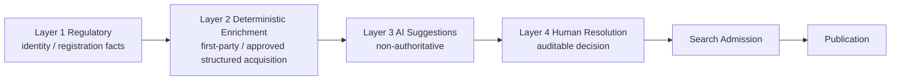
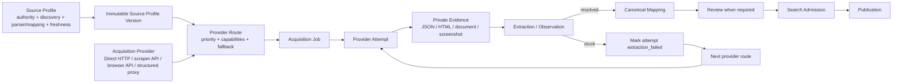
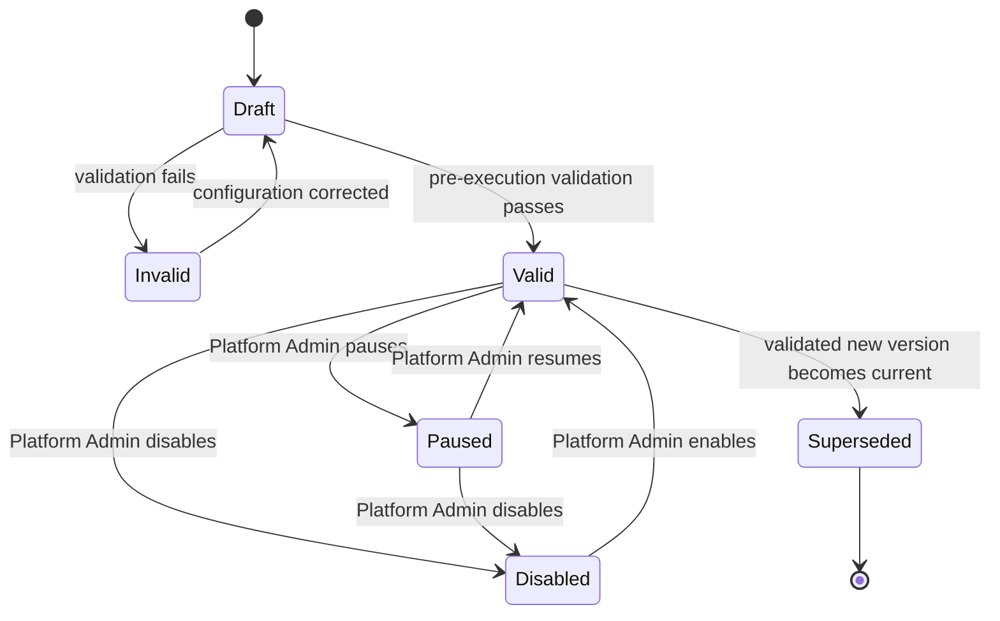
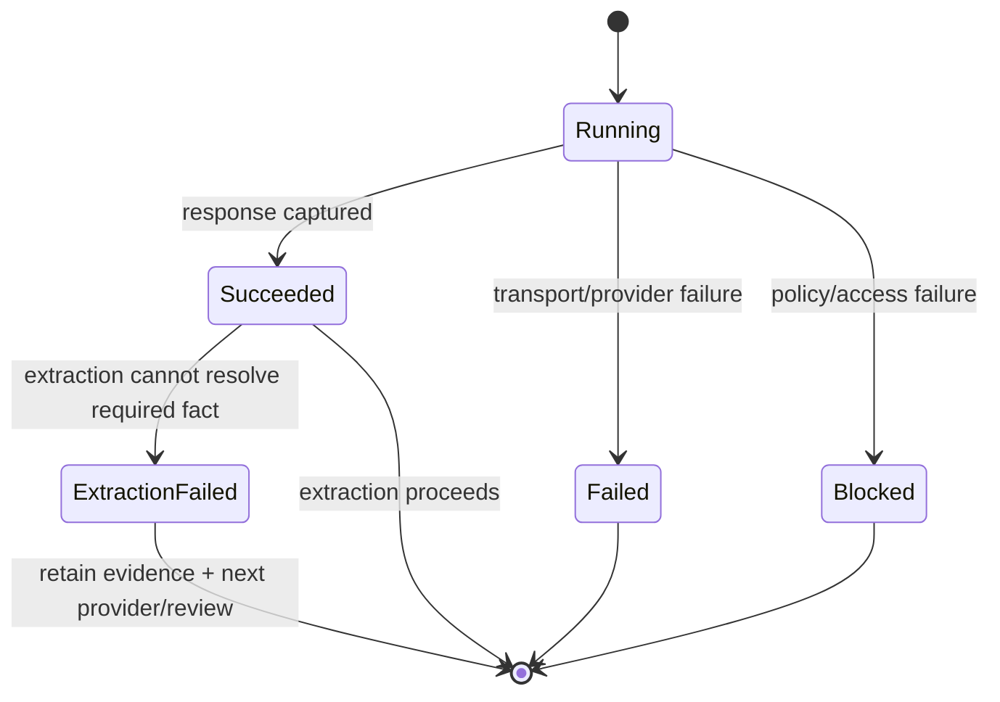

# CourseFinder Data Flow & Feature Atlas v1.0

**Effective:** 23 August 2026  
**Status:** CURRENT — M2.1 LAYER 2 PLATFORM  
**Change Control:** `CF-CHG-20260823-029`  
**Applies to:** frozen M1 AU+NZ substrate plus Layer 2 Platform v1.1

## 1. Layer 1–4 overview

Authority does not increase merely because a later layer successfully acquired data. Layer 2 may enrich Layer 1 identity but must not redefine it.

## 2. Layer 2 control planes

Layer 2 deliberately separates **what source means** from **how it is acquired**.

Provider technology is reusable configuration. Adding another acquisition vendor must not require a provider-specific canonical/source schema.

## 3. Source-configuration lifecycle

Every material source configuration change creates a new immutable profile version. Jobs use the current valid version at dispatch; historical Jobs/Evidence retain their original version reference.

## 4. Acquisition-provider registry

`pipeline.layer2_acquisition_providers` stores non-secret provider metadata:

- provider key/name and adapter class;
- base endpoint;
- auth scheme/field name;
- declared capabilities;
- generic request template;
- timeout/concurrency/rate limits;
- enabled/priority/owner/change-control;
- last runtime health/test metadata;
- a Vault secret reference only, never the credential value in browser reads.

Generic adapter classes are `direct_http`, `scraper_api`, `browser_api`, `structured_api_proxy` and `custom`.

The provider request/capability configuration rejects secret-like object keys. API keys/tokens/passwords must use the dedicated write-only Vault credential control.

## 5. Provider routing and fallback

`pipeline.layer2_profile_provider_routes` links a source profile to one or more acquisition providers with:

- priority;
- enabled state;
- required capabilities;
- non-secret request overrides;
- Evidence policy;
- fallback reasons;
- Change Control reference.

The initial substrate routes Direct HTTP first for all five source profiles and Scrape.do second for web/search profiles where JavaScript/anti-bot capability may be useful. Scrape.do remains ineligible at runtime until its credential is configured.

Fallback reasons include `blocked`, `timeout`, `403`, `429`, `5xx` and `extraction_failed`. The runtime honours the route policy rather than blindly cycling every provider.

## 6. Provider attempt → Evidence lifecycle

`pipeline.layer2_provider_attempts` records Job, source-profile version, acquisition provider, attempt number, request URL, HTTP/MIME, Evidence IDs, extraction state, blocker, metrics and timestamps.

Raw JSON, HTML, documents and image/screenshot output are stored in the existing private `evidence` bucket and represented by `pipeline.evidence_artifacts`. A screenshot is only claimed if the configured provider actually returns screenshot/image output.

## 7. Runtime security boundary

`layer2-acquire` is JWT protected and requires Pipeline Operator rank 4 or higher. It is not a generic proxy:

1. source profile must be current, valid, enabled and unpaused;
2. acquisition target must be HTTP(S);
3. target host must match a governed discovery/base/URL-pattern host on that source profile;
4. provider must be enabled, capability-compatible and credential-ready when authentication is required;
5. provider credential is obtained only through a service-role-only runtime RPC backed by Supabase Vault;
6. every successful response is persisted as private Evidence before being returned as acquisition success;
7. acquisition payload/result explicitly records `canonical_mutation_authorised=false`.

## 8. Admin screens

### Layer 2 Config

Use for source authority/configuration/version governance:

- source/profile identity;
- acquisition method and target entity;
- discovery/URL patterns;
- deterministic parser/mapping/stable identifier strategy;
- CRICOS/NZQA extraction rules;
- evidence/freshness/schedule;
- immutable history/diff;
- source health/pause/disable.

### L2 Providers

Use for acquisition technology and routing:

- Direct HTTP / scraper / browser / API providers;
- endpoint and generic request template;
- credential configured/missing state;
- write-only Vault credential rotation for Platform Admin;
- declared capabilities;
- per-source ordered routing/fallback;
- bounded acquisition and resulting Job/Evidence IDs.

Related operational screens remain Pipeline Ops → Jobs/Sources, Evidence, Review Queue and Completeness.

## 9. Role/access model

| Capability | Minimum role |
|---|---|
| View source/provider configuration, routes and traceability | Pipeline Operator, rank 4 |
| Run bounded acquisition | Pipeline Operator, rank 4 |
| Create validated immutable source profile version | PIM Admin, rank 5 |
| Configure source→provider routing | PIM Admin, rank 5 |
| Add/edit acquisition provider or set/rotate provider credential | Platform Admin, rank 6 |
| Validate/pause/resume/enable/disable source profile | Platform Admin, rank 6 |
| Execute privileged mutation/runtime RPC directly | Browser never; service role only |

Reads use `Supabase Auth → public.admin_read → server rank check`. Provider mutations use `layer2-provider-control → service-role-only layer2_provider_control`. Acquisition uses `layer2-acquire → source/profile/routing checks → private Evidence`.

## 10. Normal workflow

1. Identify an approved `pipeline.sources` source.
2. Configure/version the source in **Layer 2 Config**.
3. Configure one or more reusable acquisition providers in **L2 Providers**.
4. Put provider API credentials only into the Vault credential control.
5. Route provider(s) to the source with explicit priority/capability/fallback semantics.
6. Dispatch acquisition only from a valid/enabled/unpaused source profile.
7. Create a versioned Job and a provider-attempt record.
8. Capture provider response into private Evidence.
9. Extract observations/facts.
10. If extraction is unresolved, retain Evidence, mark `extraction_failed` and request the next configured provider or Review.
11. Map against existing canonical identity; ambiguity goes to Review.
12. Search Admission and Publication remain separate gates.

## 11. Exception workflows

### Credential missing

Provider is skipped. Platform Admin must configure/rotate the credential through the write-only Vault control. Do not add credentials to source/profile/provider JSON.

### Transport blocked / timeout / 403 / 429 / 5xx

Record the provider attempt and blocker/Evidence where available. Follow that route’s configured fallback policy.

### Extraction failed

Content acquisition succeeded but downstream extraction cannot establish the required fact. Preserve original Evidence, record `extraction_failed`, and request the next provider route where configured. Do not force/invent a value.

### Source-null

Only record source-null when successfully acquired authoritative content proves the source omitted the field. An inaccessible/blocked source is not source-null.

### Screenshot requirement

Use a provider that explicitly declares screenshot/image capability and whose request template returns image content. The Evidence policy cannot manufacture capability that the provider does not have.

## 12. Do / Don't

**Do:** keep source semantics separate from acquisition vendor; version source profiles; configure providers generically; use Vault for secrets; make fallback explicit; retain every relevant attempt’s Evidence; bind runtime targets to source allowlists; route unresolved extraction to provider fallback/review.

**Don't:** put credentials in JSON; expose Vault secret IDs/values to the browser; turn the acquisition endpoint into an arbitrary proxy; add provider-specific canonical schema; discard failed-attempt Evidence; let acquisition mutate canonical/Search/publication; overwrite Layer 1 identity.

## 13. Search/publication consequence

A valid source profile, healthy provider, successful acquisition or Evidence artifact is only an upstream operational state. No provider response directly authorises canonical mutation, Search admission or publication.

## 14. Troubleshooting

- **Source invalid/paused/disabled:** correct source profile state before acquisition.
- **Credential missing:** use L2 Providers → provider → Set/rotate API credential.
- **Required capability missing:** correct route/provider capability declaration; do not bypass it.
- **Target URL rejected:** create a governed source-profile version with the legitimate host; never bypass host binding.
- **Provider failure:** inspect provider attempt, HTTP/MIME/blocker and captured Evidence; use configured fallback.
- **Extraction failed:** retain Evidence and request next route/review.
- **No Evidence:** do not proceed to canonical mapping.
- **Ambiguous canonical match:** use Review Queue.

Successful acquisition is never canonical mutation authority.