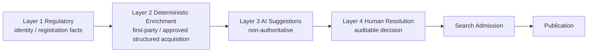
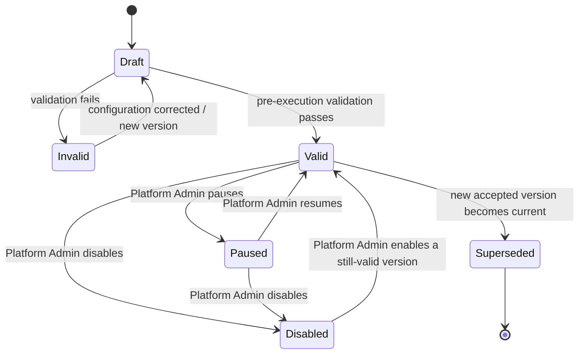
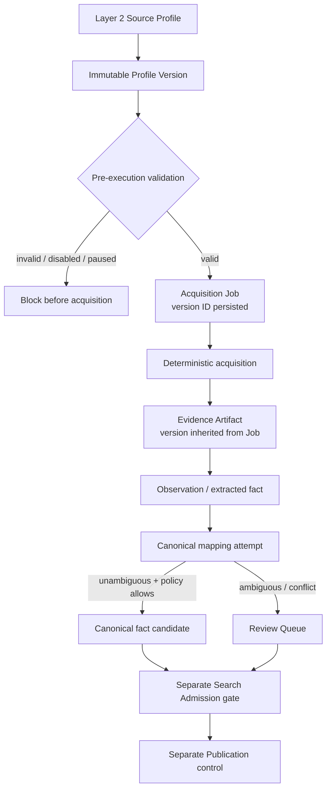

# CourseFinder Data Flow & Feature Atlas v1.0

**Effective:** 23 August 2026  
**Status:** CURRENT — M2.1 LAYER 2 PLATFORM  
**Change Control:** `CF-CHG-20260823-029`  
**Applies to:** frozen M1 AU+NZ substrate plus Layer 2 Platform v1.0

## 1. Layer 1–4 overview



Authority does not increase merely because a later layer successfully acquired data. Layer 2 may enrich Layer 1 identity but must not redefine it.

## 2. Layer 2 source-configuration lifecycle



Every material configuration change creates a new immutable profile version. Jobs use the current valid version at dispatch. Existing Jobs and Evidence retain their original version reference.

## 3. Source → Job → Evidence → Observation flow



Successful discovery or acquisition is not canonical mutation authority. An acquisition worker must first produce Evidence/observations and use the governed mapping/review path.

## 4. Configuration contract

The reusable Layer 2 contract supports, without Provider-specific schema changes:

- Provider websites, catalogues and Course detail pages;
- fee schedules, intake/calendars and English requirements;
- Scholarship catalogues;
- PDF/document sources;
- structured APIs and JSON endpoints;
- CSV/XLSX feeds;
- sitemaps and search/discovery endpoints;
- other explicitly approved deterministic methods.

Governed fields include Provider/source identity, country, authority/trust, domain, acquisition method, base/discovery URL, URL patterns, inclusion/exclusion rules, pagination, non-secret headers, authentication mechanism reference, rate/concurrency/timeout/retry, robots treatment, MIME/payload limits, parser profile, target entity, mapping/stable-ID strategy, CRICOS/NZQA extraction, Evidence requirement, freshness SLA, schedule, content-change policy, inventory, enabled/paused state, owner and Change Control/UAT reference.

Secrets are not configuration fields. Credentials, API tokens, cookies, Authorization values, client secrets and service-role values are rejected by profile validation and remain server-side.

## 5. Deployed configuration screen mock-up

```text
+ Layer 2 Config -------------------------------------------------------------+
| Enrichment Source Configuration                             [Refresh] [X]  |
| Configuration -> Acquisition -> Evidence -> Observation -> ... -> Publish  |
+----------------------------------------------------------------------------+
| Profiles | Valid versions | Healthy | Associated jobs | Evidence artifacts |
+----------------------------------------------------------------------------+
| Search... | Country | Acquisition method | Health                         |
+----------------------------------------------------------------------------+
| Source / profile | Method | Target | v# | Validation | Health | Jobs | Evd |
| RMIT ...         | Detail | Course | v1 | Valid      | ...    | ...  | ... |
| PRISMS ...       | XLSX   | Flow   | v1 | Valid      | ...    | ...  | ... |
| QILT ...         | Doc    | Outcome| v1 | Valid      | ...    | ...  | ... |
+----------------------------------------------------------------------------+
| Click row -> profile detail drawer: safe configuration, history, traceability|
| Platform Admin only: Validate / Pause / Resume / Disable / Enable           |
+----------------------------------------------------------------------------+
```

The console is mounted as an independently versioned governed overlay, consistent with Pipeline Ops/Data Quality/Access Admin, to avoid destabilising the frozen mature PIM shell.

## 6. Role/access model

| Capability | Minimum role |
|---|---|
| View Layer 2 profile list/detail/history/traceability | Pipeline Operator, rank 4 |
| Govern PIM interpretation/mapping downstream | PIM Admin, rank 5, through applicable PIM workflows |
| Validate/pause/resume/enable/disable profile | Platform Admin, rank 6 |
| Execute privileged database control RPC directly | Browser never; `service_role` only |

Reads use `Supabase Auth → public.admin_read → server rank check → security.admin_layer2_config_read`. State controls use `JWT-protected layer2-config-control Edge Function → user context/rank check → service-role-only database control RPC`.

## 7. Field/state semantics

- `valid`: configuration passes safety/completeness validation; it does not mean the source is reachable now.
- `invalid`: pre-execution validation failed; acquisition must not start.
- `healthy`: profile is enabled/unpaused/valid and no stronger operational failure/freshness condition applies.
- `stale`: last successful acquisition is older than the profile freshness SLA.
- `degraded`: latest failure is newer than latest success.
- `paused`: temporary operational hold; no new acquisition should start.
- `disabled`: source/profile intentionally disabled.
- `source_null`: acquisition/evidence proves the authoritative source omitted a field.
- `inaccessible`: acquisition could not obtain authoritative content; do not convert to source-null.
- `not_yet_enriched`: Layer 2 has not yet established the fact.

## 8. Normal workflow

1. Identify an approved source and existing `pipeline.sources` identity.
2. Create/inspect a Layer 2 profile independently of execution.
3. Create a new immutable profile version for configuration change.
4. Validate before execution.
5. Dispatch a Job only from an enabled, unpaused profile with a valid current version.
6. Persist the exact version ID on the Job.
7. Capture Evidence; Evidence inherits/matches the Job version.
8. Extract observations and map against existing canonical identity.
9. Send ambiguity/conflict to Review rather than inventing a match.
10. Admit accepted facts to Search only through their source/domain gate.
11. Publication remains a separate explicit decision.

## 9. Exception workflows

### Source-null
Record an observation that the successful authoritative source did not provide the field. Retain Evidence. Do not substitute another value merely for completeness.

### Inaccessible
Record technical/policy failure on the Job/source health. Do not mark facts source-null because content was not obtained.

### Stale
Keep prior provenance, mark freshness state, schedule/retry acquisition under policy. Do not silently treat stale as current.

### Disabled/paused
Reject new generic Layer 2 Job preparation before acquisition. Existing historical Evidence remains traceable to its profile version.

### Unsafe configuration
Validation rejects unsupported methods/targets, missing discovery location, excessive timeout/concurrency/payload limits, Evidence-disabled profiles and secret-like keys.

## 10. Do / Don't

**Do:** use reusable profile fields; preserve immutable versions; respect robots/policy; capture Evidence; retain exact Job/version links; distinguish source-null from inaccessible; use canonical stable identifiers; route ambiguity to review.

**Don't:** put credentials in profile JSON; hard-code Provider-specific columns; treat acquisition success as canonical approval; overwrite Layer 1 identity; infer CRICOS/NZQA codes; make Search/publication automatic; rewrite historical Job configuration references.

## 11. Search/publication consequence

Layer 2 configuration and acquisition are upstream operational states only. A valid/healthy profile, successful Job or Evidence artifact does not itself admit a fact to Search or publish it. Search admission remains domain/source/UAT governed; Publication remains separately authorised.

## 12. Troubleshooting / related screens

- **Layer 2 Config:** profile validity, status, version, inventory, owner, history.
- **Pipeline Ops → Jobs:** run status, metrics, failures, cursor, Change Control/UAT.
- **Pipeline Ops → Sources:** source health and operational inventory.
- **Evidence:** artifact/source/job provenance and observations.
- **Review Queue:** ambiguity/conflict requiring human resolution.
- **Completeness:** distinguish not-yet-enriched/stale/source-null from other readiness states.
- **Course/Provider/Scholarship detail:** verify downstream canonical fact and Evidence before Search/publication decisions.

For a failed start, first confirm profile `enabled=true`, `paused=false`, current version exists and validation status is `valid`; then inspect source health and latest Job error. Never bypass the validation gate by manually inserting canonical values.