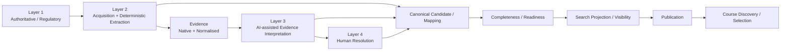
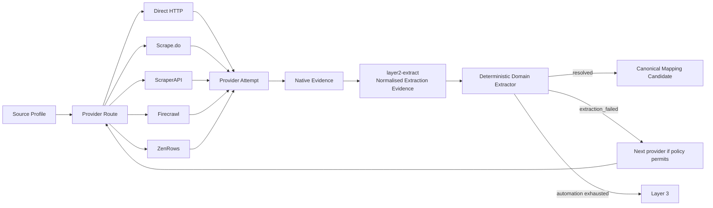
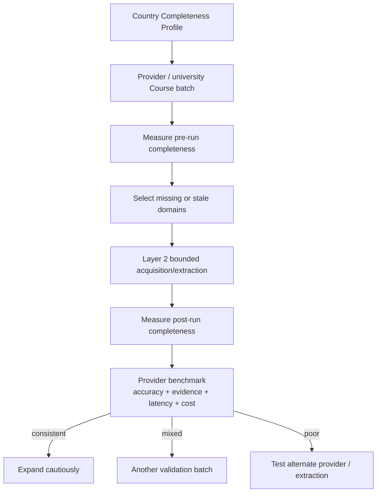
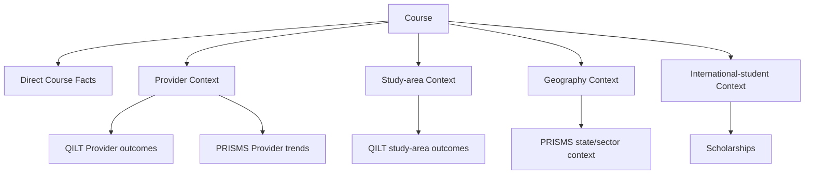

# CourseFinder Data Flow & Feature Atlas v1.1

**Status:** CURRENT M2.1 FLOW ATLAS  
**Date:** 23 August 2026  
**Supersedes:** v1.0  
**Change Controls:** `CF-CHG-20260823-029`, `CF-CHG-20260823-030`

## 1. End-to-end data flow

There is no Layer 5. Search and Publication are product states, not authority layers. CourseFinder does not perform university admissions/application/offer-letter/visa processing.

## 2. Layer 2 provider flow

## 3. Evidence forms

Native provider Evidence may be:

- HTML;
- JSON;
- Markdown;
- PDF/XLSX/ZIP/other approved documents;
- PNG/JPEG screenshot/image;
- other approved structured source formats.

Normalised extraction Evidence is a derived representation only. Native Evidence remains preserved and traceable.

## 4. Country completeness loop

The initial operating default is approximately 10 representative Courses per Provider/university, followed by adaptive expansion based on measured results.

## 5. Course decision projection

Contextual metrics preserve their original grain and reporting period. They are not converted into false Course-level facts.

## 6. Feature-to-menu map

| Operational need | Admin workspace |
|---|---|
| overall L1–L4 health | Data Acquisition → Pipeline Control |
| source authority/freshness | Data Acquisition → Source Registry |
| source discovery/parser/version | Data Acquisition → Layer 2 Source Config |
| scraper/API provider/credential/routing | Data Acquisition → Acquisition Providers |
| actual execution | Data Acquisition → Jobs |
| native/normalised provenance | Data Acquisition → Evidence |
| QILT context | Enrichment & Insights → Outcomes (QILT) |
| PRISMS context | Enrichment & Insights → Student Flow (PRISMS) |
| Course factual/context completeness | Quality & Review → Completeness |
| unresolved terminal decisions | Quality & Review → Review Queue |

## 7. Layer 3 request for better Evidence

Layer 3 may request additional Evidence from Layer 2 by declaring a reason/capability such as:

- dynamic content missing;
- JavaScript rendering required;
- screenshot/image required;
- alternate acquisition provider required;
- current Evidence stale/insufficient.

Layer 3 does not acquire independently.

## 8. Layer 4 terminal path

Layer 4 receives the entire evidence/attempt/candidate package. Its output is a governed human decision or explicit unresolved state. There is no further enrichment authority layer after Layer 4.
