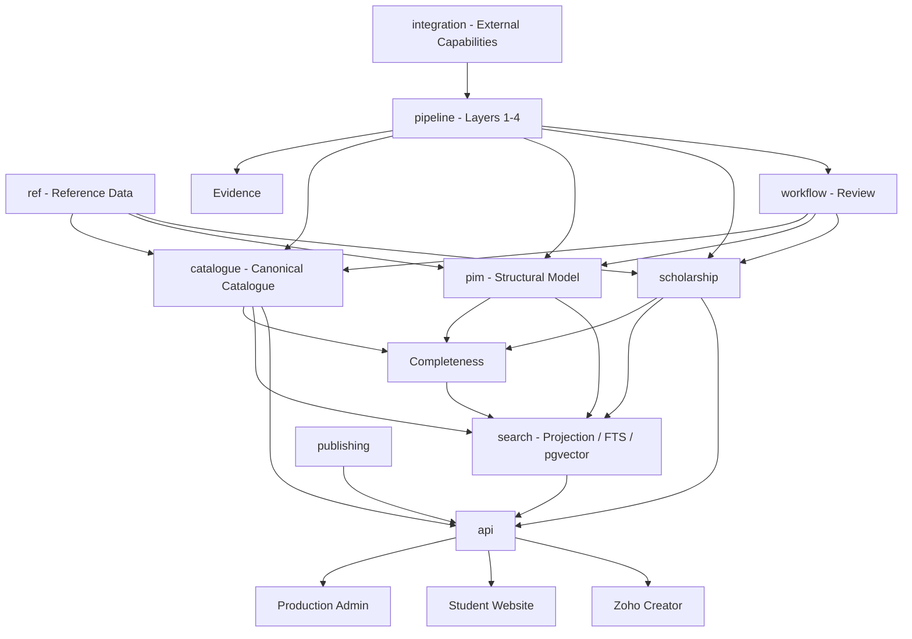
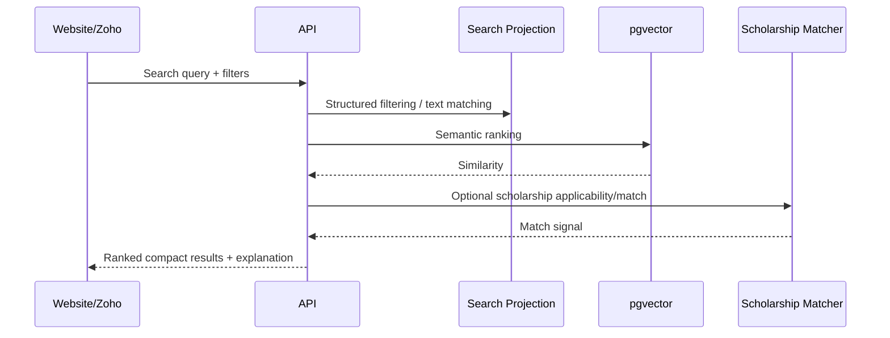
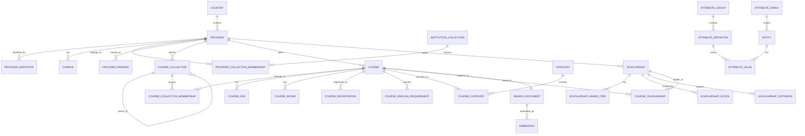

# Coursefinder Database Architecture v2.8.1

**Status:** Target production database architecture for review. No database or application changes are included in this document.

**Target project:** `Coursefinder_Prod`

**Architecture baseline:** v2.8.1

**Companion documents:**
- `docs/coursefinder-architecture-v2.8.1-menu-integration-model.md`
- `docs/coursefinder-architecture-v2.8.1-global-reference-seed-search.md`
- `docs/coursefinder-current-db-assessment-v2.8.1.md`
- `docs/coursefinder-database-architecture-v2.8.1-review-checklist.md`

---

## 1. Purpose

This document defines the complete logical target database architecture for Coursefinder production.

The design supports:

- global provider and course catalogue growth;
- staged country activation from Oceania to the Americas and Europe;
- providers, campuses, provider-defined Course Collections and Courses;
- global course taxonomy and configurable PIM attributes;
- fees, intakes, registrations and English/admission requirements;
- first-class scholarships and deterministic matching;
- institution memberships such as Go8/Russell Group/U15/AAU/LERU;
- rankings as time-series data;
- evidence-backed Layer 1–4 enrichment;
- multiple scraper providers and acquisition policies;
- multiple LLM providers, routers, models and routing policies;
- hybrid structured/full-text/pgvector search;
- controlled publication channels and APIs;
- CSV/XLSX import/export;
- secure role-based administration;
- Zoho CRM/Creator commercial recommendation integration without contaminating canonical PIM data.

The design follows established relational and PIM principles: stable identity, normalised canonical write models, controlled reference data, configurable structural families, hierarchical classifications, explicit relationships, temporal validity, provenance, rebuildable derived projections and deliberate API boundaries.

---

## 2. High-level database principles

### 2.1 Canonical and derived data are separate

Canonical facts include:

- provider identity;
- course identity;
- provider Course Collections;
- registrations;
- fees;
- intakes;
- requirements;
- scholarship facts;
- classifications;
- approved attributes.

Derived data includes:

- completeness scores;
- search projection rows;
- full-text vectors;
- embeddings;
- ranking/quality boosts;
- API aggregation views;
- recommendation scores.

Derived data must be rebuildable from canonical data plus configuration.

### 2.2 Normalise writes; denormalise reads

Canonical tables preserve relational integrity and history.

Search/API projections flatten the most-used fields for fast website/counsellor retrieval.

### 2.3 Identity is never a display name

Every canonical entity uses:

- UUID primary key;
- stable immutable/interchange key;
- external identifiers in separate tables where applicable.

Names remain mutable display data.

### 2.4 Separate data from control metadata

User-visible values such as university name, course title, tuition and IELTS thresholds are distinct from logical fields such as:

- UUIDs;
- foreign keys;
- family IDs;
- category IDs;
- source/evidence IDs;
- publication state;
- completeness profile;
- search profile;
- content hashes;
- validity timestamps;
- pipeline/model policy references.

Both are necessary, but control metadata should not clutter consumer UI.

### 2.5 Structural Family, Course Collection and Category are different

- **Family** = structural shape of an entity.
- **Course Collection** = provider-defined grouping of its own programmes.
- **Category / Field of Study** = Coursefinder-controlled global classification.
- **Institution Collection** = provider membership/association such as Go8.
- **Ranking** = time-series measurement.

### 2.6 Temporal facts remain temporal

Fees, registrations, scholarships, institution memberships, rankings, evidence and selected attributes use explicit validity/academic-year fields where historical interpretation matters.

### 2.7 Provenance is first-class

Any enriched/canonical value may retain:

- source;
- source layer;
- evidence;
- confidence;
- fetched/verified timestamp;
- review state;
- human decision.

### 2.8 Configuration is relational; secrets are not data rows

Scraper and LLM configuration is stored as governed relational metadata.

API keys/secrets stay server-side and are referenced by logical secret names only.

### 2.9 Search is hybrid

pgvector is one component of search, combined with:

- equality/range filters;
- hierarchical categories;
- full-text/trigram search;
- institution collection membership;
- ranking/quality boosts;
- scholarship state;
- completeness/freshness.

### 2.10 Commercial preference remains outside canonical PIM

Customer-specific preferred universities, commissions, direct agreements, branch/customer alignment and campaign priority belong in Zoho CRM/Creator.

Coursefinder returns neutral canonical candidates and relevance features.

### 2.11 Bulk interchange is designed explicitly

CSV/XLSX import/export uses versioned templates, stable keys, staging, validation, preview, commit and audit.

---

## 3. Recommended schema boundaries

| Schema | Purpose | Direct browser exposure |
|---|---|---|
| `ref` | Global reference/controlled vocabularies | No |
| `catalogue` | Providers, campuses, Course Collections, courses, fees, intakes, registrations | No |
| `pim` | Families, groups, attributes, values, categories, completeness | No |
| `scholarship` | Scholarships, awards, scopes, criteria, coverage | No |
| `integration` | Scraper/LLM/regulatory/API capability definitions | No |
| `pipeline` | Sources, policies, jobs, schedules, evidence | No |
| `search` | Search profiles, projections, embeddings, search config | No |
| `publishing` | Channels/locales/publication state | No |
| `workflow` | Reviews, suggestions, import/export staging/jobs | No |
| `security` | Application roles/permissions | No |
| `api` | Approved views/RPC contracts | Yes, explicitly granted/RLS protected |

The `public` schema should contain as little business data as practical.

---

## 4. Logical architecture



---

## 5. Entity registry and generic PIM relationships

Generic PIM relationships should not rely on unvalidated `entity_type + entity_id` pairs.

### `pim.entity_registry`

Key fields:

- `id uuid PK`
- `entity_type`
- `stable_key`
- `family_id nullable`
- `lifecycle_status`
- `created_at`
- `updated_at`

Canonical Provider/Course/Scholarship rows can use the same UUID as their entity registry identity.

This enables FK-safe generic links from:

- attribute values;
- categories;
- publications;
- evidence links;
- review items.

---

## 6. Reference-data model

### 6.1 `ref.regions`

Global hierarchy such as world/region/subregion/intermediate region.

Core fields:

- ID;
- standard code;
- name;
- region type;
- parent ID;
- status/order.

### 6.2 `ref.countries`

Country identity only.

Approximate business/reference fields: 7

- name;
- official name;
- ISO alpha-2;
- ISO alpha-3;
- numeric/M49 code;
- default currency;
- default locale.

Approximate control fields: 9

- ID;
- region/subregion IDs;
- catalogue status;
- student-search enabled;
- provider/course/scholarship ingestion enabled;
- valid from/to;
- updated at.

Regulator URLs and adapter keys are not stored here.

### 6.3 `ref.subdivisions`

States/provinces/territories.

Core fields:

- ID;
- country ID;
- ISO/subdivision code;
- name;
- type;
- parent ID;
- status.

### 6.4 `ref.currencies`

- code PK/business key;
- name;
- symbol;
- decimals;
- status.

### 6.5 `ref.languages`

- code;
- name;
- status.

### 6.6 `ref.study_levels`

Controlled global study-level vocabulary with optional country mappings.

### 6.7 `ref.fields_of_study`

Hierarchical global Coursefinder subject taxonomy.

Core fields:

- ID;
- code;
- name;
- parent ID;
- path;
- depth;
- status.

### 6.8 `ref.english_tests` and components

Supports IELTS/PTE/TOEFL/etc. using controlled test and component codes.

### 6.9 `ref.provider_types`

Controlled provider classification independent of regulator-specific classification.

### 6.10 `ref.institution_collections`

Provider groups/associations such as Go8/Russell Group/U15/AAU/LERU.

### 6.11 `ref.ranking_sources`

Ranking publisher/source definitions, including licensing/redistribution notes.

---

## 7. Provider and campus model

### 7.1 `catalogue.providers`

Approximate consumer-visible/business fields: 20

1. canonical name
2. display name
3. short name/acronym
4. provider type
5. website
6. public description
7. country
8. subdivision/state
9. primary city
10. address
11. postcode
12. latitude
13. longitude
14. phone
15. email
16. logo/media reference
17. established year
18. primary language
19. international-student availability/status
20. public lifecycle/status

Approximate logical/control fields: 18+

- UUID;
- stable key;
- country/provider-type FKs;
- primary campus link;
- family/entity registry link;
- lifecycle/publication state;
- canonical source;
- freshness/completeness state;
- merge/successor references;
- search inclusion state;
- audit timestamps/row version.

### 7.2 `catalogue.provider_identifiers`

Supports CRICOS/TEQSA/NZQA/ROR/future official IDs.

Core fields:

- ID;
- provider ID;
- scheme;
- identifier;
- issuing authority/country;
- primary flag;
- validity;
- source/evidence;
- verified at.

### 7.3 `catalogue.provider_aliases`

Alternate/former/source/localised names.

### 7.4 `catalogue.campuses`

Approximate consumer-visible fields: 13

- campus name/code;
- provider;
- country;
- subdivision;
- city;
- address;
- postcode;
- latitude/longitude;
- phone;
- website;
- status.

### 7.5 `catalogue.provider_registrations`

- provider ID;
- regulatory source/scheme;
- registration code;
- provider classification;
- status;
- validity;
- checked time;
- evidence.

### 7.6 `catalogue.provider_collection_memberships`

Institution Collection membership.

- provider ID;
- institution collection ID;
- status/type;
- valid from/to;
- source/evidence;
- verified at.

### 7.7 `catalogue.provider_rankings`

Approximate display fields: 8

- ranking source;
- year;
- subject/global context;
- exact rank;
- rank band;
- percentile;
- score;
- display label.

Control fields include provider/source/category/evidence/verification IDs and timestamps.

---

## 8. Course Collection model

Provider-defined Course Collections are first-class catalogue entities.

### `catalogue.course_collections`

Approximate consumer-visible fields: 7

- collection name;
- collection code;
- provider name/context;
- parent collection name;
- description;
- source URL;
- public status.

Logical/control fields: approximately 12

- ID;
- stable key;
- provider ID;
- parent collection ID;
- collection type;
- display order;
- valid from/to;
- source/evidence;
- lifecycle/publication;
- timestamps.

### `catalogue.course_collection_memberships`

- collection ID;
- course ID;
- relationship type;
- primary flag;
- display order;
- valid from/to;
- source/evidence.

This supports one course in multiple collections and nested provider verticals.

---

## 9. Course model

### 9.1 `catalogue.courses`

Approximate consumer-visible/core data fields: 32

1. course name/title
2. provider name
3. provider course code
4. country
5. state/subdivision
6. primary campus
7. study level
8. primary Field of Study
9. award/qualification
10. summary
11. description
12. duration
13. duration unit
14. credit points/credits
15. delivery mode
16. study load/attendance
17. current tuition amount
18. currency
19. fee period
20. next/available intakes
21. application deadline(s)
22. English test
23. overall threshold
24. component/subskill threshold(s)
25. academic entry requirement summary
26. majors/specialisations
27. careers/outcomes
28. official course URL
29. application URL
30. regulatory/CRICOS-style code(s)
31. scholarship availability/status
32. scholarship count/headline signal

These values come from the canonical course plus related tables and approved PIM attributes; they are not all physical columns on `courses`.

Approximate logical/control fields supporting each course: 25–30+

- UUID/stable key;
- provider/family/entity registry IDs;
- source/canonical source;
- publication/lifecycle;
- current completeness profile/score/state;
- category relationships;
- Course Collection relationships;
- evidence/freshness;
- search profile/state;
- import row version;
- timestamps;
- merge/successor identity;
- channel eligibility.

### 9.2 `catalogue.course_identifiers`

Supports provider/regulator/external course IDs separately from titles.

### 9.3 `catalogue.course_registrations`

Temporal regulatory programme/course registrations.

### 9.4 `catalogue.course_fees`

One-to-many fee records with academic year/validity, amount range, currency, fee period, international/domestic context where required, campus/offer context and provenance.

### 9.5 `catalogue.course_intakes`

One-to-many intake/term rows with campus, application deadline, status and provenance.

### 9.6 `catalogue.course_english_requirements`

Structured test/component thresholds plus source text/evidence.

### 9.7 `catalogue.course_associations`

Typed course relationships:

- related;
- pathway;
- articulation;
- successor/predecessor;
- nested award;
- specialisation/major relationship where modelled as a course entity.

---

## 10. PIM model

### `pim.attribute_families`

Structural families by entity type.

### `pim.attribute_groups`

Edit-screen/semantic grouping.

### `pim.family_groups`

Family-to-group ordering.

### `pim.attribute_definitions`

Key configuration:

- code/name;
- entity type/group;
- data type/unit;
- validation;
- required/default requirement;
- filterable;
- searchable;
- include in vector;
- localisable;
- channel scoped;
- multivalue;
- publication sensitivity;
- status/order.

### `pim.attribute_options`

Controlled option values.

### `pim.attribute_aliases`

Maps provider/source wording to canonical attributes.

### `pim.attribute_values`

Typed values attached through entity registry.

Recommended uniqueness should support entity + attribute + locale + channel + validity/preferred semantics.

### Categories

Recommended tables:

- `pim.categories`
- `pim.entity_categories`

Global Field of Study may be modelled in `ref.fields_of_study` while broader editorial/marketing/category structures remain in PIM, depending on physical v2.9 design.

### Completeness

Recommended tables:

- `pim.completeness_profiles`
- `pim.completeness_rules`
- `pim.entity_completeness`

Profile selection:

```text
Entity Type + Family + Country/Regime + Channel
```

---

## 11. Scholarship model

### `scholarship.scholarships`

Approximate consumer-visible data fields: 24–30

- scholarship name;
- provider;
- type;
- description;
- academic year;
- award type;
- award amount/percentage/range;
- currency;
- award period;
- application mode;
- application URL;
- deadline/date text;
- renewable status/conditions;
- international eligibility signal;
- active/publication status;
- validity;
- headline eligibility summary;
- source URL;
- last verified;
- next review.

### `scholarship.award_tiers`

Multiple award bands/levels.

### `scholarship.scopes`

Machine-addressable scope targets should support explicit FK references where possible:

- provider;
- Course Collection;
- global category/Field of Study;
- study level;
- campus;
- specific course;
- provider-wide/all courses.

### `scholarship.criteria`

Structured student eligibility criteria with metric, operator, typed value, mandatory flag, criteria grouping, original source text, confidence and evidence.

### `scholarship.course_links`

Explicit course-scholarship relationships for dedicated/verified/specific mappings.

### `scholarship.coverage`

Tracks:

- available;
- verified none;
- unknown;
- needs review.

`verified_none` is known data, not missing data.

---

## 12. Integration and pipeline model

### 12.1 `integration.scraper_profiles`

Defines scraper/browser/API acquisition capabilities.

### 12.2 `integration.llm_providers`

Direct LLM provider definitions.

### 12.3 `integration.llm_routers`

Aggregator/gateway/router definitions.

### 12.4 `integration.model_profiles`

Logical model configuration for extraction/classification/normalisation/embedding.

### 12.5 `integration.regulatory_sources`

Official/regulatory source definitions separate from country reference.

### 12.6 Layer 2 policies

Recommended tables/concepts:

- `pipeline.acquisition_policies`
- policy targets/overrides;
- scraper priority/fallback rules.

Inheritance:

```text
Global -> Country -> Provider -> URL/Collection exception
```

### 12.7 Layer 3 policies

Recommended concepts:

- extraction profiles;
- prompt/schema versions;
- routing policies;
- model fallback rules;
- confidence thresholds;
- cost/retry rules.

### 12.8 Jobs

`pipeline.jobs` should record:

- layer/job kind;
- source;
- scraper/model/routing profile/version;
- target scope;
- idempotency key;
- parent/retry lineage;
- counters;
- cost/usage;
- start/end/status/error;
- evidence/review outcomes.

### 12.9 Evidence

Recommended separation:

- `pipeline.evidence_artifacts`
- `pipeline.entity_evidence`

Evidence artefacts retain URL/content hashes/storage path/type/size/fetched time/supersession and metadata.

### 12.10 Schedules

`pipeline.schedules` links recurring work to policy/job definitions rather than embedding schedules into integration secrets/config.

---

## 13. Workflow model

### Review

- `workflow.review_queue`
- `workflow.review_actions`

### External suggestions

- `workflow.catalogue_suggestions`

### Import/export

- `workflow.import_jobs`
- `workflow.import_files`
- `workflow.import_rows`
- `workflow.import_errors`
- `workflow.mapping_profiles`
- `workflow.export_jobs`
- `workflow.export_profiles`

Imports never write directly from uploaded CSV/XLSX into canonical tables without validation/staging.

---

## 14. Import/export design

### 14.1 Stable interchange keys

Use stable codes/keys such as:

- country code;
- provider stable key;
- course stable key;
- collection stable key;
- category/field code;
- study-level code;
- scholarship stable key.

UUIDs can be exported for technical use but should not be required from ordinary spreadsheet users.

### 14.2 Course workbook example

Sheets:

- Providers
- Campuses
- CourseCollections
- CourseCollectionMemberships
- Courses
- CourseRegistrations
- CourseFees
- CourseIntakes
- CourseEnglishRequirements
- CourseCategories
- CourseAttributes
- Scholarships
- ScholarshipScopes
- ScholarshipCriteria

### 14.3 Import flow


Validation should detect:

- unknown reference codes;
- duplicate stable keys;
- unresolved provider/course relationships;
- invalid date/currency/type values;
- missing required Family fields;
- conflicts with canonical values;
- unauthorised columns/actions.

### 14.4 Export design

Export profiles define:

- entity/view;
- fields;
- filter set;
- locale/channel;
- format;
- relation flattening rules;
- template version.

Support CSV and XLSX for operational/business use.

---

## 15. Search architecture

### 15.1 Search is derived

Do not store the production embedding directly as the only search state on the canonical Course row.

Recommended tables:

- `search.search_profiles`
- `search.search_documents`
- `search.embeddings`
- `search.ranking_rules`
- `search.projection_jobs` or job linkage through pipeline.

### 15.2 Search document

The search document is a denormalised read model containing deterministic filter fields plus governed semantic text.

Key structured fields include:

- course/provider IDs;
- country/subdivision/campus;
- family;
- study level;
- Field of Study/category IDs;
- Course Collection IDs;
- delivery mode;
- fee/currency;
- duration;
- intakes;
- English thresholds;
- Institution Collection codes;
- ranking features;
- scholarship status/count;
- completeness/freshness;
- channel/publication status.

### 15.3 Embedding row

Each embedding records:

- search document/entity ID;
- Search Profile/version;
- embedding Model Profile/version;
- dimensions;
- content hash;
- vector;
- generated timestamp;
- active/stale state.

### 15.4 ANN indexing

Use an approved pgvector ANN index such as HNSW/IVFFlat based on tested production dimensions/query patterns. Exact choice belongs in physical v2.9/performance testing.

The current project has embeddings but no suitable ANN index on the course vector; production must correct this.

### 15.5 Search flow



---

## 16. Publishing and API model

### `publishing.channels`

Initial channels:

- internal PIM;
- counsellor/Zoho;
- student/public search;
- API.

### `publishing.entity_publications`

Tracks per-entity/channel publication state, completeness eligibility, scheduled publication and reason/state.

### `api` schema

Contains deliberate consumer contracts only.

Examples:

- provider catalogue views;
- course detail views;
- course-search RPC;
- scholarship catalogue/matcher RPC;
- reference-data views;
- export APIs;
- authenticated admin RPCs where required.

Internal tables should not be casually exposed to `anon`/browser clients.

---

## 17. Security/RBAC principles

### Roles

Initial application roles:

- `platform_admin`
- `pim_admin`
- `pipeline_operator`
- `curator`
- `counsellor`
- `viewer`

### Principles

- menu visibility does not grant permission;
- RLS/RPC server-side authorisation is authoritative;
- internal schemas remain non-exposed where practical;
- service-role/secret keys are never browser-exposed;
- user-editable metadata is not used for authorisation;
- privileged functions are minimised and explicitly secured;
- public website access occurs through approved `api` contracts.

---

## 18. Main relationship diagram



---

## 19. API/data-flow scenarios

### 19.1 Student website search

```text
Website query
→ API parses structured constraints
→ Search Projection filters candidates
→ FTS/trigram resolves text names/phrases
→ pgvector ranks semantic subject/intent
→ ranking/group/completeness boosts applied
→ scholarship applicability resolved if requested
→ compact explainable result returned
```

### 19.2 Counsellor recommendation with Zoho

```text
Student profile / counsellor query
→ Coursefinder returns neutral academically relevant candidates
→ Zoho CRM supplies customer agreement/commission/preference context
→ Zoho Creator applies open/preferred_first/restricted policy
→ final counsellor ranking shown
```

### 19.3 Provider ingestion

```text
Regulatory seed
→ canonical Provider/identifiers
→ Layer 2 discovers provider pages and Course Collections
→ evidence captured
→ Layer 3 maps/extracts global attributes/categories
→ uncertain values enter Layer 4
→ approved canonical data updated
→ completeness/search projection marked stale/rebuilt
```

### 19.4 Scholarship ingestion

```text
Provider scholarship source
→ evidence
→ Layer 3 structured scholarship candidate
→ scopes/criteria extracted
→ ambiguous rules reviewed
→ scholarship published
→ coverage/matcher/search signals rebuilt
```

### 19.5 Excel course import

```text
User uploads workbook
→ version/template detected
→ stable keys mapped
→ rows staged
→ validation/error report
→ preview
→ authorised commit
→ audit history
→ derived completeness/search rebuild
```

---

## 20. Production seed categories

Initial production seed should include globally:

- regions/subregions;
- countries;
- currencies;
- languages;
- study levels;
- delivery/study-load values;
- English tests/components;
- provider types;
- global Field of Study taxonomy;
- Institution Collection definitions;
- ranking-source definitions/placeholders;
- scholarship types/metric definitions;
- publication/lifecycle states;
- application roles/permissions;
- initial Families/Groups/core Attributes;
- initial Channels;
- initial Search Profiles disabled until embedding configuration is approved.

Destination-specific canonical providers and regulator IDs are loaded separately from official sources.

---

## 21. Current-to-target migration principles

From `coursefinder-demo`:

### Migrate validated canonical data

- providers;
- courses;
- registrations;
- fees;
- intakes;
- selected PIM definitions/aliases;
- scholarships/tiers/scopes/criteria/coverage;
- useful evidence metadata;
- review/audit history where valuable.

### Transform/map

- country reference;
- free-text Field of Study;
- provider/course identity keys;
- generic PIM relationships;
- regulator/source references;
- scholarship transitional columns.

### Add through new enrichment/mapping

- Course Collections;
- campuses where absent;
- global categories;
- provider external ID crosswalks;
- Institution Collection memberships;
- rankings where permitted;
- completeness profiles.

### Rebuild, do not migrate blindly

- completeness scores/views;
- search projection;
- embeddings;
- vector indexes;
- API views;
- catalogue stats.

---

## 22. v2.8.1 architecture decisions

1. Build `Coursefinder_Prod` cleanly rather than clone the demo project.
2. Use dedicated schemas with `api` as the deliberate consumer boundary.
3. Seed global reference data from day one.
4. Use stable UUID + interchange key + external identifiers.
5. Treat Course Collections as first-class provider-defined entities.
6. Keep Course Families structural and global Categories semantic/classification-oriented.
7. Keep Institution Collections separate from Course Collections.
8. Keep Rankings as temporal facts.
9. Preserve first-class scholarships/scopes/criteria/coverage.
10. Use relational multi-scraper/multi-LLM configuration.
11. Keep secrets outside browser-readable data.
12. Use profile-driven completeness.
13. Use derived versioned Search Projections and embeddings.
14. Use hybrid indexed search rather than vector-only retrieval.
15. Keep commercial customer preference in Zoho.
16. Build controlled CSV/XLSX staging/import/export.
17. Enforce RBAC server-side.

---

## 23. Next physical-design stage

After v2.8.1 approval, Database Schema v2.9 should define every physical object:

- schema/table names;
- columns and data types;
- PK/FK/unique/check constraints;
- indexes;
- generated/materialised fields where required;
- RLS/grants;
- API exposure;
- seed rows;
- import/export template columns;
- current-to-target migration mapping;
- migration order;
- performance assumptions and verification tests.

Only after v2.9 sign-off should `Coursefinder_Prod` be created and built.

---

## Appendix A — Relationship to earlier designs

Earlier architecture documents remain in the repository for design history. This document is complete in itself and, together with the other v2.8.1 companion documents listed at the top, forms the authoritative production architecture baseline for the next physical-schema stage.
