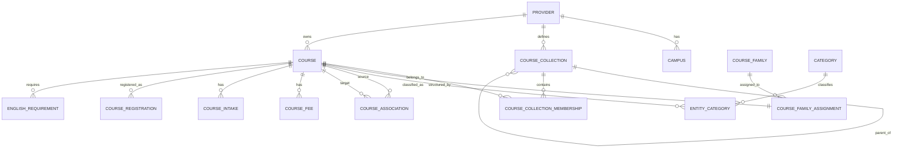
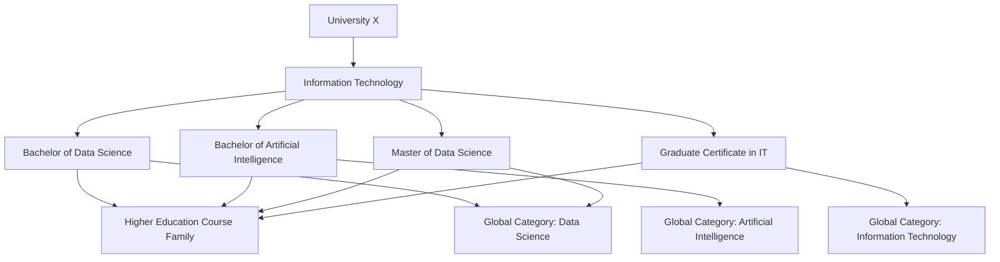
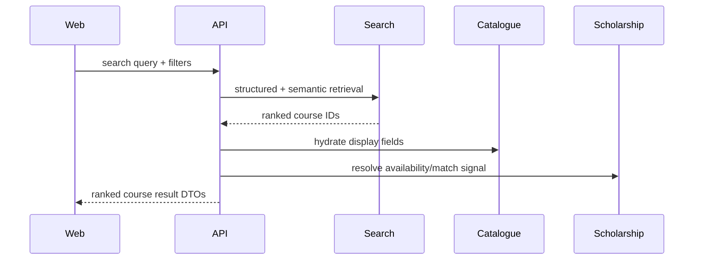
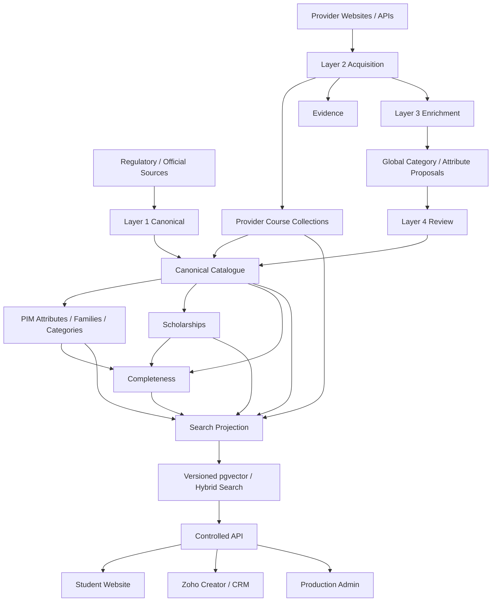

# Coursefinder Database Architecture v2.8.1

**Status:** Target production architecture for review. No database or application changes are included in this version.

**Recommended target project:** `Coursefinder_Prod`

**Supersedes for design review:** `coursefinder-database-architecture-v2.8.md`

**Companion assessment:** `coursefinder-current-db-assessment-v2.8.md`

---

## 1. Purpose

This revision incorporates the additional requirement that universities commonly organise multiple related courses into their own programme verticals or collections, for example an Information Technology collection containing Bachelor, Master, Graduate Certificate, Data Science, AI and Cyber Security courses.

The production design therefore distinguishes four different concepts:

1. **Course Family** — structural schema/type of a course.
2. **University Course Collection** — provider-defined grouping/vertical.
3. **Global Category / Field Taxonomy** — Coursefinder-controlled classification across institutions.
4. **Course Relationship / Association** — pathway, successor, nested award, articulation or related-course relationship.

These concepts must not be collapsed into a single category or family model.

The remainder of the v2.8 architecture remains valid: canonical catalogue data, configurable PIM metadata, reference data, evidence-backed enrichment, first-class scholarships, multi-scraper and multi-LLM integrations, hybrid search, secure API projections, and CSV/Excel interchange.

---

## 2. High-level principles

### 2.1 Canonical facts and provider presentation are both preserved

Coursefinder stores a globally consistent canonical course while preserving how the institution organises and labels that course.

Example:

```text
Provider: University X
University Collection: Information Technology
Course: Master of Data Science
Course Family: Higher Education Course
Study Level: Masters
Global Category: Computing > Data Science
```

The provider's own grouping is useful for navigation and provenance, but it does not replace Coursefinder's global taxonomy.

### 2.2 Structural Family is not a subject hierarchy

A Course Family determines data shape, validation, required groups and completeness rules.

Examples:

- Higher Education Course
- VET / Vocational Course
- ELICOS
- Foundation / Pathway
- Research Program
- Short Course / Microcredential

A university's `Information Technology`, `Business`, `Health`, `Engineering` or `Creative Arts` vertical is not a Course Family unless it genuinely changes the structural schema.

### 2.3 Provider collections are first-class catalogue entities

A provider collection is a durable entity because it can have:

- provider-specific name/code;
- hierarchy;
- source URL;
- description;
- validity;
- one-to-many or many-to-many course membership;
- ordering;
- search relevance;
- independent import/export requirements.

### 2.4 Search remains hybrid

Provider collection information contributes useful semantic context, but deterministic identifiers remain separate from embeddings.

Structured search fields should include:

- provider ID;
- course family ID;
- collection IDs;
- global category IDs;
- study level;
- country/location;
- fees;
- English requirements;
- intake;
- scholarship availability;
- institution collections/rankings.

Semantic projection may include the collection name/path where useful.

---

## 3. Production schema boundaries

```text
ref          Global controlled reference data
catalogue    Providers, campuses, collections, courses and structural facts
pim          Families, groups, attributes, categories and values
scholarship  Scholarships, scopes, criteria and coverage
integration  Scraper/LLM/model/router definitions
pipeline     Sources, policies, jobs, evidence and schedules
search       Search profiles, projections and embeddings
publishing   Channels, locales and publication state
workflow     Reviews, suggestions, imports and exports
security     Roles and permissions
api          Deliberately exposed views/RPC contracts
```

The `public` schema should contain little or no canonical business data.

---

## 4. Updated core catalogue model



### Relationship interpretation

- **Provider → Course Collection:** a university defines its own collection/vertical.
- **Course Collection → Course Collection:** optional hierarchy, e.g. `Information Technology > Postgraduate`.
- **Course Collection ↔ Course:** many-to-many to allow one course to appear in several provider-defined collections.
- **Course → Family:** one primary structural family.
- **Course ↔ Global Category:** many-to-many controlled taxonomy.
- **Course ↔ Course:** explicit typed association for pathways, successor courses, nested awards and related programmes.

---

## 5. New catalogue tables

### 5.1 `catalogue.course_collections`

Purpose: preserve university/provider-defined course groupings.

**Display/business fields (approximately 8):**

1. collection name
2. collection short name
3. provider collection code
4. description
5. source URL
6. public label
7. status
8. display order

**Logical/relationship fields (approximately 12):**

1. `id`
2. `stable_key`
3. `provider_id`
4. `parent_collection_id`
5. `collection_type_code`
6. `source_id`
7. `evidence_id`
8. `valid_from`
9. `valid_to`
10. `publication_state`
11. `created_at`
12. `updated_at`

Suggested `collection_type_code` values:

- `subject_vertical`
- `faculty_school`
- `award_group`
- `study_level_group`
- `marketing_collection`
- `pathway_group`
- `provider_defined_other`

Do not force every provider collection into a global taxonomy node.

### 5.2 `catalogue.course_collection_memberships`

Purpose: many-to-many membership between courses and provider collections.

Fields:

- `collection_id`
- `course_id`
- `relationship_type`
- `is_primary`
- `display_order`
- `valid_from`
- `valid_to`
- `source_id`
- `evidence_id`
- `verified_at`

Recommended unique constraint:

`(collection_id, course_id, relationship_type)`

### 5.3 `catalogue.course_associations`

Purpose: explicit course-to-course relationship types separate from provider collections.

Fields:

- `source_course_id`
- `target_course_id`
- `association_type`
- `directionality`
- `source_id`
- `evidence_id`
- `valid_from`
- `valid_to`
- `status`

Suggested association types:

- `related`
- `pathway_to`
- `articulates_to`
- `nested_award`
- `exit_award`
- `successor`
- `predecessor`
- `credit_transfer`

---

## 6. Course record model

A Course remains the atomic academic offering returned by search and APIs.

### Consumer-visible course data — approximately 33 fields

1. Course name
2. Provider/university name
3. Provider course code
4. Provider collection/vertical name
5. Country
6. State/province
7. Campus
8. Study level
9. Global field of study
10. Award/qualification
11. Summary
12. Description
13. Duration
14. Duration unit
15. Credits
16. Delivery mode
17. Study load
18. Tuition fee minimum
19. Tuition fee maximum
20. Currency
21. Fee period
22. Academic year
23. Intake dates
24. Application deadline
25. English test
26. Overall English score
27. Minimum sub-score/band
28. Academic entry requirement summary
29. Majors/specialisations summary
30. Careers/outcomes
31. Official course URL
32. Regulatory/registration code
33. Scholarship availability/count

Not every course will populate every field. Completeness Profiles determine which are required for a given family/country/channel.

### Logical/relationship fields — approximately 30+

These normally do not display directly in public UI:

- course UUID
- stable key
- provider UUID
- primary campus ID
- family ID
- global category IDs
- provider collection IDs
- source/evidence IDs
- registration IDs
- completeness profile ID
- publication state
- channel state
- search profile ID
- search-document version
- embedding version/model ID
- source content hash
- canonicalisation state
- merge/successor pointer
- freshness timestamps
- validation state
- current preferred-value state
- created/updated timestamps
- import row version
- job lineage

---

## 7. Course Family, Collection and Category responsibilities

| Concept | Owner | Purpose | Example | Search behaviour |
|---|---|---|---|---|
| Course Family | Coursefinder | Structural schema/completeness | Higher Education Course | determines available/required fields and search profile |
| Course Collection | University/provider | Original programme grouping | Information Technology | structured filter within provider + semantic context |
| Global Category | Coursefinder | Cross-provider taxonomy | Computing > Data Science | primary global browse/filter taxonomy |
| Study Level | Coursefinder reference | Academic level | Masters | exact structured filter |
| Association | Canonical relationship | Course-to-course relationship | pathway_to | relationship traversal, not taxonomy |

### Example



---

## 8. Search and pgvector impact

### 8.1 Search projection

The search document should contain governed text assembled from configured fields.

Example:

```text
Course: Master of Data Science
Provider: University X
Provider Collection: Information Technology
Global Category: Computing > Data Science
Study Level: Masters
Description: ...
Careers: ...
```

### 8.2 Structured metadata

The search projection should also store filterable metadata independently:

```text
provider_id
country_id
subdivision_id
campus_ids
course_family_id
course_collection_ids[]
category_ids[]
study_level_code
fee_min
fee_max
currency_code
ielts_overall
intake_months[]
scholarship_available
institution_collection_ids[]
ranking_band
publication_channel
```

### 8.3 Why collection IDs must remain structured

If a user searches:

> postgraduate IT courses at University X

Coursefinder should be able to resolve:

```text
provider = University X
study level = postgraduate
provider collection/category intent = IT
```

and then use semantic similarity only for ambiguous meaning.

### 8.4 Re-embedding triggers

A course embedding/search document becomes stale when any configured vector-included content changes, including:

- course title/description;
- selected PIM attributes;
- global category labels/path;
- provider collection labels/path when configured;
- search profile version;
- embedding model profile.

Collection membership alone may require search-projection regeneration even when the canonical course row does not change.

---

## 9. Scholarship impact

Provider course collections can be useful in scholarship scope but should not replace global scholarship criteria.

Example provider scholarship:

```text
Provider: University X
Scope: Information Technology collection
Study level: postgraduate
International only: true
```

Recommended scope types therefore include:

- `provider_wide`
- `specific_course`
- `provider_course_collection`
- `global_category`
- `study_level`
- `campus`
- `country_of_student`

The matcher should resolve provider collection membership deterministically before applying student eligibility criteria.

Scholarship prose should still remain separate from course semantic text except for a controlled summary/signal.

---

## 10. Layer 2 acquisition impact

Layer 2 should capture provider-native navigation as evidence where possible.

Discovery output may therefore include:

```text
provider
collection hierarchy
collection source URL
course URL
course membership
provider label
```

Example:

```text
Faculty of IT
  > Information Technology
      > Master of Data Science
      > Master of AI
```

Layer 2 stores the original provider hierarchy without forcing it into the global field taxonomy.

A later deterministic mapping/Layer 3 step can map course content into global categories.

---

## 11. Layer 3 enrichment impact

Layer 3 may use collection context to improve classification.

Example extraction context:

```json
{
  "course_title": "Master of Data Science",
  "provider_collection": "Information Technology",
  "source_breadcrumb": ["Study", "IT", "Postgraduate"],
  "candidate_global_categories": ["DATA_SCIENCE", "COMPUTING"]
}
```

Layer 3 may propose global category mappings, but provider collection membership itself remains evidence-backed provider data.

Low-confidence mapping should route to Layer 4 rather than silently changing taxonomy.

---

## 12. Import/export refinement

### Recommended workbook sheets

```text
Providers
ProviderIdentifiers
Campuses
CourseCollections
CourseCollectionMemberships
Courses
CourseRegistrations
CourseFees
CourseIntakes
CourseEnglish
CourseCategories
CourseAttributes
CourseAssociations
Scholarships
ScholarshipScopes
ScholarshipCriteria
```

### `CourseCollections` import columns

User-facing interchange fields:

- `provider_key`
- `collection_key`
- `parent_collection_key`
- `collection_name`
- `collection_type`
- `description`
- `source_url`
- `status`
- `display_order`

### `CourseCollectionMemberships` import columns

- `provider_key`
- `collection_key`
- `course_key`
- `relationship_type`
- `is_primary`
- `display_order`
- `valid_from`
- `valid_to`

UUIDs should not be required in normal Excel/CSV interchange.

Import flow remains:


---

## 13. API use cases

### 13.1 Provider landing page

Request:

`GET /providers/{provider_key}`

Response logically contains:

```json
{
  "provider": {},
  "collections": [
    {
      "collection_key": "IT",
      "name": "Information Technology",
      "children": [],
      "course_count": 24
    }
  ]
}
```

The website can then render the provider's native course structure without querying PIM internals.

### 13.2 Global course search

Query:

> data science masters in Australia

Flow:



Provider collection is returned as context but global category drives cross-university comparison.

### 13.3 Provider-specific collection search

Query:

> Show postgraduate courses from University X's Information Technology group

Resolved filters:

```text
provider_id = X
course_collection_id = IT_COLLECTION_X
study_level in postgraduate-level codes
```

No vector call is required unless free-text relevance is also requested.

---

## 14. Updated data-flow architecture



---

## 15. Production menu impact

The production Platform Admin menu should include Course Collections under Catalogue:

```text
Catalogue
  Providers
  Campuses
  Course Collections
  Courses
  Scholarships
  Categories
  Associations
```

A Provider detail page may also expose its collections contextually.

The PIM Model menu remains separate because provider Course Collections are canonical catalogue relationships, not PIM families/categories.

---

## 16. Migration impact from current database

The current database has no dedicated Course Collection entity.

Migration should therefore:

1. migrate canonical provider/course records first;
2. not infer provider collections from current `field_of_study` values;
3. discover/import provider collections from official provider navigation/data sources in the new pipeline;
4. preserve global categories separately;
5. regenerate search projections/embeddings after collection/category mapping;
6. avoid treating provider collection labels as permanent global categories.

This reinforces the recommendation to create `Coursefinder_Prod` as a clean schema-first project rather than cloning the current database.

---

## 17. Decisions to approve before v2.9 physical schema

1. Approve `Course Collection` as a first-class canonical catalogue entity.
2. Approve hierarchical provider collections via `parent_collection_id`.
3. Approve many-to-many collection/course membership.
4. Approve Course Family as structural and separate from provider collections.
5. Approve global Coursefinder Categories as separate from provider collections.
6. Approve typed Course Associations for pathways/related/successor structures.
7. Approve provider collection membership as a structured search filter.
8. Approve provider collection labels as optional configured semantic-search context.
9. Approve `provider_course_collection` as a scholarship scope type.
10. Approve two new import/export sheets: `CourseCollections` and `CourseCollectionMemberships`.
11. Approve Course Collections under the production Catalogue menu.

---

## 18. Next step after approval

Prepare **Database Schema v2.9** as the physical production blueprint containing:

- every schema and table;
- every column and datatype;
- PK/FK and unique constraints;
- indexes including hybrid/vector indexes;
- RLS and Data API exposure;
- seed/reference data;
- import staging tables and validation functions;
- search projection schema;
- migration mapping from the current demo database;
- initial migration ordering for `Coursefinder_Prod`.

Only after v2.9 review/sign-off should the `Coursefinder_Prod` Supabase project be created and migration `001` applied.
