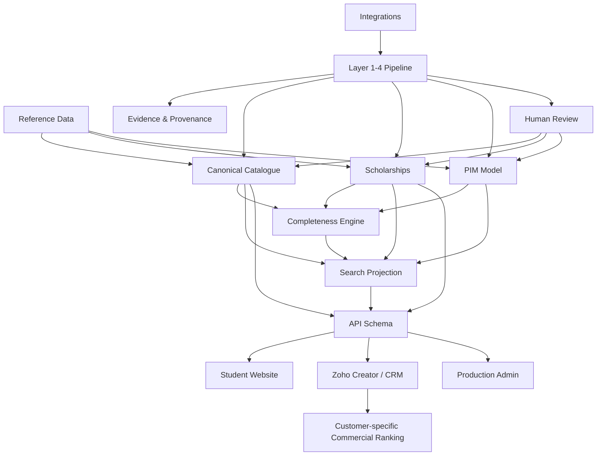
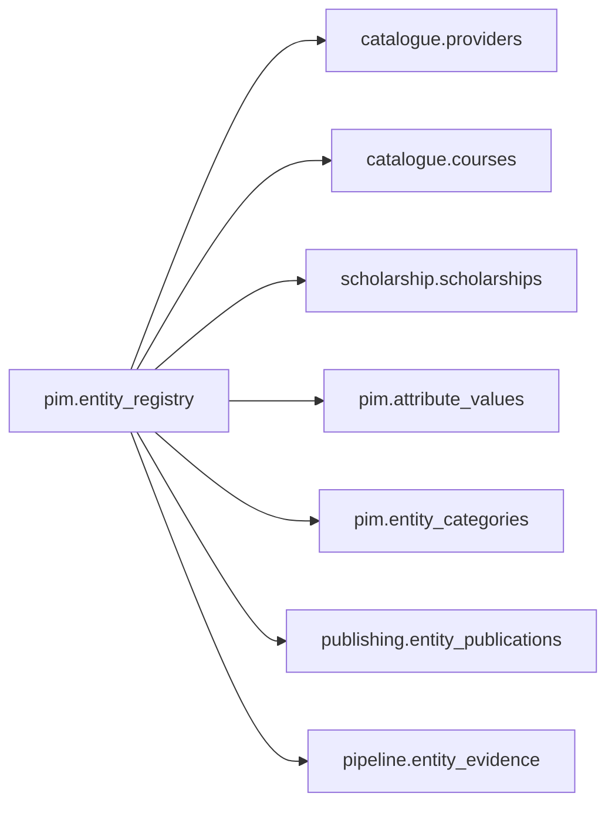
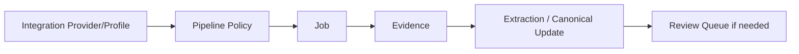
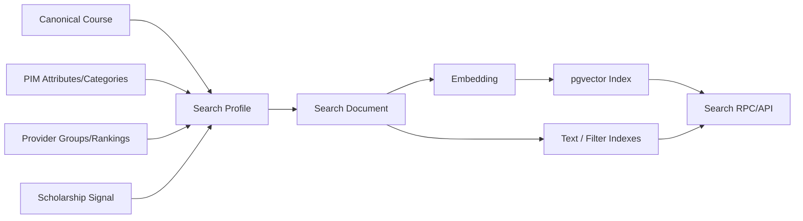
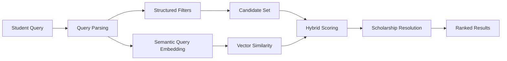
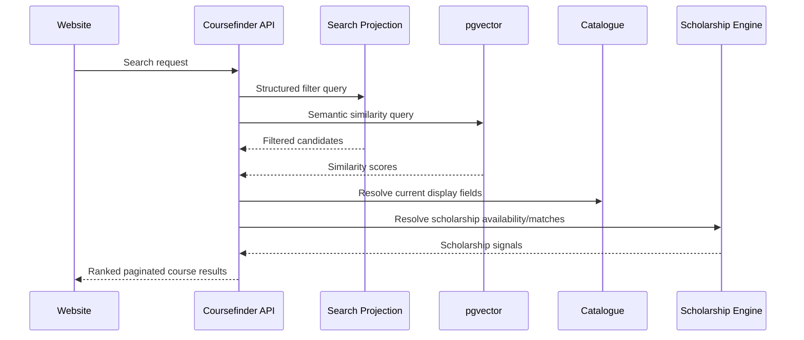
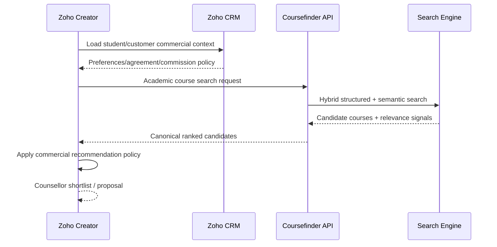
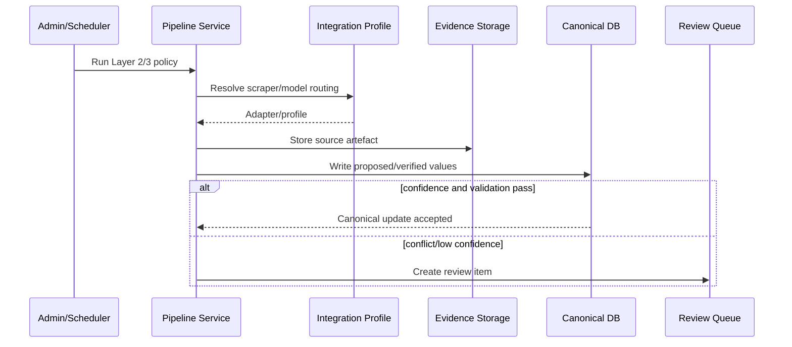
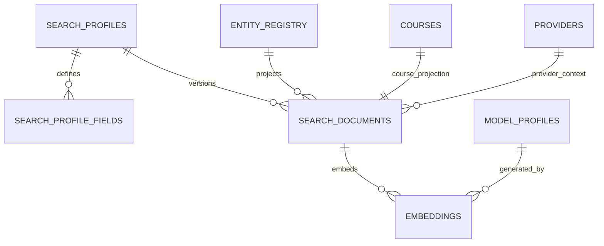

# Coursefinder Database Architecture v2.8

**Status:** Target production design. Architecture only — no database or application changes are included in this version.

**Recommended target project:** `Coursefinder_Prod`

**Companion assessment:** `docs/coursefinder-current-db-assessment-v2.8.md`

---

# 1. Purpose

This document defines the target production database architecture for Coursefinder before creation of the new Supabase production project.

The design is intended to support:

- global education catalogue growth from Oceania to the Americas and Europe;
- providers/universities, campuses, courses, fees, intakes, English requirements and registrations;
- scholarships and deterministic scholarship matching;
- mature PIM principles: families, groups, attributes, categories, aliases and completeness;
- evidence-backed Layer 1–4 enrichment;
- multiple scraper providers and acquisition methods;
- multiple LLM providers, aggregators, models and routing policies;
- fast public/counsellor search using structured filters plus pgvector;
- global institution groups such as Go8/Russell Group/U15/AAU/LERU;
- rankings as a separate time-series dimension;
- Zoho CRM/Creator as the commercial preference and counsellor orchestration layer;
- secure APIs and publication channels;
- reliable CSV/Excel import/export;
- future migration, audit and interoperability requirements.

This is not a copy of any third-party backend schema. The design applies established PIM and relational-database principles: canonical entities, controlled reference data, separate classification, configurable attributes, explicit relationships, provenance, versioning and derived read/search projections.

---

# 2. High-level database principles

## 2.1 Canonical data is separate from derived data

Canonical provider, course and scholarship facts are authoritative PIM/catalogue records.

Derived data includes:

- completeness scores;
- public search projections;
- embeddings;
- ranking boosts;
- recommendation scores;
- API aggregation views.

Derived data must always be rebuildable from canonical data and configuration.

---

## 2.2 Normalise write models; denormalise read models

The canonical database should favour relational integrity and repeatable history.

Example:

- one `courses` row;
- many fee rows;
- many intake rows;
- many registration rows;
- many categories;
- many scholarship relationships.

The website should **not** join all of those tables for every search request. A separate search/API projection supplies the flattened read model.

---

## 2.3 Display data and logical data are different

A user sees:

- University of Melbourne;
- Australia;
- Master of Data Science;
- AUD 56,000;
- IELTS 6.5;
- February / July intakes.

The database also needs non-display fields such as:

- UUIDs;
- foreign keys;
- family IDs;
- category IDs;
- source IDs;
- evidence IDs;
- completeness-profile IDs;
- search-profile IDs;
- content hashes;
- publication state;
- valid-from / valid-to;
- ranking-source IDs;
- integration-policy IDs;
- job lineage;
- embedding model/profile IDs.

These fields are essential to connect and assess records but generally should not appear in normal user interfaces.

---

## 2.4 Stable internal IDs plus stable interchange keys

Every canonical entity receives:

1. UUID primary key for internal relational use;
2. stable human/system interchange key such as `AU-MELBOURNE-UNIVERSITY` or generated immutable key;
3. external identifiers stored separately.

Names are display data, not primary identity.

---

## 2.5 Reference data is global from day one

The database should seed global geography and common controlled vocabularies even when only Oceania is operationally active.

Use:

- ISO 3166 country/subdivision codes;
- UN M49 region/subregion structure;
- ISO currency codes;
- controlled study-level codes;
- controlled field-of-study hierarchy;
- controlled English-test codes;
- controlled provider types;
- controlled institution collection types;
- ranking source definitions.

References:

- https://www.iso.org/iso-3166-country-codes.html
- https://unstats.un.org/unsd/methodology/m49/

---

## 2.6 Separate taxonomy, structural family and membership

Do not use a single generic category concept for everything.

- **Family** = what structural fields are expected on an entity.
- **Category** = hierarchical subject/classification used for navigation/filtering.
- **Institution Collection** = membership such as Group of Eight or Russell Group.
- **Ranking** = time-series measurement by a ranking source.
- **Attribute** = reusable business fact/field.

These are different relational concepts.

---

## 2.7 Temporal data is explicit

Fees, rankings, registrations, memberships, scholarships and evidence can change.

Use `valid_from`, `valid_to`, academic year and verification timestamps rather than overwriting history whenever historical interpretation matters.

---

## 2.8 Evidence and provenance are first-class

Any field generated or verified by Layers 1–4 can retain:

- source;
- source layer;
- evidence artifact;
- confidence;
- fetched/verified time;
- review status;
- human decision.

The system should be able to answer:

> Where did this value come from, when was it checked, and why is it currently preferred?

---

## 2.9 Configuration is data, secrets are not

Scraper, LLM and routing configuration should be relational/configurable.

Secrets remain in Supabase Edge Function secrets/Vault-equivalent secret storage and are referenced only by a logical secret key.

No API key should be stored in a browser-readable configuration row.

---

## 2.10 Search is hybrid

pgvector is a semantic ranking component, not the only search mechanism.

Production search combines:

- exact filters;
- range filters;
- categories;
- full-text/trigram where appropriate;
- institution collections;
- rankings;
- pgvector similarity;
- completeness/freshness;
- scholarship availability;
- customer commercial reranking outside the PIM when applicable.

---

## 2.11 Commercial preference remains outside canonical PIM

Customer-specific data such as:

- preferred universities;
- commission;
- direct agreements;
- branch/customer alignment;
- commercial campaign priority;

belongs in Zoho CRM/Creator.

Coursefinder returns canonical candidate courses and relevance signals. Zoho applies customer-specific business ranking rules.

---

## 2.12 APIs are deliberate contracts

Do not expose internal tables directly as the public product API.

Use an `api` schema containing approved:

- views;
- RPC functions;
- search endpoints;
- export endpoints.

Internal schemas remain non-exposed wherever possible.

Supabase relationship APIs can infer nested relationships from proper foreign keys, reinforcing the importance of real relational constraints.

Reference: https://supabase.com/docs/guides/database/joins-and-nesting

---

## 2.13 Bulk interchange is designed, not improvised

CSV/Excel import/export is a product capability with:

- template versions;
- stable codes/keys;
- staging;
- validation;
- preview;
- controlled commit;
- row-level errors;
- audit trail;
- reusable export profiles.

---

# 3. Recommended Supabase schema boundaries

The production Postgres database should use explicit logical schemas.

| Schema | Purpose | Exposed to browser/Data API? |
|---|---|---|
| `ref` | Global reference and controlled vocabularies | No direct access; via API views |
| `catalogue` | Providers, campuses, courses, registrations, fees, intakes | No |
| `pim` | Families, groups, attributes, categories, values, completeness | No |
| `scholarship` | Scholarships, awards, scopes, criteria, coverage | No |
| `integration` | Scraper/LLM/provider/model definitions | No |
| `pipeline` | Sources, policies, jobs, evidence, schedules | No |
| `search` | Search profiles, documents, embeddings | No |
| `publishing` | Channels, locale and publication state | No |
| `workflow` | Reviews, suggestions, imports/exports | No |
| `security` | Application roles/permissions | No |
| `api` | Controlled consumer views/RPC contracts | Yes, with RLS/grants |

The `public` schema should contain as little business data as practical.

---

# 4. Logical architecture



---

# 5. Core entity registry

To support generic PIM values/categories/evidence without orphaned polymorphic IDs, use a lightweight entity registry.

## `pim.entity_registry`

Key fields:

- `id uuid PK`
- `entity_type`
- `stable_key`
- `family_id`
- `lifecycle_status`
- `created_at`
- `updated_at`

Canonical tables use the same UUID as their entity ID.

Example:



This allows generic relationships to retain actual foreign-key integrity.

---

# 6. Reference data design

## 6.1 `ref.countries`

Purpose: global country identity only.

Suggested fields:

**Display/business data (6):**

1. `name`
2. `official_name`
3. `iso_alpha2`
4. `iso_alpha3`
5. `iso_numeric`
6. `default_currency_code`

**Logical/control fields (8):**

1. `id`
2. `m49_region_id`
3. `m49_subregion_id`
4. `catalogue_status` (`seed_only`, `active`, `paused`)
5. `default_locale`
6. `valid_from`
7. `valid_to`
8. `updated_at`

Regulator URLs and ingestion adapters do **not** belong here.

---

## 6.2 `ref.regions`

Represents UN M49 hierarchy.

Fields:

- `id`
- `m49_code`
- `name`
- `region_type` (`world`, `region`, `subregion`, `intermediate_region`)
- `parent_id`
- `display_order`
- `status`

---

## 6.3 `ref.subdivisions`

States/provinces/territories.

Display fields:

- subdivision name;
- ISO subdivision code;
- subdivision type.

Logical fields:

- ID;
- country ID;
- parent subdivision;
- status;
- validity.

This supports `AU-VIC`, `US-CA`, `CA-ON`, etc.

---

## 6.4 Other reference tables

Recommended seed tables:

- `ref.currencies`
- `ref.languages`
- `ref.study_levels`
- `ref.fields_of_study`
- `ref.english_tests`
- `ref.provider_types`
- `ref.institution_collections`
- `ref.ranking_sources`

### `ref.fields_of_study`

Hierarchical global taxonomy:

- `id`
- `code`
- `name`
- `parent_id`
- `path`
- `level`
- `status`

Course source labels can map to one or more controlled fields without destroying the original wording.

### `ref.institution_collections`

Examples:

- `GO8_AU`
- `RUSSELL_GROUP_UK`
- `U15_CA`
- `AAU_NA`
- `LERU_EU`

Fields:

- `id`
- `code`
- `name`
- `collection_type`
- `country_or_region_scope`
- `website`
- `description`
- `status`

Membership itself lives in the catalogue schema with temporal validity.

---

# 7. Provider/university design

## 7.1 `catalogue.providers`

Canonical institution record.

### Consumer-visible/business fields — approximately 20

1. canonical name
2. display name
3. short name
4. provider type
5. website
6. description
7. country name/code
8. state/province
9. primary city
10. address
11. postcode
12. latitude
13. longitude
14. phone
15. email
16. logo/media reference
17. established year
18. international-student status/availability
19. primary language
20. public status

Not all of these must be populated at launch; the architecture reserves clear places for them.

### Logical/decision/relationship fields — approximately 18

- `id`
- `stable_key`
- `country_id`
- `provider_type_id`
- `primary_campus_id`
- `family_id`
- `lifecycle_status`
- `publication_default`
- source priority/current canonical source
- current completeness status
- created/updated timestamps
- verification/freshness timestamps
- canonicalisation state
- merge/successor pointer when required
- search inclusion state
- import/export row version

Most membership, identifiers and rankings are not stored as columns on the provider row; they are relationship rows.

---

## 7.2 `catalogue.provider_identifiers`

Maps the canonical provider to external systems.

Fields:

- `id`
- `provider_id`
- `scheme`
- `identifier`
- `country_id`
- `is_primary`
- `valid_from`
- `valid_to`
- `source_id`
- `verified_at`

Examples:

- CRICOS provider code;
- TEQSA identifier;
- NZQA provider number;
- ROR ID;
- future US/Canada/Europe identifiers.

Unique rule: `(scheme, identifier)` where appropriate.

---

## 7.3 `catalogue.provider_aliases`

Tracks alternate and former names.

Fields:

- provider_id;
- alias;
- alias_type;
- locale;
- valid_from/to;
- source.

Useful for search, matching imports and historical identity.

---

## 7.4 `catalogue.campuses`

A provider may have multiple campuses.

Consumer-visible fields — approximately 13:

- campus name;
- provider name;
- campus code;
- country;
- subdivision;
- city;
- address;
- postcode;
- latitude;
- longitude;
- phone;
- website;
- campus status.

Logical fields include IDs, publication, validity and source/evidence references.

---

## 7.5 `catalogue.provider_registrations`

Regulatory identity/history.

Fields:

- provider_id;
- regulator/source ID;
- registration scheme;
- registration code;
- provider classification;
- status;
- valid_from/to;
- checked_at;
- evidence ID.

Country does not hard-code a single regulator; multiple registrations are supported.

---

## 7.6 `catalogue.provider_collection_memberships`

Institution groups such as Go8.

Fields:

- provider_id;
- institution_collection_id;
- membership_type;
- valid_from;
- valid_to;
- status;
- source_id;
- evidence_id;
- verified_at.

This is a deterministic filter, not an arbitrary provider attribute.

---

## 7.7 `catalogue.provider_rankings`

Time-series rankings.

Consumer-visible fields — approximately 8:

- ranking source;
- year;
- overall/subject name;
- rank;
- rank band;
- percentile;
- score;
- display label.

Logical fields include provider ID, source ID, subject taxonomy ID, evidence and verification status.

Ranking licensing/redistribution must be confirmed per source before loading production datasets.

---

# 8. Course design

## 8.1 `catalogue.courses`

A course is the primary programme entity.

The course row stores stable canonical single-value facts. Repeating or temporal facts remain child tables.

### Consumer-visible data across the assembled course record — approximately 32 fields

1. course name/title
2. provider/university name
3. provider course code
4. country
5. state/province
6. campus/location summary
7. study level
8. primary field of study
9. secondary fields/categories
10. award/qualification title
11. course summary
12. description
13. duration value
14. duration unit
15. credit points where applicable
16. delivery mode(s)
17. study load
18. current tuition fee
19. fee currency
20. fee period
21. intake/start dates
22. application deadline(s)
23. English test name
24. English overall requirement
25. English subskill requirement summary
26. academic entry requirement summary
27. majors/specialisations
28. careers/outcomes
29. official course URL
30. official application URL
31. registration/CRICOS code(s)
32. scholarship availability/count

Additional family-specific fields are supplied by the PIM attribute model without adding permanent columns to the base course table.

### Internal logical/decision information — approximately 25–30 fields/relationships

Examples:

- UUID;
- stable course key;
- provider ID;
- entity/family ID;
- lifecycle state;
- publication state;
- canonical source/evidence;
- primary category ID;
- completeness-profile/result references;
- current freshness state;
- search profile/version;
- vector stale state;
- source priority;
- created/updated timestamps;
- merge/successor references;
- relationship to campuses;
- related/pathway course links;
- source-specific aliases;
- channel publication flags.

These support filtering/search/governance but are not normal student-facing fields.

---

## 8.2 Recommended base course columns

Keep the base table relatively small:

- `id`
- `entity_id`
- `stable_key`
- `provider_id`
- `provider_course_code`
- `canonical_title`
- `award_title`
- `study_level_code`
- `primary_field_id`
- `summary`
- `description`
- `duration_value`
- `duration_unit`
- `credit_points`
- `study_load_code`
- `official_url`
- `application_url`
- `lifecycle_status`
- `created_at`
- `updated_at`

Delivery modes, campuses, fees, intakes, requirements and categories are relational where they can repeat.

---

## 8.3 `catalogue.course_registrations`

Fields:

- course ID;
- scheme/register;
- code;
- campus ID when the registration is campus-specific;
- status;
- valid from/to;
- source;
- evidence;
- verified time.

---

## 8.4 `catalogue.course_fees`

Recommended fields:

- `id`
- `course_id`
- `campus_id` nullable
- `academic_year`
- `student_type` (`international`, `domestic`, etc.)
- `fee_type`
- `amount_min`
- `amount_max`
- `currency_code`
- `billing_period`
- `indicative`
- `valid_from`
- `valid_to`
- `source_id`
- `evidence_id`
- `verified_at`

Fee is temporal and should not be a permanent single column on the course.

---

## 8.5 `catalogue.course_intakes`

Recommended fields:

- course ID;
- campus ID;
- intake/start date;
- academic term code;
- application opening date;
- application deadline;
- status;
- international availability;
- source/evidence;
- verified time.

---

## 8.6 `catalogue.course_english_requirements`

Support multiple tests and subskills.

Fields:

- course ID;
- test code;
- overall score;
- listening minimum;
- reading minimum;
- writing minimum;
- speaking minimum;
- equivalency/notes;
- country/campus applicability if needed;
- valid from/to;
- source/evidence.

Provider-level defaults can exist separately and be inherited when no explicit course rule exists.

---

# 9. PIM design

## 9.1 Families

Recommended initial Course families:

- Higher Education Course
- VET / Vocational Course
- ELICOS / English Language
- Foundation / Pathway
- Research Program
- Short Course / Microcredential

Recommended Scholarship families:

- Merit Scholarship
- International Scholarship
- Equity / Access Scholarship
- Research Scholarship
- Faculty / Course-specific Scholarship
- Government / External Scholarship

A family defines structural applicability, not university membership.

---

## 9.2 `pim.attribute_families`

Fields:

- ID;
- code;
- name;
- entity type;
- description;
- default flag;
- status;
- timestamps.

---

## 9.3 `pim.attribute_groups`

Organises edit screens, for example:

- General
- Regulatory
- Academic Structure
- Admissions
- English Requirements
- Fees
- Intakes
- Delivery
- Campuses
- Scholarships
- Careers / Outcomes
- SEO / Content
- Evidence / Provenance

---

## 9.4 `pim.attributes`

Each attribute defines behaviour explicitly.

Recommended metadata:

- code;
- label/name;
- entity type;
- data type;
- unit;
- validation rules;
- localisable;
- channel-scoped;
- multi-value;
- filterable;
- full-text searchable;
- vector-eligible;
- sensitive/internal;
- publication behaviour;
- status.

Do not automatically put every custom attribute into pgvector.

---

## 9.5 `pim.family_attributes`

Critical production mapping.

Fields:

- family ID;
- attribute ID;
- group ID;
- display order;
- required flag;
- completeness weight;
- publication requirement;
- default value if appropriate;
- status.

This determines what actually applies to a family.

---

## 9.6 `pim.attribute_values`

Generic long-form values for attributes that do not deserve dedicated canonical columns.

Fields:

- ID;
- entity registry ID;
- attribute ID;
- typed value fields (text/number/date/boolean/code/json);
- locale;
- channel;
- source layer;
- source ID;
- evidence ID;
- confidence;
- review status;
- preferred flag;
- valid from/to;
- timestamps.

For high-volume/filter-critical facts such as fee, intake, provider country, study level and registration, dedicated relational tables/columns remain preferable.

---

## 9.7 Categories

`pim.categories` is hierarchical and separate from families.

Recommended category roots:

- Course Subject / Field of Study
- Marketing / Featured Collections
- Scholarship Type / Audience
- Provider Classification where a hierarchy is genuinely needed

Use `pim.entity_categories` to assign entities.

For efficient descendant queries, add either a closure table or maintained materialised path. A simple parent-only tree is insufficient for large faceted search if every request must recursively traverse it.

---

## 9.8 Completeness profiles

### `pim.completeness_profiles`

Defines a publication/data-quality rule set by:

- entity type;
- family;
- country/regime;
- channel;
- active version.

### `pim.completeness_profile_fields`

Fields:

- profile ID;
- attribute/core-field code;
- requiredness;
- weight;
- not-applicable rule;
- verified-none acceptance;
- minimum freshness;
- validation function/rule reference.

### `pim.entity_completeness`

Derived cache:

- entity ID;
- profile ID/version;
- score;
- missing count;
- failing field codes;
- calculated at;
- publishable boolean.

This replaces hard-coded six/seven-field completeness views.

---

# 10. Scholarship design

## 10.1 `scholarship.scholarships`

Keep the master focused on identity/content/lifecycle.

### Consumer-visible fields — approximately 26

1. scholarship name
2. provider name
3. scholarship type
4. academic year
5. description
6. award display value
7. minimum award amount
8. maximum award amount
9. minimum percentage
10. maximum percentage
11. currency
12. value period
13. renewable
14. renewal conditions
15. application mode
16. application URL
17. deadline
18. deadline text
19. international-only flag
20. nationality/region summary
21. study-level scope summary
22. subject/course scope summary
23. academic eligibility summary
24. source URL
25. status
26. last verified / freshness display

### Logical/relationship information — approximately 20+

- scholarship UUID;
- stable key;
- provider ID;
- family ID;
- source/evidence IDs;
- validity window;
- publication state;
- confidence/review state;
- linked award tiers;
- scope rules;
- criteria rules;
- explicit course links;
- coverage status;
- category links;
- search publication/index state.

---

## 10.2 `scholarship.award_tiers`

One scholarship can have multiple award levels.

Fields:

- scholarship ID;
- tier name;
- value type;
- amount;
- percentage;
- currency;
- period;
- conditions;
- display order.

---

## 10.3 `scholarship.scopes`

Defines what catalogue records the scholarship applies to.

Use typed dimensions where possible:

- provider ID;
- course ID;
- category ID;
- study level code;
- country code;
- institution collection ID;
- include/exclude;
- source/evidence;
- confidence.

A generic scope kind/payload can remain for uncommon future cases.

---

## 10.4 `scholarship.criteria`

Defines student eligibility rules.

Examples:

- nationality;
- residency;
- GPA;
- WAM;
- ATAR;
- IELTS;
- previous qualification;
- academic merit;
- financial need;
- demographic/other rules.

Rules should distinguish:

- deterministically machine-evaluable;
- partially evaluable;
- prose-only/manual review.

Ambiguous criteria should return `possible`, never silently auto-pass.

---

## 10.5 `scholarship.course_links`

Use only when the scholarship explicitly names/includes/excludes a course or when a human has verified a direct relationship.

Do not create thousands of physical links where a provider/category/study-level scope can represent the rule correctly.

---

## 10.6 `scholarship.coverage`

Tracks whether scholarship research has been completed for a provider/course:

- available;
- verified_none;
- unknown;
- review_required.

`verified_none` is complete data, not missing data.

---

# 11. Integration and pipeline design

## 11.1 Separation

**Integrations** define available capabilities.

**Pipeline** defines how and when those capabilities are used.



---

## 11.2 Integration registry

### `integration.providers`

Generic registry with `integration_type`:

- scraper;
- direct API;
- regulatory source;
- LLM provider;
- LLM router/aggregator;
- consumer system.

Fields:

- ID;
- code;
- name;
- integration type;
- adapter key;
- enabled;
- health state;
- base endpoint where non-secret;
- capability metadata;
- secret reference;
- status.

### `integration.profiles`

Environment/usage-specific profile:

- provider ID;
- logical purpose;
- concurrency;
- rate limits;
- timeout;
- retry;
- cost metadata;
- country/domain restrictions;
- secret reference;
- priority.

---

## 11.3 LLM model profiles

### `integration.model_profiles`

Fields:

- logical purpose (`course_extraction`, `scholarship_extraction`, `normalisation`, `classification`, `embedding`);
- provider/router profile;
- model ID;
- model version/reference;
- structured output capability;
- temperature/config;
- token/cost limits;
- dimensions for embeddings;
- production/test status;
- fallback group.

This allows models to change without changing catalogue tables.

---

## 11.4 Layer 2 acquisition policy

### `pipeline.acquisition_policies`

Defines:

- scope/country/provider family;
- primary scraper profile;
- fallback profiles;
- JS render requirement;
- screenshot/PDF capture;
- retry;
- freshness/revisit period;
- evidence requirements;
- concurrency;
- status/version.

Provider override precedence:

```text
Global Default
  -> Country Default
     -> Provider Type / Family Default
        -> Provider Override
```

---

## 11.5 Layer 3 extraction/routing

### `pipeline.extraction_profiles`

Defines:

- target entity/family;
- attributes in scope;
- output schema;
- prompt/template version;
- confidence rules;
- evidence citation requirements;
- validation rules;
- Layer 4 threshold.

### `pipeline.routing_policies`

Defines primary/fallback model profiles and behaviour on:

- provider failure;
- structured schema failure;
- cost ceiling;
- low confidence;
- unsupported language;
- retry exhaustion.

---

## 11.6 Jobs

### `pipeline.jobs`

Every execution records:

- job ID;
- layer;
- job type;
- source;
- policy/profile versions used;
- country/provider/course scope;
- status;
- counters;
- cost/usage where available;
- start/end;
- retry parent;
- error summary;
- idempotency key.

### `pipeline.job_events`

Detailed event/log stream for troubleshooting without overloading the job row.

---

## 11.7 Evidence

### `pipeline.evidence_artifacts`

Metadata only:

- source URL;
- URL/content hashes;
- fetch method;
- HTTP status;
- artifact type;
- MIME type;
- byte size;
- private Storage bucket/path;
- fetched time;
- validity;
- source/job;
- supersedes link;
- extracted text summary where appropriate;
- metadata JSON.

Raw HTML, PDFs and screenshots remain in private Storage.

### `pipeline.entity_evidence`

Allows one evidence artifact to support multiple entities/attributes without embedding all relationships into the artifact row.

---

# 12. Search and pgvector architecture

## 12.1 Search is a derived subsystem

Canonical entities never depend on a vector model.



---

## 12.2 `search.search_profiles`

Defines how an entity is projected into search.

Example profiles:

- `student_course_search_v1`
- `counsellor_course_search_v1`
- `scholarship_search_v1`

Fields:

- profile ID/code;
- entity type/family;
- version;
- embedding model profile;
- active status;
- ranking configuration;
- created/published dates.

---

## 12.3 `search.search_profile_fields`

For each field/attribute:

- include in display projection;
- exact/filterable;
- range filterable;
- full-text searchable;
- include in semantic text;
- semantic weight/order;
- boost weight;
- null handling.

Example:

| Field | Filter | Text | Vector | Role |
|---|---|---|---|---|
| Course title | Yes | Yes | Yes | High semantic |
| Field of study | Yes | Yes | Yes | High semantic |
| Description | No | Yes | Yes | High semantic |
| Provider | Yes | Yes | Optional | Filter/brand |
| Go8/Russell membership | Yes | Yes label | Optional label | Deterministic group filter |
| Fee | Range | No | No | Structured |
| IELTS | Range | No | No | Structured |
| Intake | Date | No | No | Structured |
| Ranking | Range/band | No | No | Structured boost/filter |
| Scholarship available | Yes | No | No | Structured |

---

## 12.4 `search.search_documents`

Flattened read/search record.

Typical fields:

- entity ID;
- search profile/version;
- title;
- provider name;
- country/subdivision/city;
- family;
- study level;
- primary/secondary field IDs;
- fee current min/max/currency;
- IELTS current;
- duration;
- next intake;
- delivery modes;
- institution collection codes;
- ranking summary;
- scholarship status/count;
- completeness score;
- freshness;
- publication state;
- semantic text;
- full-text document;
- content hash;
- generated time.

This is intentionally denormalised for fast reads.

---

## 12.5 `search.embeddings`

Do not store production embeddings directly in `catalogue.courses`.

Fields:

- ID;
- entity ID;
- search document ID;
- search profile/version;
- embedding model profile ID;
- vector;
- dimensions;
- content hash;
- generated at;
- stale flag;
- status.

When canonical/search-profile content changes, mark the embedding stale and queue regeneration.

---

## 12.6 Vector index strategy

Use pgvector HNSW or IVFFlat based on benchmarked workload after the embedding model and dimensions are finalised.

Supabase documents approximate vector indexes and cautions that filtered ANN search can return fewer rows than requested unless iterative search/filter strategy is handled correctly.

Reference: https://supabase.com/docs/guides/database/extensions/pgvector

Production search therefore should use a tested strategy such as:

1. pre-filter candidate universe where highly selective;
2. vector search with iterative scan/over-fetch;
3. apply final structured conditions;
4. combine deterministic scoring.

---

## 12.7 Search request example

Student asks:

> “Masters in AI in Australia at a top research university under 50k with scholarship, IELTS 6.5.”

The API resolves:

```json
{
  "country": "AU",
  "study_level": "masters",
  "semantic_query": "artificial intelligence",
  "max_fee": 50000,
  "currency": "AUD",
  "max_ielts_required": 6.5,
  "scholarship_required": true,
  "institution_collection_or_ranking_intent": "research_prestige"
}
```

Search pipeline:



---

# 13. Publishing architecture

## 13.1 Channels

Recommended initial channels:

- Internal PIM
- Counsellor / Zoho
- Student/Public Website
- API/Partner

### `publishing.channels`

Fields:

- code;
- name;
- audience;
- active;
- default completeness profile;
- API exposure rules.

### `publishing.entity_publications`

Per entity/channel:

- publication state;
- publishable flag;
- completeness result;
- published at;
- withdrawn at;
- reason;
- version.

A record can be available internally while not yet approved for the student website.

---

# 14. Zoho integration boundary

## 14.1 Coursefinder owns

- canonical provider/course/scholarship facts;
- institution groups/rankings;
- academic/student-fit filtering inputs;
- semantic relevance;
- completeness/freshness;
- evidence/source quality.

## 14.2 Zoho CRM owns

- customer/agency;
- student/contact master;
- commission;
- direct agreement;
- preferred provider;
- customer-specific restrictions;
- commercial relationship dates/status.

## 14.3 Zoho Creator owns

- counsellor workflow;
- search orchestration;
- customer recommendation policy;
- reranking/boosting;
- shortlist/compare/proposal workflow.

### Recommended modes

- `open`: all academically eligible courses; preferred commercial partners boosted;
- `preferred_first`: partner providers ranked first but non-partners still returned;
- `restricted`: only approved partner catalogue returned.

Commercial data is never used to rewrite canonical Coursefinder PIM facts.

---

# 15. API design scenarios

## 15.1 Public website course search

**Input**

- natural language query;
- destination;
- study level;
- fee range;
- IELTS;
- intake;
- scholarship requirement.

**API flow**



The website does not query raw PIM tables.

---

## 15.2 Counsellor / Zoho search



Coursefinder exposes stable `provider_id`/`provider_key` and `course_id`/`course_key` so Zoho never has to match institutions by mutable names.

---

## 15.3 Pipeline enrichment



---

# 16. Import/export architecture

Bulk interchange must be easy for operational users while preserving relational integrity.

## 16.1 Principles

1. imports never insert directly into canonical tables from an uploaded workbook;
2. upload goes to staging/import job;
3. values are validated against stable codes and keys;
4. user sees preview/error report;
5. commit is explicit and auditable;
6. exports use stable business keys as well as optional UUIDs;
7. templates are versioned;
8. CSV and XLSX use the same logical columns;
9. imports are idempotent where a stable external/interchange key is supplied.

Supabase supports CSV import for smaller data and recommends planned bulk methods such as PostgreSQL `COPY` for large production imports.

Reference: https://supabase.com/docs/guides/database/import-data

---

## 16.2 Workflow tables

### `workflow.import_templates`

- template code;
- entity/domain;
- version;
- supported file types;
- column schema;
- mapping rules;
- active flag.

### `workflow.import_jobs`

- file name;
- template/version;
- submitted by;
- status;
- row counts;
- validation summary;
- commit state;
- timestamps.

### `workflow.import_rows`

- job ID;
- row number;
- raw row JSON;
- resolved keys;
- validation state;
- errors/warnings;
- proposed action (`insert`, `update`, `skip`, `conflict`).

### `workflow.export_profiles`

- profile code;
- entity/domain;
- format;
- field selection;
- filters;
- flattening rules;
- version.

### `workflow.export_jobs`

Tracks generated export file, row count, checksum and expiry.

---

## 16.3 Recommended Excel workbook templates

### Provider workbook

Tabs:

1. `Providers`
2. `ProviderIdentifiers`
3. `ProviderAliases`
4. `Campuses`
5. `Registrations`
6. `InstitutionMemberships`
7. `Rankings`

### Course workbook

Tabs:

1. `Courses`
2. `CourseRegistrations`
3. `CourseFees`
4. `CourseIntakes`
5. `CourseEnglish`
6. `CourseCategories`
7. `CourseAttributes`

### Scholarship workbook

Tabs:

1. `Scholarships`
2. `AwardTiers`
3. `Scopes`
4. `Criteria`
5. `CourseLinks`
6. `Coverage`

### Reference workbook

Tabs:

- Countries
- Subdivisions
- StudyLevels
- FieldsOfStudy
- ProviderTypes
- InstitutionCollections
- RankingSources
- EnglishTests

---

## 16.4 Stable interchange keys

Do not require operational users to manually work with UUIDs.

Example course import:

```csv
provider_key,course_key,course_title,study_level_code,primary_field_code,official_url
AU-MONASH,AU-MONASH-MDS,Master of Data Science,masters,DATA_SCIENCE,https://...
```

The import engine resolves stable keys to UUID relationships.

Exports may contain both:

- `course_key` — recommended for round-trip import;
- `course_id` — optional system reference/read-only.

---

## 16.5 Wide versus long attribute export

Support both.

### Wide

One course per row with selected common attributes as columns. Useful for Excel users.

### Long

```text
entity_key | attribute_code | value | locale | channel | source
```

Useful for arbitrary custom fields and round-trip PIM maintenance.

The import/export system should never force hundreds of optional custom fields into the core `courses` physical table.

---

# 17. Display-field versus logical-field summary

The following counts are **logical consumer fields across the assembled entity**, not necessarily columns in a single table.

| Entity | Approx. consumer-visible fields | Approx. logical/relation/control fields | Main relationship tables |
|---|---:|---:|---|
| Country | 6 | 8 | regions, subdivisions |
| Provider/University | 20 | 18+ | identifiers, aliases, campuses, registrations, memberships, rankings |
| Campus | 13 | 8+ | provider, geography, course relations |
| Course | 32 | 25–30 | registrations, fees, intakes, English, categories, attributes, scholarships |
| Scholarship | 26 | 20+ | tiers, scopes, criteria, course links, coverage |
| Institution Collection | 6 | 6+ | provider memberships |
| Ranking Result | 8 | 7+ | provider, ranking source, subject/category, evidence |
| PIM Attribute | ~8 visible admin metadata | ~12 behavioural metadata | family/group/options/aliases/values |
| Search Document | ~15–25 result fields | ~15 indexing/version fields | profile, embedding, categories |

The normal website/student UI will show only a subset of these fields at any one time. The database keeps the additional relational/control fields so that filtering, provenance, history, API joins and search remain correct.

---

# 18. Core ERD

```mermaid
erDiagram
    REF_COUNTRIES ||--o{ REF_SUBDIVISIONS : contains
    REF_COUNTRIES ||--o{ PROVIDERS : locates
    REF_PROVIDER_TYPES ||--o{ PROVIDERS : classifies

    PROVIDERS ||--o{ PROVIDER_IDENTIFIERS : has
    PROVIDERS ||--o{ PROVIDER_ALIASES : has
    PROVIDERS ||--o{ CAMPUSES : has
    PROVIDERS ||--o{ PROVIDER_REGISTRATIONS : registered_as
    PROVIDERS ||--o{ PROVIDER_COLLECTION_MEMBERSHIPS : member_of
    INSTITUTION_COLLECTIONS ||--o{ PROVIDER_COLLECTION_MEMBERSHIPS : includes
    PROVIDERS ||--o{ PROVIDER_RANKINGS : ranked
    RANKING_SOURCES ||--o{ PROVIDER_RANKINGS : publishes

    PROVIDERS ||--o{ COURSES : offers
    COURSES ||--o{ COURSE_REGISTRATIONS : registered_as
    COURSES ||--o{ COURSE_FEES : priced
    COURSES ||--o{ COURSE_INTAKES : starts
    COURSES ||--o{ COURSE_ENGLISH_REQUIREMENTS : requires

    ENTITY_REGISTRY ||--|| PROVIDERS : registers
    ENTITY_REGISTRY ||--|| COURSES : registers
    ENTITY_REGISTRY ||--|| SCHOLARSHIPS : registers

    ATTRIBUTE_FAMILIES ||--o{ ENTITY_REGISTRY : structures
    ATTRIBUTE_FAMILIES ||--o{ FAMILY_ATTRIBUTES : contains
    ATTRIBUTES ||--o{ FAMILY_ATTRIBUTES : applies
    ATTRIBUTES ||--o{ ATTRIBUTE_VALUES : stores
    ENTITY_REGISTRY ||--o{ ATTRIBUTE_VALUES : has

    CATEGORIES ||--o{ ENTITY_CATEGORIES : assigned
    ENTITY_REGISTRY ||--o{ ENTITY_CATEGORIES : classified

    PROVIDERS ||--o{ SCHOLARSHIPS : offers
    SCHOLARSHIPS ||--o{ SCHOLARSHIP_TIERS : has
    SCHOLARSHIPS ||--o{ SCHOLARSHIP_SCOPES : applies_to
    SCHOLARSHIPS ||--o{ SCHOLARSHIP_CRITERIA : requires
    SCHOLARSHIPS ||--o{ COURSE_SCHOLARSHIP_LINKS : linked
    COURSES ||--o{ COURSE_SCHOLARSHIP_LINKS : linked
```



---

# 19. Search ERD



---

# 20. Suggested physical table inventory

The target design is intentionally more normalised than the prototype. Around **60–70 physical tables** is reasonable once all domains are active, but most will be small reference/configuration tables. Only a small subset will carry high row volumes.

### High-volume/data-heavy tables

Likely:

- courses;
- registrations;
- fees;
- intakes;
- attribute values;
- evidence metadata;
- jobs/events;
- search documents;
- embeddings;
- review/audit events.

### Small controlled/configuration tables

Likely:

- countries;
- regions;
- study levels;
- provider types;
- English tests;
- families;
- groups;
- attributes;
- completeness profiles;
- scraper/model profiles;
- routing policies;
- channels;
- roles/permissions.

A larger table count is not inherently a performance issue. It is preferable to a few overloaded tables full of unrelated nullable fields and JSON when the relationships need to be filterable and governed.

---

# 21. Indexing principles

## 21.1 B-tree

Use for:

- foreign keys;
- unique business/interchange keys;
- country/provider/study-level filters;
- publication/lifecycle state;
- academic year/date;
- ranking source/year;
- job/review status.

## 21.2 Partial indexes

Useful for:

- published/current entities;
- open review items;
- stale embeddings;
- active integration policies;
- current fees/intakes.

## 21.3 GIN/trigram/full text

Use selectively for:

- aliases;
- title/provider keyword search;
- search-document full text.

## 21.4 Vector ANN

Add HNSW/IVFFlat only on the dedicated embedding table after benchmarking model dimensions and filtered-search patterns.

---

# 22. Security and RBAC principles

## 22.1 Roles

Initial application roles:

- `platform_admin`
- `pim_admin`
- `pipeline_operator`
- `curator`
- `counsellor`
- `viewer`

Use role/permission tables for application authorisation.

Do not grant PostgreSQL superuser semantics to application users.

## 22.2 Server-side enforcement

Hidden menus are not security.

All write/RPC operations validate permissions server-side.

## 22.3 RLS

Use RLS on exposed API tables/views where applicable and on sensitive internal tables as defence in depth.

Supabase warns that authentication alone (`TO authenticated`) is not sufficient authorisation for sensitive row access; policies must reflect actual ownership/permissions.

Reference: https://supabase.com/docs/guides/database/postgres/row-level-security

## 22.4 Student/CRM data

Avoid storing customer/student PII in Coursefinder unless operationally required. Matcher/search APIs can accept transient structured profiles and return decisions without persisting the full CRM record.

---

# 23. Audit and history

Every admin/pipeline mutation should be reconstructable.

Recommended audit event fields:

- event ID;
- actor type/user/service;
- entity ID;
- action;
- before summary/hash;
- after summary/hash;
- changed fields;
- source job/review;
- timestamp;
- correlation ID.

Do not use the audit log as the canonical source itself; it supports traceability.

---

# 24. Data lifecycle and retention

Define retention policies per data class:

- canonical catalogue: long-lived;
- historical fees/rankings/memberships: long-lived where useful;
- evidence metadata: long-lived;
- raw evidence objects: policy-based retention/versioning;
- job event logs: archive after operational window;
- import staging rows: purge after controlled period;
- export files: short expiry;
- ephemeral search sessions: short retention or no persistence;
- audit/security events: compliance-driven retention.

---

# 25. Seed-data strategy

## 25.1 Global seed immediately

Seed before first production catalogue migration:

- ISO countries;
- UN M49 regions/subregions;
- currencies;
- languages;
- study levels;
- delivery modes;
- English tests;
- provider types;
- baseline field-of-study taxonomy;
- institution collection definitions;
- ranking source definitions;
- PIM families/groups/core attributes;
- publication channels;
- application roles/permissions.

## 25.2 Country activation in phases

### Phase A — Oceania

- Australia
- New Zealand
- additional Oceania destinations as commercially required

### Phase B — Americas

- United States
- Canada
- selected Latin American destinations if relevant

### Phase C — Europe

- United Kingdom
- Ireland
- Germany
- other European countries based on business priority

The geography schema does not change between phases; only ingestion/source configuration and active catalogue records expand.

---

# 26. Migration strategy from `coursefinder-demo`

Migration must be controlled and mapped.

## Phase 1 — Create new production schema

- migrations from zero;
- seed reference data;
- install required extensions in deliberate schemas;
- create RBAC/security boundaries;
- create API schema.

## Phase 2 — Provider migration

- deduplicate current provider rows;
- generate stable provider keys;
- map country references;
- migrate registrations;
- create external identifier crosswalks;
- map aliases/campuses as available.

## Phase 3 — Course migration

- generate stable course keys;
- migrate registrations;
- migrate fees;
- migrate intakes;
- migrate English data;
- map free-text fields to controlled categories;
- retain unmapped source wording for later review.

## Phase 4 — PIM model

- migrate approved families/groups/attributes;
- rebuild family-attribute applicability;
- assign one structural family per entity;
- migrate valid custom values/aliases.

## Phase 5 — Scholarships

- remove transitional duplicate columns;
- migrate scholarships, tiers, scopes, criteria, direct course links and coverage;
- preserve evidence lineage.

## Phase 6 — Evidence/workflow

- migrate only useful evidence/review history;
- retain current demo project for historical trace if migration of all old operational events has no business value.

## Phase 7 — Rebuild derived layers

- calculate completeness against new profiles;
- build search documents;
- generate embeddings using approved model profile;
- benchmark vector/text/filter search;
- create API projections.

## Phase 8 — Consumer UAT

- production admin;
- Zoho Creator/CRM integration;
- public/student website;
- import/export templates;
- pipeline execution.

---

# 27. Acceptance criteria for `Coursefinder_Prod`

Before production cutover:

1. no demo RLS policies;
2. no anonymous configuration writes;
3. canonical business tables are outside exposed schema;
4. global reference seed is loaded;
5. every migrated provider has stable key and country reference;
6. provider external identifiers can be added without schema changes;
7. every course has stable key, provider and family;
8. free-text subject values are mapped or explicitly flagged unmapped;
9. completeness is profile-driven;
10. scholarships use typed scopes/criteria where possible;
11. search documents are versioned and rebuildable;
12. embeddings store model/profile/content metadata;
13. vector index/search is benchmarked;
14. public API never requires raw PIM table access;
15. Zoho commercial ranking remains outside canonical PIM;
16. CSV/XLSX import validation and round-trip export work;
17. audit/review/evidence lineage is testable;
18. backup/restore and migration rollback procedures are documented.

---

# 28. Recommended immediate next steps

1. Review and approve this target architecture.
2. Lock the physical table list and naming convention.
3. Produce `coursefinder-database-schema-v2.9.md` with column-by-column DDL-level specification.
4. Produce reference seed catalogue and import templates.
5. Produce current-to-target migration mapping by table/column.
6. Confirm search embedding model/dimension and Search Profile v1.
7. Confirm Layer 2/Layer 3 integration profile objects.
8. Confirm API contract for website and Zoho.
9. Only then create `Coursefinder_Prod` and apply migration 001 onward.

The new production project should be a controlled implementation of this architecture, not a copied version of the demo database.