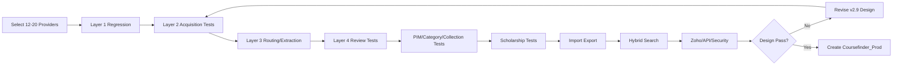

# Coursefinder Pilot-to-Production Validation v2.9

**Status:** Validation plan against the approved v2.8.1 architecture and v2.9 physical schema design.

**Purpose:** Prove the database model and operating workflows with realistic end-to-end scenarios before creating `Coursefinder_Prod`.

---

## 1. Validation principle

The production schema should be validated by business scenarios, not only by table-by-table review.

Layer 1 has already demonstrated successful multi-country parsing in the pilot and should now be treated primarily as a regression baseline.

The highest-risk areas for production validation are:

- Layer 2 acquisition and provider-native structure capture;
- Layer 3 extraction/routing interactions where Layer 2 data is incomplete or inconsistent;
- Layer 4 human review, override, approval, evidence and audit;
- PIM family/category/course-collection behaviour;
- scholarship scope and matching;
- search projection and pgvector freshness;
- import/export round trips;
- secure API and role boundaries.

---

## 2. Test data strategy

Use a controlled test set of 12–20 providers rather than the whole pilot catalogue initially.

Select providers that intentionally differ in:

- country;
- provider type;
- website structure;
- JavaScript/static rendering;
- course collection structure;
- fee/intake presentation;
- English requirements;
- scholarship complexity;
- naming conventions;
- document/PDF reliance;
- page quality and data completeness.

Recommended coverage:

- Australia: 5–7 providers;
- New Zealand: 2–3 providers;
- one or two representative providers from each additional pilot country for regression diversity.

---

## 3. Scenario matrix

### S01 — Layer 1 canonical provider/course regression

**Purpose:** Confirm existing successful Layer 1 behaviour remains compatible with v2.9.

**Input:** Existing structured/regulatory source.

**Expected:**
- provider identity resolves correctly;
- external/regulatory IDs are preserved;
- courses attach to correct provider;
- duplicate reruns are idempotent;
- source/evidence lineage remains queryable;
- no Layer 2/3 enrichment overwrites authoritative Layer 1 facts without governed precedence.

**DB concepts exercised:** provider identifiers, registrations, course identifiers, sources, jobs, provenance.

---

### S02 — Provider website with clear course collection hierarchy

Example website hierarchy:

`Information Technology > Data Science > Bachelor / Master programs`

**Expected:**
- Layer 2 captures provider-native Course Collections;
- parent/child collection hierarchy is preserved;
- course membership is many-to-many where required;
- global Coursefinder category mapping remains separate;
- provider wording is retained as source/evidence;
- no new Course Family is created simply because the provider uses a new vertical name.

**Production risk tested:** confusing Course Collection, Family and Category.

---

### S03 — Provider with no explicit course collections

**Expected:**
- courses remain valid without a Course Collection;
- Layer 3 may propose global category classification;
- no synthetic provider collection is invented unless explicitly configured;
- completeness does not fail solely because provider collections are absent.

---

### S04 — One course appears in multiple provider collections

Example:

`Master of Data Science` appears under both `Information Technology` and `Business Analytics`.

**Expected:**
- one canonical course;
- multiple collection memberships;
- one membership may be marked primary for display;
- no course duplication;
- website/API can return both collection contexts.

---

### S05 — Same provider uses inconsistent labels for the same concept

Example:

- "Indicative annual fee"
- "International tuition"
- "Annual course fee"

**Expected:**
- Layer 2 preserves source wording;
- aliases/normalisation map to canonical attributes;
- structured fee data lands in the fee model;
- no provider-specific database columns are created.

---

### S06 — Dynamic JavaScript site / scraper fallback

**Expected:**
- primary acquisition adapter attempts retrieval;
- configured fallback adapter is used on failure or incomplete render;
- job records show adapter/profile actually used;
- cost, retry and timing are captured;
- duplicate evidence is controlled by content/hash rules;
- secret material never enters catalogue rows or browser-visible config.

**Production risk tested:** scraper vendor lock-in and opaque fallback behaviour.

---

### S07 — PDF-only or mixed HTML/PDF evidence

**Expected:**
- Layer 2 can attach PDF evidence to provider/course/fee/requirement;
- evidence versioning and supersession work;
- extracted values retain document/page/source context where available;
- source facts can be reviewed independently of derived canonical values.

---

### S08 — Layer 3 model routing and fallback

**Expected:**
- an extraction profile invokes the configured model profile;
- provider/model failure uses routing-policy fallback;
- output is schema validated;
- model/profile/version and cost are recorded;
- low confidence or schema ambiguity creates Layer 4 review rather than silently publishing.

**Production risk tested:** LLM vendor/model dependency and non-deterministic writes.

---

### S09 — New/unmapped provider terminology

Example provider uses a course label or requirement not yet recognised by global attributes/categories.

**Expected:**
- source value is retained;
- Layer 3 proposes mapping or new controlled attribute/category;
- proposal enters Layer 4;
- no uncontrolled schema mutation occurs automatically;
- reviewer can map to existing concept, create approved new concept, or reject.

---

### S10 — Conflicting values between sources

Example:

- official course page fee = AUD 52,000;
- faculty page fee = AUD 50,000;
- older cached evidence = AUD 48,000.

**Expected:**
- all evidence can coexist;
- precedence/freshness rules produce a preferred candidate;
- conflict is visible;
- Layer 4 reviewer can approve/override;
- decision and reason are audited;
- approved value becomes canonical without deleting source history.

---

### S11 — Layer 4 review approval

**Expected:**
- reviewer sees current value, proposed value, source/evidence, confidence and reason;
- approve action updates canonical/preferred value through controlled server-side action;
- review action is immutable/audited;
- search/completeness refresh is queued only where relevant.

---

### S12 — Layer 4 rejection

**Expected:**
- proposed value is rejected without deleting evidence;
- rejected candidate is not published;
- decision prevents the same evidence/version from repeatedly reopening an identical review unless underlying data changes;
- audit retains actor/time/reason.

---

### S13 — Human override followed by later automated refresh

**Expected:**
- later Layer 2/3 result does not silently replace a governed human decision;
- material source changes may reopen review;
- precedence and expiry rules are explicit;
- reviewer can release/expire an override.

**Production risk tested:** automation fighting manual curation.

---

### S14 — Scholarship broad provider scope

**Expected:**
- scholarship applies provider-wide without thousands of course links;
- structured student eligibility remains separate;
- search projection exposes scholarship availability accurately;
- explicit exclusions override broad inclusion where designed.

---

### S15 — Scholarship scoped to Course Collection

Example:

`20% scholarship for programs in the Engineering faculty/collection`.

**Expected:**
- scholarship scope references the relevant provider Course Collection;
- courses inherit possible applicability through collection membership;
- student eligibility criteria remain independently evaluated;
- ambiguous scope routes to review.

---

### S16 — Course family-driven admin form

**Expected:**
- selecting a Family controls visible Attribute Groups;
- options lists are controlled data;
- required fields come from Completeness Profile, not hard-coded UI;
- changing Family does not silently delete incompatible historical values;
- UI can clearly show missing/invalid fields.

---

### S17 — Category tree reassignment

**Expected:**
- global categories can be moved/reorganised without rewriting course canonical facts;
- descendant filtering remains correct;
- category changes mark affected search projections stale where configured;
- provider Course Collections remain untouched.

---

### S18 — CSV/XLSX import round trip

**Expected:**
- export selected providers/courses/collections;
- edit supported display/business fields;
- re-import using stable keys rather than UUIDs;
- staging detects invalid codes, missing references and duplicate identities;
- preview clearly shows insert/update/conflict;
- commit is idempotent;
- resulting audit/search refresh is correct.

---

### S19 — Search query with mixed hard and soft constraints

Example:

`Master of AI in Australia under 50k, IELTS 6.5, scholarship, preferably Go8`.

**Expected:**
- country, level, fee, IELTS and scholarship are structured constraints;
- AI intent uses lexical/vector relevance;
- Go8 is institution-collection filter/boost depending query intent;
- ranking and completeness may boost but do not override hard constraints;
- API returns explainable facets/signals.

---

### S20 — Search freshness after Layer 4 approval

**Expected:**
- canonical update changes source content hash/search-document hash;
- affected search projection is marked stale;
- embedding regeneration is queued only when vector-relevant content changed;
- filter-only changes update structured projection without unnecessary embedding cost.

---

### S21 — Zoho commercial reranking

**Expected:**
- Coursefinder returns academically/catalogue-relevant candidates and stable provider/course IDs;
- Zoho applies preferred-provider/direct-agreement/commission rules externally;
- commercial values do not become canonical PIM attributes;
- restricted/preferred/open recommendation mode can be applied without changing search truth.

---

### S22 — Security boundary test

**Expected:**
- browser/public roles cannot read internal pipeline/integration/evidence/security tables directly;
- only approved API views/RPCs are exposed;
- role-restricted writes are enforced server-side;
- changing frontend/menu visibility cannot elevate permissions;
- no service-role/secret key is exposed to frontend.

---

## 4. Layer 2 acceptance criteria

Layer 2 is ready for production when the selected provider test set demonstrates:

- at least two acquisition methods/adapters successfully interchangeable;
- deterministic provider/course identity matching;
- provider-native Course Collection capture where present;
- no duplicate course creation caused by navigation structure;
- stable evidence storage and content hashing;
- source label preservation plus canonical mapping;
- controlled retries/fallbacks;
- clear job/error/cost visibility;
- safe handling of dynamic pages and documents;
- idempotent reruns.

Do not judge Layer 2 only on scrape success. The success measure is whether acquired data lands in the target model without damaging identity, taxonomy or provenance.

---

## 5. Layer 4 acceptance criteria

Layer 4 is ready for production when reviewers can reliably:

- see why an item needs review;
- compare current and proposed values;
- inspect evidence;
- approve/reject/map/defer;
- create a governed new attribute/category only with correct permissions;
- record immutable actions/audit;
- protect human-approved values from uncontrolled automated replacement;
- reopen decisions when source/freshness materially changes;
- trigger only the required downstream completeness/search updates.

Layer 4 should be treated as the production safety valve for imperfect Layer 2/3 data.

---

## 6. Database design failure signals

Stop and revise v2.9 if testing requires any of the following repeatedly:

- adding provider-specific columns;
- storing important filterable values only in JSON;
- duplicating courses to represent website navigation;
- creating a new Family merely for a subject/vertical;
- using categories to represent all relationship types;
- hard-coding scraper/model names into canonical records;
- overwriting evidence/history to resolve conflicts;
- manually repairing IDs after every import;
- querying many canonical tables synchronously for website search;
- putting commercial preference into canonical provider/course data.

These indicate a design problem, not merely an implementation problem.

---

## 7. Test execution sequence

---

## 8. Recommended gate before production project creation

Create `Coursefinder_Prod` only after:

1. Layer 1 regression passes;
2. Layer 2 scenarios S02-S07 pass or have documented acceptable limitations;
3. Layer 4 scenarios S09-S13 pass;
4. course Family/Collection/Category scenarios pass;
5. scholarship scope scenarios pass;
6. import/export round trip passes;
7. hybrid search produces correct hard-filter behaviour;
8. security boundary tests pass;
9. no repeated database-model workaround is required.

At that point the pilot has validated the production design, rather than production being used to discover basic modelling problems.

---

## 9. Outcome classification

For each scenario record one of:

- `PASS` — design and implementation behave as intended;
- `PASS_WITH_LIMITATION` — acceptable documented limitation;
- `DESIGN_GAP` — physical/logical schema must change before production;
- `IMPLEMENTATION_GAP` — model is sound; code/config requires correction;
- `DATA_SOURCE_LIMITATION` — upstream source cannot provide the required fact reliably.

This distinction is important: not every failed scrape means the database design is wrong, and not every workaround should be solved in scraper code.

---

## 10. Next action

Run the validation pack against the existing pilot database and codebase using the selected representative providers. Record outcomes and design gaps before creating `Coursefinder_Prod`.

If v2.9 survives the scenario set without material design gaps, freeze the physical schema baseline and proceed to production project creation and ordered migrations.
