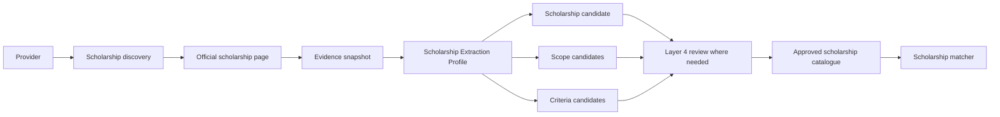

# Coursefinder Pilot Validation — Wave 1 Scenario 4 v2.9

**Status:** Validation result and implementation findings.

**Scope:** Layer 2 course-detail enrichment plus scholarship discovery/normalisation for representative Monash and UTS courses.

**Environment:** Existing `coursefinder-demo` project. No production schema change in this scenario.

---

## 1. Purpose

Validate that the v2.9 design can represent evidence-backed enrichment from real university pages for:

- official course URL;
- description;
- duration;
- intake/session;
- tuition fee;
- English requirements;
- evidence/provenance;
- scholarship discovery;
- scholarship value/benefit;
- scholarship status/application mode;
- student eligibility criteria;
- provider/course/study-level scope;
- scholarship-to-course matching without copying scholarship prose into the course entity.

Failure classification remains:

- `DESIGN_GAP`
- `IMPLEMENTATION_GAP`
- `DATA_SOURCE_LIMITATION`

---

## 2. Test courses

### Monash University

Canonical demo course:

- `Master of Data Science`
- Demo course ID: `46d6d9be-eb06-4a60-aeff-a5add08d54ef`

Current demo state before Layer 2 validation:

- `course_url`: null
- `description`: null
- duration: 104 weeks
- fee rows: 1
- intake rows: 0
- English requirement rows: 0
- scholarship links: 0

Official Monash course page currently exposes:

- provider course code `C6004`;
- course description/outcomes;
- Clayton/Malaysia locations;
- duration of 1.5 or 2 years depending on prior qualifications;
- Semester One (February) and Semester Two (July) starts;
- English-language requirement link;
- 2026 fee information;
- scholarship discovery link;
- CRICOS and accreditation on the international view.

### University of Technology Sydney

Canonical demo course:

- `Master of Data Science and Innovation`
- Demo course ID: `f81ba42f-3a1e-45ab-97ea-837ec33f189c`

Current demo state before Layer 2 validation:

- `course_url`: null
- `description`: null
- duration: 104 weeks
- fee rows: 2
- intake rows: 0
- English requirement rows: 0
- scholarship links: 0

Official UTS course page currently exposes:

- UTS course code `C04372`;
- CRICOS `084268K`;
- 2-year full-time / 4-year part-time duration;
- Autumn 2026 and Spring 2026 intakes;
- course description;
- City campus;
- structured admissions requirements;
- IELTS Academic overall 6.5 / writing 6.0 and equivalent tests;
- 2026 tuition fee information;
- direct international scholarship discovery links.

---

## 3. Layer 2 field validation

| Field | Monash | UTS | v2.9 Representation | Outcome |
|---|---|---|---|---|
| Official course URL | Available | Available | `catalogue.courses.course_url` / source link | PASS |
| Course description | Available | Available | canonical/enriched course field + evidence | PASS |
| Provider course code | Available | Available | external/provider identifier | PASS |
| CRICOS | Available on international source | Available | course registration | PASS |
| Duration | Multiple entry durations | Fixed + possible accelerated pathway | structured duration plus conditions/option detail | PASS |
| Intake | Feb/Jul | Autumn/Spring 2026 | `course_intakes`, retaining provider label | PASS |
| Fee | Available, audience/year-sensitive | Available, audience/year-sensitive | temporal `course_fees` | PASS |
| English | Linked requirement | Explicit course threshold | `course_english_requirements` + evidence | PASS |
| Description evidence | Official course page | Official course page | private evidence artifact + source metadata | PASS |
| Source changes | Annual fee/intake changes expected | Annual fee/intake changes expected | validity/freshness + new evidence version | PASS |

### Important acquisition rule

Layer 2 must preserve **audience/context** when extracting fees and admissions requirements.

A value is not merely `fee = 55,700`; it requires context such as:

- international/domestic;
- academic year;
- annual/total/credit-point period;
- campus where relevant;
- indicative/final status;
- source URL/evidence;
- confidence/verification time.

The same principle applies to English requirements and intake dates.

---

## 4. Existing Layer 2 implementation assessment

The active demo `layer2-deterministic` function already supports the core course enrichment contract:

- official course-page discovery;
- direct/scraper/render fallback;
- evidence snapshots with hashes;
- fee extraction;
- intake extraction;
- description extraction;
- IELTS extraction;
- course URL update;
- confidence threshold;
- low-confidence routing to Layer 4;
- unchanged-content skipping using content hashes.

This validates that the pilot implementation direction is compatible with the v2.9 architecture.

### Implementation concerns identified

1. The current live extractor uses a single compact extraction shape centred on fee/IELTS/intakes/description. Production should use versioned Extraction Profiles rather than hard-coded prompts.
2. Intake extraction currently normalises month names to first-of-month dates. Production should retain the provider session label and only create exact dates when the source provides an exact date.
3. Fee extraction needs explicit audience/context classification before promotion.
4. English extraction must preserve writing/subskill requirements, not only overall/min-band where the institution supplies component-level rules.
5. The current Layer 2 Edge Function is still deployed with `verify_jwt=false`; production security remains governed by the v2.9 API/security design.

Classification: `IMPLEMENTATION_GAP`, not database redesign.

---

## 5. Scholarship validation

Scholarships are now a formal validation stream in Wave 1.

### 5.1 Monash test — International Merit Scholarship

Official Monash source supports structured extraction of:

- scholarship name;
- international-student audience;
- undergraduate-only scope;
- full-time Monash Australia requirement;
- excluded programmes/pathways;
- benefit of AUD 15,000 per annum for scholarships awarded from 2026;
- total value up to AUD 75,000;
- 20 awards per year;
- academic-achievement selection;
- retention requirement of distinction average 70% or above;
- automatic consideration/no separate application.

Important validation result:

This scholarship should **not** link to `Master of Data Science`, because the official scope is undergraduate. The matcher must resolve this from structured scope/criteria rather than provider-wide scholarship presence.

### 5.2 UTS test — Academic Excellence International Scholarship

Official UTS source supports structured extraction of:

- scholarship name;
- value = 30% of UTS tuition fees;
- application open date 1 January 2026;
- status = open;
- standard-course-duration benefit;
- international-only eligibility;
- undergraduate, honours and postgraduate coursework scope;
- full-time/on-campus Sydney requirement;
- exclusion of online/distance courses;
- exclusion where incompatible scholarships/grants or sponsorship apply;
- automatic consideration;
- applicability to intakes from 2025–2028.

For `Master of Data Science and Innovation`, this scholarship is a plausible provider/study-level match, subject to the student meeting academic and other eligibility rules.

---

## 6. Scholarship data-model test

The v2.9 scholarship model is sufficient for the tested cases when used as intended:

```text
Scholarship
  ├── Award / value
  ├── Temporal status and dates
  ├── Scope
  │     ├── Provider
  │     ├── Study level
  │     ├── Course / Course Collection / Category where explicit
  │     └── Delivery/campus/audience constraints
  ├── Eligibility Criteria
  │     ├── Citizenship/residency
  │     ├── Academic achievement
  │     ├── Study load / mode
  │     ├── exclusions
  │     └── retention/renewal rules
  └── Evidence
```

### Result

No new scholarship database entity is required from these two test cases.

Classification: **PASS — no scholarship `DESIGN_GAP` identified.**

---

## 7. Scholarship implementation gap

The active `layer2-deterministic` demo worker is course-centric and does not currently perform scholarship discovery/normalisation.

Therefore Wave 1 identifies a clear `IMPLEMENTATION_GAP`:

### Required Layer 2 scholarship acquisition capability

Recommended production flow:



This should be a separate Layer 2 job kind/profile from course-detail acquisition even if it uses the same scraper/provider infrastructure.

Do not overload the course extraction prompt with scholarship parsing.

---

## 8. Layer 4 scholarship scenarios added

| ID | Scenario | Pass Condition |
|---|---|---|
| SCH-L4-01 | Provider-wide scholarship discovered | Reviewer approves provider/study-level scope without creating thousands of unnecessary course links |
| SCH-L4-02 | Course explicitly excluded | Exclusion criterion prevents incorrect match |
| SCH-L4-03 | Undergraduate-only scholarship tested against postgraduate course | No match |
| SCH-L4-04 | Scholarship percentage benefit | Percent stored as structured award, not free text only |
| SCH-L4-05 | Scholarship annual fixed amount | Amount/currency/period stored structurally |
| SCH-L4-06 | Automatic consideration | Application mode recorded as automatic |
| SCH-L4-07 | Application window/status changes | New evidence updates temporal state; old state retained where historically relevant |
| SCH-L4-08 | Academic threshold ambiguous | Candidate routed to Layer 4 rather than invented threshold |
| SCH-L4-09 | Multiple criteria/exclusions | Matcher evaluates structured rules conservatively |
| SCH-L4-10 | Scholarship page removed/changed | Evidence becomes stale; scholarship is not silently deleted |

---

## 9. Scenario 4 outcome

### Database design

**PASS** for course-detail enrichment and scholarship representation.

No new v2.9 database redesign is required from this scenario.

### Implementation gaps

- production Extraction Profiles need to replace hard-coded extraction shapes;
- exact intake/session semantics must be preserved;
- fee audience/context must be explicit;
- richer English component requirements need extraction support;
- scholarship discovery/extraction worker/profile is not yet implemented;
- scholarship scope/criteria must be evaluated through Layer 4/matcher rather than broad provider-course linking;
- production auth/security for Layer 2 must be hardened.

### Data-source limitations

None material for the two representative official sources. Both providers expose sufficient information for the tested course and scholarship cases.

---

## 10. Next validation step

Proceed to Layer 4 workflow testing using the candidates demonstrated in Scenarios 2–4:

1. approve a correct course value;
2. reject an incorrect/low-confidence value;
3. resolve a Layer 1 vs Layer 2 conflict;
4. reclassify Course Collection vs Academic Option;
5. approve/reject scholarship scope and eligibility mappings;
6. confirm append-only review/audit behaviour;
7. confirm changed evidence reopens a previously reviewed item.

The pending physical-design amendment remains the Scenario 2 `Course Academic Option` entity. No additional design change is introduced by Scenario 4.