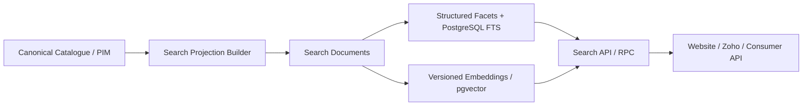

# Coursefinder Pilot-to-Production Validation — Wave 1 Scenario 7 v2.9

**Status:** Executed against the existing demo project.

**Scope:** Read-optimised Search Projection, search RPC/API contract and database traffic simulation.

**Environment:** `coursefinder-demo` (`gfryvshbeptxwbzjomhe`).

---

## 1. Objective

Validate that the production search architecture should read from a derived search projection rather than directly from the canonical catalogue tables.

The test specifically evaluates:

- structured filtering;
- full-text search;
- scholarship flags;
- API-safe result shape;
- repeated search traffic;
- query execution behaviour;
- whether the v2.9 separation between canonical write model and search read model is justified.

---

## 2. Pilot implementation

A separate pilot schema was created:

`search_pilot`

Canonical tables were not modified.

### `search_pilot.course_documents`

One row per published canonical course containing:

- `course_id`
- `provider_id`
- `provider_name`
- `country_code`
- `canonical_title`
- `level_code`
- `field_of_study`
- `publication`
- `has_fee`
- `has_intake`
- `has_english`
- `has_scholarship`
- `scholarship_count`
- `search_text`
- generated `search_tsv`
- `source_hash`
- `refreshed_at`

Indexes created:

- country;
- level;
- provider;
- publication;
- composite country + level + publication;
- GIN full-text index on `search_tsv`;
- partial indexes for fee/intake/English/scholarship flags.

The projection contains 13,698 published courses, including 12,079 Australian courses.

Only two current demo courses have an eligible/possible scholarship link. This is a source/enrichment coverage limitation rather than a search-model limitation.

---

## 3. Pilot API contract

A narrow stable SQL RPC was created:

`public.search_courses_pilot_v2_9(...)`

Inputs:

- `p_q`
- `p_country`
- `p_level`
- `p_has_scholarship`
- `p_limit`

Maximum result count is 50.

Returned fields:

- course ID;
- provider ID/name;
- country;
- course title;
- study level;
- field of study;
- fee/intake/English/scholarship flags;
- scholarship count;
- text relevance rank.

The function is `SECURITY INVOKER` and is intentionally read-only.

The existing pilot Edge Function `catalogue-api-pilot-v2-9` remains the HTTP-facing prototype. Production should use the same pattern but route searches through the production `api` schema/search contract rather than direct canonical-table queries.

---

## 4. Functional validation

Example test:

- query: `data science`
- country: `AU`
- limit: `5`

The RPC returned ranked matching Australian courses with provider information and search flags.

Scholarship-only filtering also executed successfully. The demo currently returns two courses because scholarship ingestion/linking coverage remains minimal.

Result: **PASS**.

---

## 5. Performance comparison

### Scenario 6 canonical-table search

Representative AU wildcard search against canonical tables:

- approximately **24.02 ms** DB execution for `Data Science`;
- 1,000 serial search equivalents: approximately **23.99 seconds** total;
- approximately **531,003 shared-buffer hits**;
- no disk reads;
- no temp spill.

### Scenario 7 projected FTS search

Equivalent AU `Data Science` search against `search_pilot.course_documents` using PostgreSQL FTS:

- approximately **1.25 ms** DB execution;
- GIN bitmap index used;
- approximately 125 shared-buffer hits for the representative request;
- no disk reads;
- no temp spill.

This is approximately **19x faster** for the representative text query.

### 1,000-search simulation

Queries rotated through:

- Data Science
- Information Technology
- Cybersecurity
- Artificial Intelligence

Projected FTS result:

- **1,000 searches completed in ~1.71 seconds total**;
- average serial DB execution approximately **1.7 ms/search**;
- approximately **133,278 shared-buffer hits**;
- zero disk reads;
- zero temp reads/writes.

Compared with Scenario 6 canonical-table simulation (~23.99 seconds), the projected model delivered approximately **14x better total serial throughput** for the tested pattern.

Result: **PASS**.

---

## 6. Architecture conclusion

The validation strongly supports the v2.9 architecture:

Canonical catalogue tables should remain optimised for correctness, relationships, evidence and administration.

Website/counsellor search should consume a derived search model.

---

## 7. Production implications

### Keep

- `search.search_profiles`
- `search.search_profile_fields`
- `search.search_documents`
- `search.search_embeddings`
- structured facet columns in search documents;
- PostgreSQL FTS;
- pgvector as an additional semantic layer;
- API/RPC boundary rather than direct browser access to canonical schemas.

### Add/confirm

Production search documents should include controlled IDs as well as display labels for:

- country;
- subdivision/city/campus;
- provider;
- study level;
- global field/category;
- provider Course Collection;
- Academic Option where search-relevant;
- institution collection;
- fee bands/currency;
- intake periods;
- English requirement summaries;
- scholarship availability/count;
- publication/channel state.

Search profile configuration determines whether a field is `FILTER`, `TEXT`, `VECTOR`, `BOOST` or `RETURN`.

---

## 8. Refresh strategy

Do not synchronously rebuild the entire projection on every canonical update.

Recommended production pattern:

1. canonical record changes;
2. change/outbox event records affected entity;
3. search job rebuilds only affected search document;
4. compare `source_hash` / content hash;
5. update FTS projection;
6. regenerate embedding only if semantic content hash/profile/model changed;
7. mark projection version current.

This reduces unnecessary embedding and search work.

---

## 9. API recommendations

Production API should:

- cap page size;
- use cursor/keyset pagination for deep result sets;
- expose only publication-approved fields;
- validate all filter codes;
- rate-limit public endpoints;
- cache suitable anonymous searches at API/CDN layer;
- keep admin/internal fields out of DTOs;
- use structured filters before semantic/vector ranking where possible;
- log search-profile/model versions for diagnostics;
- avoid raw commission/commercial preference data in Coursefinder search ranking.

---

## 10. Validation classification

| Finding | Classification | Outcome |
|---|---|---|
| Canonical wildcard search relatively expensive | IMPLEMENTATION/READ-MODEL issue | solved by Search Projection |
| Search projection + FTS | PASS | production design validated |
| Structured filtering | PASS | indexed facets effective |
| Scholarship filter | PASS | model works; demo coverage low |
| API-safe result DTO | PASS | suitable foundation |
| pgvector | NOT BLOCKING | retain as semantic layer after FTS/filters |
| New DB design gap | NONE | no new structural design gap from Scenario 7 |

---

## 11. Wave 1 conclusion after Scenario 7

Scenario 7 produced **no new material design gap**.

The production search architecture is validated as:

`Canonical model -> Search Projection -> structured/FTS retrieval -> semantic/vector retrieval where useful -> ranking -> API`.

The remaining known design refinements identified across Wave 1 are bounded and should be consolidated into the final physical schema before production creation:

1. Course Academic Options;
2. Provider Associations / provider lineage;
3. explicit review reopening/supersession lineage;
4. Scholarship scope by Course Collection.

Once those are consolidated, the v2.9 production model can be frozen for implementation.