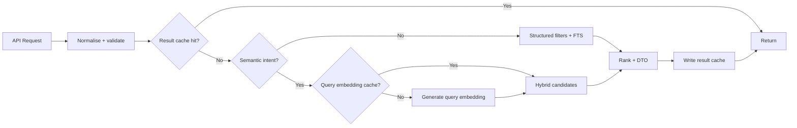

# Coursefinder Pilot Validation — Scenario 8: Website + Zoho Hybrid API, pgvector and Cache v2.9

**Status:** Executed pilot design and performance assessment.

**Environment:** Existing `coursefinder-demo` project. Production project not created.

## 1. Purpose

Validate realistic consumer API patterns for:

- public website course discovery;
- Zoho Creator / CRM recommendation workflows;
- hybrid Full Text Search + pgvector retrieval;
- structured filters before semantic ranking;
- cache opportunities;
- any physical database changes needed before production.

## 2. Pilot findings

Current catalogue:

- 13,698 courses total.
- 2,450 courses currently have embeddings.
- current embeddings are 1,536 dimensions.
- embedding coverage is incomplete and concentrated in a subset of Australian providers.

A pilot vector projection was created in `search_pilot.course_vectors` with an HNSW cosine index. No canonical tables were modified.

Observed warm pilot timings:

| Path | Representative DB execution |
|---|---:|
| Structured/FTS Search Projection | ~1–3 ms |
| HNSW vector neighbours, top 20 | ~10.8 ms |
| Hybrid FTS + vector + RRF fusion | ~36.9 ms |

These timings are database execution only and do not include network latency or query-embedding generation.

Conclusion: semantic search is valuable but should not run for every website request. Structured/FTS retrieval remains the default fast path; pgvector should be invoked for natural-language intent, related-course discovery and recommendation workflows.

## 3. Website API scenarios

### WEB-01 — Normal faceted search

Example intent:

`Masters in Data Science in Australia`

Request concept:

```json
{
  "q": "data science",
  "country": "AU",
  "study_level": "masters",
  "mode": "keyword",
  "page_size": 20
}
```

Execution:

1. normalise query/filter set;
2. search projection structured filters;
3. FTS ranking;
4. return cached/public-safe DTO.

Do not create a query embedding.

### WEB-02 — Semantic natural-language discovery

Example:

`I want a postgraduate course that combines AI with healthcare data`

Request:

```json
{
  "q": "I want a postgraduate course that combines AI with healthcare data",
  "country": "AU",
  "study_level": "masters",
  "mode": "hybrid"
}
```

Execution:

1. normalise query;
2. fetch/create cached query embedding;
3. apply hard structured constraints;
4. FTS top candidate set;
5. pgvector top candidate set;
6. reciprocal-rank fusion;
7. optional configured boosts;
8. return results with safe match reasons.

### WEB-03 — Related courses

Endpoint concept:

`GET /courses/{course_key}/related`

No external embedding call is required if the course Search Document already has an embedding.

Use:

- same country or allowed destination set;
- optional same study level/family;
- HNSW nearest neighbours;
- exclude current course;
- diversify by provider if configured.

This is a strong pgvector use case because the stored course embedding can be reused directly.

### WEB-04 — Autocomplete

`data sci...`

Use only prefix/trigram/FTS/reference indexes. Do not invoke pgvector or an LLM/embedding API per keystroke.

### WEB-05 — Scholarship-aware search

`cyber security masters with scholarship`

Course retrieval remains academic. Scholarship availability is a structured Search Projection field or separate scholarship retrieval signal. Do not embed raw eligibility/commission logic into the course vector.

## 4. Zoho / counsellor API scenarios

### ZOHO-01 — Student recommendation shortlist

Zoho sends academic constraints and a free-text goal:

```json
{
  "request_id": "crm-or-creator-idempotency-key",
  "country": ["AU"],
  "study_level": ["masters"],
  "fields": ["data-science", "artificial-intelligence"],
  "budget_max": 55000,
  "english": {"test":"IELTS","overall":7.0},
  "query": "AI and data analytics with strong industry focus",
  "limit": 30
}
```

Coursefinder:

1. validates structured filters;
2. applies academic eligibility/availability filters where deterministic;
3. performs hybrid retrieval only across remaining candidates;
4. returns stable `provider_id` / `course_id` / business keys, academic score and match reasons.

Zoho CRM/Creator then applies commercial preference/commission/direct-agreement re-ranking. Commercial values never enter Coursefinder vectors.

### ZOHO-02 — Preferred-provider re-ranking

Coursefinder returns academic candidate IDs and scores.

Zoho applies:

- direct agreement;
- preferred provider;
- branch/counsellor policy;
- territory;
- commercial priority.

The final response may include `academic_rank` and `commercial_rank`, but Coursefinder retains only safe recommendation-event metadata where required.

### ZOHO-03 — Student changes one constraint

Example: budget changes from AUD 55,000 to 45,000.

Reuse the same normalised query embedding because semantic intent is unchanged. Re-run structured filtering/fusion without paying the embedding cost again.

### ZOHO-04 — Provider/course detail refresh

Zoho stores stable identifiers and requests current public catalogue detail by IDs. This should use an ID/detail cache and must not invoke semantic search.

### ZOHO-05 — Bulk shortlist comparison

Zoho sends 5–20 course IDs. Coursefinder returns a structured comparison payload in one API call rather than one Edge Function invocation per course.

This avoids fan-out and reduces request/invocation overhead.

## 5. Recommended API split

Keep separate endpoints/contracts rather than one universal search function:

- `/search/courses` — structured + FTS, optional hybrid;
- `/search/semantic` — explicit semantic/hybrid intent;
- `/courses/{id}` — detail;
- `/courses/{id}/related` — stored-vector similarity;
- `/courses/compare` — batch IDs;
- `/scholarships/search` — scholarship retrieval/matching;
- `/recommendations/courses` — authenticated counsellor/Zoho academic candidate service.

This keeps cache policy, security and cost behaviour predictable.

## 6. Database improvements recommended

### 6.1 Keep vector outside canonical course rows

Confirmed. Production should use separate `search.search_embeddings` keyed by:

- `document_id`;
- `search_profile_id`;
- `embedding_model_id`;
- `dimensions`;
- `content_hash`;
- vector;
- generated timestamp/status.

This allows model/profile migrations and vector regeneration without changing canonical entities.

### 6.2 Add explicit Search Document version state

`search.search_documents` should include:

- `content_hash`;
- `profile_version`;
- `projection_version`;
- `source_updated_at`;
- `generated_at`;
- `embedding_status` (`missing`, `current`, `stale`, `failed`);
- `embedding_content_hash`.

Only regenerate embeddings when the semantic content hash or model/profile changes.

### 6.3 Separate FILTER / TEXT / VECTOR / BOOST / RETURN fields

Retain the v2.9 Search Profile model. Hard filters such as country, level, fee range, intake, publication and course family must reduce the candidate population before semantic ranking wherever practical.

### 6.4 Query embedding cache

Recommended logical key:

`sha256(normalised_query + embedding_model + embedding_profile_version)`

Value:

- vector;
- model/version;
- created_at;
- expiry/usage metadata.

Repeated query/filter changes can therefore reuse the same embedding.

Do not store every arbitrary user query forever. Apply TTL/size controls and avoid storing sensitive profile text in clear form when a hash is sufficient.

### 6.5 Result cache

Recommended cache key:

`hash(channel + normalised_query + structured_filters + search_profile_version + catalogue_generation)`

Website public searches can use short-to-medium TTLs. Invalidation should be generation/version based rather than attempting row-by-row cache deletion.

Suggested production pattern:

- `catalogue_generation` integer or timestamp changes when publication/search projection materially changes;
- cache key includes generation;
- older cache entries become unreachable naturally.

### 6.6 Detail cache

Provider/course detail is highly cacheable by stable ID + `updated_at`/publication generation. Separate detail caching from search caching.

### 6.7 Do not put application cache in canonical Postgres tables

Postgres remains source/search store. For high-volume ephemeral result/query caches, use an edge-compatible cache/Redis layer. Database-backed cache can be retained only for small durable/search-generation metadata.

### 6.8 Batch APIs for Zoho

Prefer one `/courses/compare` or recommendation request containing multiple IDs/constraints rather than function fan-out. This reduces Edge Function invocation count and avoids recursive-function traffic patterns.

## 7. pgvector physical recommendations

- HNSW is a suitable initial production ANN candidate, but benchmark again after production Search Documents are fully embedded.
- Do not copy the pilot's legacy 1,536-dimensional embeddings into production.
- Choose embedding model/dimensions based on retrieval quality + latency/cost tests; keep model/dimensions versioned in metadata.
- ANN should search the derived vector store, never `catalogue.courses`.
- For filtered ANN, validate query plans and recall on the real data distribution; use candidate filtering/fusion strategies if hard filters reduce ANN recall.
- Related-course calls can reuse stored vectors and avoid query-embedding generation entirely.

## 8. Cache policy by consumer

| Consumer/action | Search method | Cache recommendation |
|---|---|---|
| Website autocomplete | prefix/FTS | CDN/edge, short TTL |
| Website faceted search | structured + FTS | edge/Redis result cache |
| Website natural language | hybrid FTS+vector | query-embedding cache + result cache |
| Related courses | stored vector | result cache by course/profile/version |
| Course detail | ID lookup | strong detail cache |
| Zoho recommendation | hybrid after hard filters | query-embedding cache; short result cache if policy-safe |
| Zoho commercial re-rank | Zoho-side | cache in commercial-policy layer, not PIM |
| Bulk compare | structured IDs | request/batch cache optional |

## 9. Security and data separation

Website API exposes only published consumer-safe fields.

Zoho API is authenticated and may receive richer academic facts but should not receive private evidence artefacts or internal review metadata unless a separate privileged contract is explicitly approved.

Commercial preference and commission remain outside Coursefinder canonical/search vector data.

## 10. Design conclusion

Scenario 8 does not invalidate v2.9. It strengthens three production requirements:

1. first-class versioned Search Documents and Search Embeddings;
2. cache-generation/version metadata as part of the Search/API design;
3. distinct Website and Zoho API contracts with explicit semantic mode rather than pgvector on every request.

Recommended production request strategy:



This is the recommended basis for `Coursefinder_Prod` search/API implementation after the final v2.9 consolidation.