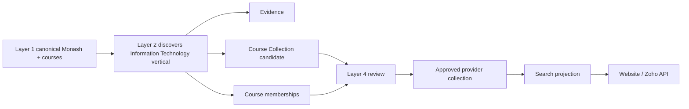
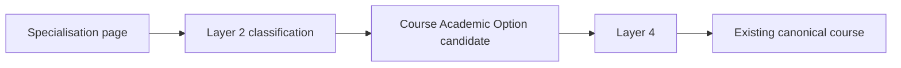
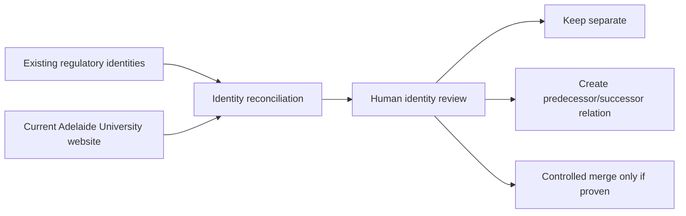
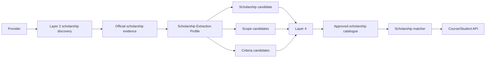

# Coursefinder Pilot-to-Production Validation — Wave 1 v2.9

**Status:** Execution test plan and initial baseline findings.

**Environment:** Existing Supabase demo project `coursefinder-demo` (`gfryvshbeptxwbzjomhe`).

**Purpose:** Prove the approved v2.9 production design against realistic data and workflow scenarios before `Coursefinder_Prod` is created.

This document is execution-focused. It does not redesign the architecture unless a test exposes a genuine design gap.

---

## 1. Validation principle

The pilot should prove the production design before production is created.

Failure classification:

- `DESIGN_GAP` — schema/relationship/search/workflow design cannot represent the required outcome cleanly.
- `IMPLEMENTATION_GAP` — design is sufficient, but code/configuration is missing or incorrect.
- `DATA_SOURCE_LIMITATION` — source website/document does not expose the required data reliably.

Only `DESIGN_GAP` justifies changing the v2.9 physical design.

---

## 2. Layer focus

### Layer 1 — regression baseline

Layer 1 has already proven multi-country regulatory parsing across seven pilot countries and should be treated as a regression baseline rather than the principal risk area.

Current live catalogue baseline:

| Country | Providers | Courses | Provider registrations | Course registrations |
|---|---:|---:|---:|---:|
| Australia | 56 | 12,079 | 57 | 12,836 |
| Canada | 8 | 28 | 8 | 28 |
| Germany | 213 | 1,479 | 213 | 1,500 |
| United Kingdom | 221 | 28 | 228 | 28 |
| Ireland | 8 | 28 | 8 | 28 |
| New Zealand | 8 | 28 | 8 | 28 |
| United States | 8 | 28 | 8 | 28 |

Layer 1 Wave 1 objective:

- provider identity remains stable;
- regulatory identifiers remain attached correctly;
- repeated ingestion is idempotent;
- no duplicate canonical provider/course is created by the validation work;
- Layer 2 never overwrites authoritative Layer 1 identity without controlled review.

### Layer 2 — primary acquisition test area

Layer 2 must prove that heterogeneous university websites can be converted into evidence-backed, structured candidate values without coupling the architecture to one website or one scraper.

Layer 2 validation explicitly includes two independent acquisition job families:

- **Course Detail Acquisition** — course URL, description, fees, intakes, English/admissions, academic options and provider collections.
- **Scholarship Acquisition** — scholarship discovery, benefit/value, application mode/status, temporal validity, scopes, eligibility criteria and evidence.

The two job families may share scraper infrastructure but should use separate Extraction Profiles and canonical write contracts.

### Layer 4 — primary governance test area

Layer 4 must prove that uncertain, conflicting, new or changed information can be reviewed, approved/rejected, audited and re-opened when source evidence changes.

Scholarship scopes and eligibility mappings are part of Layer 4 validation, not automatic broad course linking.

---

## 3. Wave 1 Australian provider set

The following providers were selected from the existing catalogue because together they provide high course volumes and different acquisition/classification cases.

| Provider | Current Courses | Descriptions | Embeddings | Fee Rows | Intake Rows | English Rows | Primary Test Role |
|---|---:|---:|---:|---:|---:|---:|---|
| The University of Sydney | 611 | 0 | 611 | 618 | 0 | 0 | course vs specialisation relationships; course page tabs; fees/intakes |
| UNSW Sydney | 606 | 0 | 5 | 632 | 0 | 0 | structured program codes/CRICOS; interdisciplinary classifications |
| Monash University | 495 | 0 | 495 | 525 | 0 | 0 | provider Course Collections/IT vertical; majors; exit awards; scholarships |
| University of Technology Sydney (UTS) | 472 | 0 | 0 | 526 | 0 | 0 | provider verticals, specialisations, sessions/intakes, course codes; scholarships |
| RMIT University (RMIT) | 450 | 0 | 0 | 492 | 0 | 0 | alternative site/navigation structure and acquisition fallback |
| The University of Melbourne (UniMelb) | 410 | 0 | 0 | 427 | 0 | 0 | course structure/specialisations and structured intake extraction |
| Adelaide University | 472 | 0 | 0 | 494 | 0 | 0 | provider transition/identity and successor/conflict handling |

The current catalogue already has strong Layer 1 fee/registration coverage for this cohort, while description, intake, English and scholarship enrichment coverage is largely absent. This makes the group useful for testing Layer 2 without reconstructing Layer 1.

---

## 4. Initial source observations

The live university sites demonstrate several structures that the v2.9 design must represent.

### Monash

Monash exposes an Information Technology study area that groups undergraduate, graduate, double-degree and other offerings under one provider-defined vertical. Individual courses such as Master of Data Science and Master of Information Technology then expose entry requirements, course structure, applications/fees and potential exit awards.

Expected representation:

- `catalogue.course_collections` — provider-native Information Technology collection;
- `catalogue.course_collection_memberships` — membership of each atomic course;
- Course Family — Higher Education Course;
- global Coursefinder categories — Data Science / Artificial Intelligence / Computing etc.;
- exit awards represented by typed association where they are actual award relationships, not duplicated as arbitrary categories.

### University of Sydney

Sydney exposes both atomic courses and separate subject-area/specialisation pages. For example, a Data Science and AI specialisation page identifies the courses that offer the specialisation.

Expected representation:

- atomic degree remains `catalogue.courses`;
- specialisation/major is not automatically promoted to a separate degree;
- use a first-class Course Academic Option model for majors/minors/specialisations/streams;
- provider collection can represent provider navigation grouping where appropriate;
- Layer 4 must review ambiguous pages that could otherwise create duplicate pseudo-courses.

### UNSW

UNSW course pages expose program codes, CRICOS codes, campus information and interdisciplinary course descriptions.

Expected representation:

- program code stored as provider/course identifier;
- CRICOS remains authoritative registration data;
- interdisciplinary subject mapping can produce multiple global category assignments while preserving the provider wording.

### UTS

UTS course pages expose provider course codes, CRICOS, duration, sessions/intakes, total tuition values and provider-specific specialisations/majors.

Expected representation:

- provider-native course code and CRICOS remain separate identifiers;
- Autumn/Spring sessions map to controlled intake structures while retaining original labels;
- provider faculty/vertical navigation can map to Course Collections;
- majors/specialisations map to Course Academic Options, not separate canonical courses unless independently awarded.

### University of Melbourne

Melbourne exposes course overview, course structure, multiple specialisations and explicit intake/month information.

Expected representation:

- degree is atomic course;
- course structure remains provider detail/attributes;
- specialisations are Course Academic Options;
- exact intake dates become structured intake rows; session/month labels are preserved.

### Adelaide University

The current catalogue also contains legacy University of Adelaide and UniSA identities. Adelaide University is therefore a deliberate identity-transition test case.

Expected representation:

- do not merge providers automatically based on similar names;
- preserve external regulator identifiers and validity;
- successor/predecessor or transition relationships must be explicit;
- Layer 4 must approve canonical merge/successor decisions.

---

## 5. Layer 2 scenario matrix

| ID | Scenario | Providers | Expected Outcome | Pass Condition |
|---|---|---|---|---|
| L2-01 | Discover provider-native course vertical | Monash, UTS | Create candidate Course Collection with evidence | Collection name/source preserved; no global category created automatically |
| L2-02 | Discover child group within vertical | Monash, UTS | Hierarchical provider collection or Academic Option candidate | Parent/child semantics retained and classified correctly |
| L2-03 | Atomic course detail extraction | all seven | Extract title, code, description, duration, delivery/location, URL | Values typed, evidence linked, no duplicate course |
| L2-04 | Fee extraction | Sydney, UNSW, UTS, Monash | Candidate current-year fee and period/audience | Amount/currency/period/year/audience captured distinctly |
| L2-05 | Intake extraction | UTS, Melbourne, Monash | Convert Semester/Autumn/Spring/month terminology | Structured intake plus original provider label/evidence retained |
| L2-06 | English/admission requirements | Monash, Sydney, Melbourne, UTS | Extract structured threshold where present plus source text | Component-level thresholds retained where stated; ambiguity routed to review |
| L2-07 | Major/specialisation vs course | Sydney, Monash, UTS, Melbourne | Prevent specialisation becoming duplicate degree | Correct Course Academic Option candidate generated |
| L2-08 | Multiple categories | UNSW, Monash | Map interdisciplinary course to multiple global taxonomy nodes | Provider wording preserved; mappings confidence/evidence recorded |
| L2-09 | Exit award relationship | Monash | Capture Graduate Certificate/Diploma exit option | Typed relationship, not duplicate arbitrary course unless independently canonical |
| L2-10 | Scraper/provider fallback | RMIT plus one JS-heavy page | Primary adapter failure invokes configured fallback | Same acquisition contract/evidence shape regardless of adapter |
| L2-11 | Evidence versioning | any changed page | New fetch supersedes prior artefact | Old evidence retained; new candidate references current evidence |
| L2-12 | Re-run idempotency | all seven | Repeat acquisition without duplicate candidate/current values | No duplicate canonical records; unchanged hashes are no-op/refresh only |
| L2-13 | Source disappearance | any page removed/redirected | Mark evidence/source stale rather than delete canonical fact | Review/freshness state changes; canonical history retained |
| L2-14 | Provider identity transition | Adelaide | Acquisition recognises content without auto-merging historical providers | Identity conflict routed to L4 |
| SCH-L2-01 | Scholarship discovery | Monash, UTS | Locate official scholarship pages independently of course detail worker | Official provider source and evidence captured |
| SCH-L2-02 | Scholarship benefit extraction | Monash, UTS | Parse fixed amount or tuition percentage plus duration/period | Structured award/value retained, not free text only |
| SCH-L2-03 | Scholarship application/status | Monash, UTS | Parse automatic/application-required, open/close/status | Temporal and application semantics captured |
| SCH-L2-04 | Scholarship scope | Monash, UTS | Provider/study-level/course/category/collection scope candidates | No indiscriminate course-link explosion |
| SCH-L2-05 | Scholarship criteria/exclusions | Monash, UTS | Structured nationality, academic, mode/load and exclusions | Ambiguous rules routed to L4 rather than guessed |
| SCH-L2-06 | Scholarship evidence change | Monash, UTS | Annual value/status/rule change creates new evidence/candidate | Prior evidence retained; review/freshness updated |

---

## 6. Layer 4 scenario matrix

| ID | Review Scenario | Expected Decision Behaviour | Pass Condition |
|---|---|---|---|
| L4-01 | Approve new attribute value | candidate promoted as preferred canonical/enriched value | actor, evidence, previous/current value and timestamp audited |
| L4-02 | Reject incorrect extraction | candidate rejected without deleting evidence | rejection reason retained; extraction not published |
| L4-03 | Conflicting Layer 1 vs Layer 2 value | authoritative Layer 1 protected unless explicit permitted override | reviewer sees source priority and conflict side-by-side |
| L4-04 | Two Layer 2 sources disagree | reviewer selects preferred value/source | alternate candidate remains traceable |
| L4-05 | Proposed new global category | curator reviews rather than pipeline creating taxonomy automatically | no uncontrolled category proliferation |
| L4-06 | Proposed new provider collection | review provider-native structure and approve | collection created under correct provider and source |
| L4-07 | Specialisation mistaken for course | reviewer reclassifies to Course Academic Option | duplicate canonical course avoided |
| L4-08 | Provider rename/transition | Adelaide identity conflict | explicit successor/merge/no-merge decision with evidence |
| L4-09 | Course page materially changes after approval | new candidate/review generated | old human decision not silently overwritten |
| L4-10 | Fee/intake becomes stale | queue freshness review | previous historical record retained; publication rules applied |
| L4-11 | Low-confidence taxonomy mapping | approve/change mapping | global category ID and provider wording both preserved |
| L4-12 | Bulk review | approve consistent low-risk values from same evidence/profile | bulk action retains per-record audit entries |
| L4-13 | Undo/correct prior human decision | new review action supersedes previous decision | audit is append-only; no history destruction |
| L4-14 | Unknown/unmodellable fact | classify `DESIGN_GAP`, `IMPLEMENTATION_GAP` or `DATA_SOURCE_LIMITATION` | architecture change occurs only for proven design gap |
| SCH-L4-01 | Provider-wide scholarship discovered | approve provider/study-level scope | broad scope represented without unnecessary explicit course links |
| SCH-L4-02 | Course or population explicitly excluded | approve exclusion criterion | matcher prevents incorrect match |
| SCH-L4-03 | Undergraduate-only scholarship vs postgraduate course | reject match | study-level scope is deterministic |
| SCH-L4-04 | Percentage benefit | approve structured award | percentage/duration stored structurally |
| SCH-L4-05 | Fixed annual benefit | approve amount/currency/period | temporal award represented correctly |
| SCH-L4-06 | Automatic consideration | approve application mode | no fake deadline/application requirement created |
| SCH-L4-07 | Scholarship status/window changes | approve new temporal state | old evidence/history retained |
| SCH-L4-08 | Ambiguous academic criterion | reviewer resolves or leaves possible | matcher does not invent threshold |
| SCH-L4-09 | Multiple criteria and exclusions | review structured rule set | conservative deterministic matcher result |
| SCH-L4-10 | Scholarship source removed/changed | stale/review state | scholarship not silently deleted |

---

## 7. Cross-layer end-to-end scenarios

### Scenario A — Monash IT vertical

Pass outcome:

- one canonical course remains one canonical course;
- IT vertical is provider-native Course Collection;
- global categories remain independent;
- collection can be used for provider-page navigation and structured search.

### Scenario B — Sydney specialisation

Pass outcome: no fake degree is created merely because a specialisation page exists.

### Scenario C — Adelaide identity transition

Pass outcome: name similarity never performs an uncontrolled destructive merge.

### Scenario D — Scholarship discovery and matching

Pass outcome:

- scholarship is first-class;
- broad scope is represented with scope rules rather than duplicate course links;
- student eligibility is evaluated separately;
- scholarship prose does not pollute canonical course fields or course embeddings.

---

## 8. Search checks after approved enrichment

For a small approved subset, regenerate a test Search Projection and validate queries such as:

1. `data science masters in Melbourne`
2. `AI bachelor at UTS`
3. `Monash information technology postgraduate courses`
4. `data science course with February or March intake`
5. `Go8 data science masters`
6. `cybersecurity postgraduate with scholarship`
7. `UTS postgraduate data science with international scholarship`
8. `Monash undergraduate scholarship for international student`

Pass conditions:

- structured filters resolve facts;
- global categories resolve cross-provider concepts;
- Course Collections improve provider-specific navigation/recall;
- Course Academic Options improve detail and semantic context without becoming fake courses;
- pgvector resolves semantic intent only after/alongside structured constraints;
- scholarship filtering uses approved scope/status signals and matcher output;
- commercial preference is not introduced into canonical Coursefinder scoring.

---

## 9. Data quality observations already identified

Wave 1 begins with known enrichment gaps rather than treating them as failures:

- none of the seven selected providers currently has meaningful course-description coverage in `courses.description`;
- intake coverage is effectively absent for six of seven selected providers;
- course-level English requirement rows are absent for all seven;
- existing embeddings are inconsistent by provider;
- Monash and UTS currently have no scholarship catalogue rows or course-scholarship links in the demo project.

These are ideal Layer 2/Layer 4 validation targets and are not reasons to modify the canonical design by themselves.

---

## 10. Execution order

1. Freeze the seven provider IDs and initial counts.
2. Run Layer 1 regression/idempotency check.
3. Execute Monash and UTS Course Collection acquisition scenarios.
4. Execute Sydney specialisation-vs-course scenario.
5. Execute representative course-detail extraction: URL, description, fee, intake and English.
6. Execute Monash and UTS scholarship discovery/extraction validation.
7. Exercise Layer 4 approve/reject/conflict/reclassification flows for course data and scholarships.
8. Execute Adelaide identity-transition scenario.
9. Validate evidence supersession and stale-source behaviour.
10. Run small approved search projection/embedding test including scholarship filters/matcher.
11. Record each failure classification.
12. Consolidate proven design changes, including Course Academic Options.
13. Amend/freeze v2.9 only if a `DESIGN_GAP` is confirmed.
14. If no material design gaps remain, create `Coursefinder_Prod`.

---

## 11. Exit criteria for Wave 1

Wave 1 passes when:

- no test requires uncontrolled schema-specific university fields;
- Course Family, Course Collection, Course Academic Option, Category and Association remain sufficient and distinct;
- Layer 2 can change acquisition adapter without changing canonical contracts;
- course-detail and scholarship acquisition can use independent Extraction Profiles;
- evidence is available for every promoted Layer 2 value tested;
- Layer 4 decisions are auditable and non-destructive;
- source change can reopen prior human decisions;
- no tested provider structure forces duplicate course creation;
- scholarship scope/eligibility can be represented without mass course-link duplication;
- search can consume approved canonical/collection/category/scholarship data without embedding business/commercial rules;
- no unresolved high-severity `DESIGN_GAP` remains.

---

## 12. Production gate

`Coursefinder_Prod` should be created only after Wave 1 produces no unresolved material design gaps.

Implementation gaps can be scheduled into the production build; data-source limitations can be handled through acquisition/fallback/review policy. Neither should unnecessarily redesign the database.