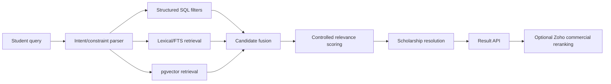

# Coursefinder Security, API & Search v2.9

**Status:** Production security/API/search design for review.

**Target:** `Coursefinder_Prod`.

---

# 1. Security model

The browser must never access internal catalogue, pipeline, integration or evidence tables directly unless a narrowly-scoped authenticated admin workflow explicitly requires it.

Preferred pattern:

```text
Browser / Zoho / Website
        ↓
api schema views/RPCs or Edge Functions
        ↓
Internal schemas
```

The production design follows least privilege and action-based authorization.

---

# 2. Schema exposure

Expose only the `api` schema through Supabase Data API where practical.

Internal schemas:
- `ref`
- `catalogue`
- `pim`
- `scholarship`
- `integration`
- `pipeline`
- `search`
- `publishing`
- `workflow`
- `security`

should not be granted broad `anon`/`authenticated` access.

If any view is exposed, prefer `security_invoker = true` so underlying RLS/grants remain authoritative.

No production equivalent of current anonymous `pipeline_config` write access is permitted.

---

# 3. Application roles

Roles:
- platform_admin
- pim_admin
- pipeline_operator
- curator
- counsellor
- viewer

Authorization is permission-based server-side.

Menu hiding is UX only.

Suggested permission domains:
- catalogue.provider.*
- catalogue.course.*
- catalogue.scholarship.*
- pim.model.*
- pim.category.*
- data_quality.*
- pipeline.execute.layer1/2/3
- pipeline.config.*
- review.*
- integration.*
- search.config.*
- publishing.*
- import.*
- export.*
- admin.*

---

# 4. RLS principles

1. Enable RLS on exposed tables/views where applicable.
2. `TO authenticated` alone is not sufficient authorization.
3. Never authorize from user-editable user metadata.
4. Avoid `SECURITY DEFINER`; where unavoidable, keep functions out of exposed schemas, validate `auth.uid()` and revoke PUBLIC execute by default.
5. Service-role secrets are server-only.
6. Evidence object storage is private.
7. Student/profile PII must be separated from public catalogue APIs.
8. Public website search should access only approved published projections.

---

# 5. API contract layers

## Public/student API

Read-only published catalogue/search:
- course search
- course detail
- provider detail
- scholarship summary/detail where allowed
- reference facets

No direct canonical write operations.

## Counsellor/Zoho API

Read canonical/published course candidates plus:
- stable provider/course keys
- structured relevance signals
- scholarship status
- institution group/ranking metadata
- completeness/freshness signals

Commercial preference/commission logic remains in Zoho.

## Admin API

Authenticated, permission-controlled:
- catalogue CRUD
- PIM model management
- category/collection management
- review workflow
- import/export
- pipeline execution
- integration/search configuration
- publishing

---

# 6. Initial API objects

## `api.course_catalogue_v1`

Flattened read view with core display fields:
- course_key
- course_name
- provider_key/name
- country/subdivision/city
- study level
- primary field
- duration
- delivery mode
- current tuition summary
- next intakes
- primary English requirement
- scholarship status/count
- course collection labels
- institution collection labels
- selected ranking summary
- completeness/freshness
- publication state

## `api.provider_catalogue_v1`

- provider key/name/type
- country/location
- website/description
- campuses
- institutional memberships
- selected ranking summary
- course count
- scholarship coverage status

## `api.scholarship_catalogue_v1`

- scholarship key/name/provider
- type/year/value summary
- deadline/application mode
- scopes
- criteria summary
- status/freshness

## `api.search_courses_v1`

Input supports:
- free text query
- country/subdivision/city
- provider
- study level
- field/category
- provider course collection
- institution collection
- tuition range/currency
- duration
- delivery mode
- intake date range
- English-test threshold
- scholarship required
- ranking filter/band where licensed
- pagination/sort

Output includes:
- course/provider display summary
- matched structured facets
- semantic score
- composite relevance score
- scholarship signal
- explanation signals

---

# 7. Hybrid search execution



Use vectors for semantic meaning, PostgreSQL indexes for facts.

---

# 8. Search projection

`search.documents` is rebuilt asynchronously from canonical data.

Hot filter columns should be physical typed columns rather than only JSONB:
- country_id
- provider_id
- study_level_id
- primary_field_id
- fee_min/current_fee
- fee_currency
- duration-normalized value
- primary English thresholds
- next_intake_date
- scholarship_status
- publication_status
- completeness_score
- freshness_score

Arrays/JSONB may hold:
- category IDs
- course collection IDs
- institution collection IDs
- selected ranking feature set

The API should not join the full canonical model for every search keystroke.

---

# 9. Search profiles

A Search Profile determines:
- which attributes contribute lexical text
- which contribute vector text
- which are structured filters
- semantic weights
- ranking/quality boost weights
- channel/family scope
- profile version

Initial profiles:
- COURSE_STUDENT_SEARCH_V1
- COURSE_COUNSELLOR_SEARCH_V1
- SCHOLARSHIP_SEARCH_V1

Provider-native Course Collection labels may contribute semantic context, but collection IDs remain deterministic filters.

Institution Collections such as Go8 remain deterministic memberships. Their labels may be included in semantic text to support natural-language recall.

Ranking numbers remain numeric filter/sort/boost features, not semantic content.

---

# 10. Embedding design

Embeddings are derived, versioned records separate from canonical courses.

Each embedding records:
- search document
- model profile
- model ID
- dimensions
- content hash
- generated timestamp
- status

A change to any vector-included source field or Search Profile marks the document stale and queues re-embedding.

Model/profile changes create a new embedding generation; they do not silently overwrite historical lineage.

---

# 11. pgvector index design

Production must use an ANN index for active embeddings.

Recommended initial choice: HNSW cosine-distance index for the active course embedding profile, subject to benchmark validation after seed/migration data is loaded.

Key rules:
- one known vector dimension per active indexed table/profile;
- do not mix incompatible dimensions in one indexed vector column;
- benchmark HNSW parameters using production-scale data;
- keep btree/GIN structured filters alongside vector index;
- test filtered vector retrieval because post-filtering can reduce result counts;
- implement candidate expansion/re-ranking where required.

The current prototype's unindexed direct `courses.embedding` model is not carried forward.

---

# 12. Relevance scoring

Composite scoring should be transparent/configurable.

Possible components:
- semantic/vector similarity
- lexical match
- exact category/field match
- student constraint fit
- institution collection preference if explicitly requested
- ranking boost if requested/configured
- scholarship availability/match
- completeness
- evidence freshness

Do not hard-code commercial commission/preferred-university bias in Coursefinder search. Zoho may rerank the returned candidate set according to customer policy.

---

# 13. Search performance targets

Initial design targets:
- common facet/filter queries return from projection/indexes without full PIM joins;
- search API returns first page quickly enough for interactive website use;
- detail hydration is separate from search candidate ranking;
- asynchronous projection/embedding rebuild avoids blocking catalogue writes.

Exact latency SLOs should be established after production-scale benchmark data is loaded.

---

# 14. Edge Functions

Use Edge Functions for operations that need:
- secret-bearing external API calls
- pipeline execution/orchestration
- embedding generation
- import parsing/commit workflows
- signed evidence access
- privileged admin actions that should not be raw table writes

Browser clients use publishable keys and user JWTs only.

Legacy prototype Layer 1–3 functions should not be copied automatically into the new project; production endpoints should be rebuilt or explicitly reviewed against v2.9 authorization and integration policy design.

---

# 15. Auditability

Search/admin/pipeline operations should expose enough lineage to answer:
- which Search Profile generated the result?
- which embedding model/version was used?
- what structured filters were applied?
- which scholarship rules were evaluated?
- what canonical source/evidence backs the displayed fields?
- what Zoho-side commercial ranking was applied after Coursefinder, if any?

The last item belongs to Zoho audit, not Coursefinder canonical data.